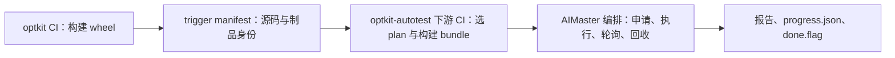

# optkit-autotest 独立仓库迁移设计

- Last updated：2026-07-21
- 状态：accepted
- 级别：L3 架构变更
- 需求 ID：REQ-20260721-autotest-repo-split
- 主责模块：auto-test
- 影响范围：optkit 打包与 CI、auto_test、workflows、AIMaster 编排、OBS 制品、结果网站兼容契约
- 迁移基线：optkit `c8f9b049bf84da0d3af83180d8295113faec35e8`；workflows 本地 `ae1df739de5fe2ba9ee8466b9ed40d3c040b544a`

## 1. 决策结论

新建团队级仓库 `IPD/OPTG/SDLA/optkit-autotest`，把 optkit 根目录的 `auto_test/` 与 workflows 当前有效的 optkit 专用机器编排合并进去。optkit 只保留产品代码、快速测试、源码影响映射、不可变 wheel 构建和下游触发；原 workflows 在迁移验收后只读归档。

本次迁移遵循“先迁边界、后做重构”：保留 `auto_test` Python 命名空间、现有计划/报告/结果目录与 `done.flag` 契约，不同时重命名包、调整测试矩阵或修改测试失败是否阻断 CI 的语义。

## 2. 背景与动机

- `setup.py::find_packages()` 会把 `auto_test` 收进 optkit wheel，并显式携带配置、脚本和约 13 MB fixtures；测试平台资产污染产品制品。
- 依赖方向是 `auto_test → optkit/optkit_v2`，产品代码不依赖 auto_test，天然适合拆出。
- auto_test 已拥有判断器、计划、GPU 调度、runner、报告、存储和环境管理，属于测试平台而非推理优化库。
- workflows 当前唯一有效需求是 optkit 自动测试；继续独立发布 workflows wheel只会增加跨仓契约和部署漂移。
- 现有 optkit CI 同时构建产品 wheel、裁 plan、组装 tar 和触发机器，产品发布与测试平台生命周期耦合。

## 3. 目标边界



| 系统 | 保留职责 | 不再承担 |
| --- | --- | --- |
| optkit | 产品源码；单元/公共 API 契约测试；`.ci/autotest-impact.yaml`；wheel 与 manifest；触发下游 | auto_test 包、fixtures、plan 执行、测试 tar、机器编排 |
| optkit-autotest | 判断与计划；v1/v2 引擎；模型适配；调度与 runner；报告；fixtures；AIMaster 机器生命周期 | optkit 产品实现；通用工作流平台 |
| 原 workflows | 观察期内 legacy 回滚；之后只读历史 | 新需求、独立 wheel 发布、线上权威链路 |

## 4. 新仓库结构

迁移初期保持现有 import，仓库名和发行包名使用 `optkit-autotest`：

```text
optkit-autotest/
├── auto_test/
│   ├── adapters/
│   ├── engines/
│   ├── runners/
│   ├── config/
│   ├── fixtures/
│   ├── judge.py
│   ├── scheduler.py
│   ├── run.py
│   ├── report.py
│   ├── env.sh
│   ├── test.sh
│   └── orchestration/
│       ├── workflow.py
│       ├── machine.py
│       └── config.py
├── tests/
│   ├── unit/
│   ├── orchestration/
│   ├── contract/
│   └── integration/
├── schemas/
│   └── trigger-manifest-v1.json
├── project.md
├── architecture/
├── pyproject.toml
├── .gitlab-ci.yml
├── AGENTS.md
└── README.md
```

继续兼容：

```bash
python -m auto_test judge --base HEAD~1 --head HEAD --out auto_test/config/plans/v2_smoke.yaml
python -m auto_test schedule auto_test/config/plans/v2_full.yaml --gpus 0,1,2,3
optkit-auto-test --workflow-id c8f9b04
```

不迁移 workflows 的旧 `scripts/`、Playwright/Jira 路径、过时 README 与 Playwright 依赖。

### 4.1 新仓库 living-docs 初始化

新仓库创建并导入代码后执行 `docs-init`，使用已经确认的六个模块边界：

| 模块 | 一句话职责 |
| --- | --- |
| selection-plan | 解析源码影响并生成可序列化 TestPlan |
| adapter-engine | 隔离模型加载差异与 v1/v2 apply 策略 |
| execution | 展开 Cell、GPU 调度并运行测试 |
| report-storage | 记录结果、进度和兼容报告 |
| orchestration | 管理 AIMaster 机器完整生命周期 |
| contract-artifact | 管理 manifest、bundle、hash 与跨仓 schema |

`docs-init` 必须在新 git 仓库内完成：生成 `project.md`、`architecture/main-design.md` 和模块文档；安装 pre-push 同步门；经确认后把 living-docs 维护规则合入新仓库 `AGENTS.md`；最后调用 `docs-acceptance`。当前 optkit 已有外部项目记忆，不对其重复执行 init。

## 5. 跨仓触发契约

optkit CI 生成 `trigger-manifest.json`，上传后只向下游传 URL 与 SHA256，避免把大量 changed files 塞进 CI 变量。

```json
{
  "schema_version": 1,
  "run_id": "c8f9b04",
  "event_type": "commit",
  "source": {
    "repository": "optkit",
    "ref": "master",
    "sha": "c8f9b04",
    "base_sha": "e2c647d",
    "changed_files": ["optkit_v2/components/quant/backend.py"]
  },
  "wheel": {
    "url": "https://obs.cn-north-4.myhuaweicloud.com/obs-open-platform/optkit-master/wheels/optkit-c8f9b04.whl",
    "sha256": "e3b0c44298fc1c149afbf4c8996fb92427ae41e4649b934ca495991b7852b855"
  },
  "selection": {
    "engine": "v2",
    "profile": "auto"
  }
}
```

- commit：`event_type=commit`、`profile=auto`，下游按 impact 裁 smoke。
- release tag：`event_type=release`、`profile=full`。
- `.ci/autotest-impact.yaml` 留在 optkit，随 manifest 一起发布，保证源码移动时可在同一 PR 更新映射。
- 未知 `schema_version`、manifest/wheel hash 不一致、空 plan 且无明确兜底时，在申请机器前失败。
- bundle 必须记录 optkit SHA、wheel hash、autotest SHA、plan hash、manifest hash。

## 6. CI 设计

### 6.1 optkit 上游 CI

1. 构建不可变 optkit wheel。
2. 上传到按 commit/tag 隔离的对象路径并计算 SHA256。
3. 生成并上传 trigger manifest。
4. 以 GitLab multi-project trigger 触发 optkit-autotest，使用等待下游结果的策略。
5. 不再运行 auto_test judge、打 `auto_test.tar`、嵌套 wheel 或调用已安装的 workflows wheel。

### 6.2 optkit-autotest 自身 CI

普通 MR/push 不申请 GPU，只运行：静态检查、单测、plan/schema 校验、状态机测试、wheel/bundle 构建与敏感文件扫描。

optkit 下游触发时：

1. 校验 manifest 与 wheel hash。
2. 生成 plan 和自洽 bundle。
3. 上传以 `run_id + autotest_sha` 命名的不可变 bundle。
4. 从当前 CI checkout 直接启动 orchestration，不依赖测试 Runner 上手工安装的 workflows wheel。
5. 等待 `done.flag`、聚合报告并验证机器全部回收。

定时/手动 CI 使用显式 known-good optkit wheel，默认只跑一台 5090 smoke；三机型 full 只允许 release 或人工授权。

### 6.3 权限、依赖与资源安全

- `master`、release tag、GPU job 受保护；optkit `CI_JOB_TOKEN` 加入下游触发 allowlist。
- `AM_MASTER_AUTHORIZATION`、OBS 与 SSH 凭证使用 protected/masked variables，不进入 manifest、bundle、日志或报告。
- `am_tools` 必须先发布成可重复安装的内部 wheel并固定精确版本，同时对 `ensure_pubkey/register_pubkey` 等接口做启动前探测。
- orchestration job 使用同一 AIMaster 项目的 `resource_group` 串行执行、`interruptible: false`、`timeout: 12h`。
- 运行中作业不可被新提交直接取消；Python `finally`、CI `after_script` 与超时清理共同保证关机。
- pre bundle 建议保留 30 天；release bundle 长期保留。

## 7. 仓库创建与历史迁移

目标远端：

```text
git@git.mtlab.meitu.com:IPD/OPTG/SDLA/optkit-autotest.git
```

仓库要求：默认分支 `master`；master/tag protected；普通修改经 MR；绑定 `docker` 与 `optkit-test` Runner；GPU 权限只授予受保护来源。

历史迁移必须在临时克隆中执行：

1. 从 optkit 基线 `c8f9b049` 过滤 `auto_test/` 历史，作为主历史。
2. 从 workflows 本地基线 `ae1df739` 过滤 `workflows/optkit/{auto_test,machine,config}.py` 与对应测试；该提交比 `origin/master` 超前 1 个提交，不能只用远端历史。
3. 以第二条历史合并进新仓库，在合并提交中重定位到 `auto_test/orchestration/`。
4. 新建干净的 pyproject、README、CI 与 living-docs，不迁旧包装文件。
5. 记录两个原始 SHA 并打迁移标签。

不得在当前 optkit/workflows 工作目录直接运行会重写历史的过滤命令。

## 8. 分阶段切流

### A. 建立 legacy 基线

先完成 REQ-20260702 剩余 P1 release 验证，固化 wheel SHA、plan/Cell 数量、报告样例、三机型结果与机器关机证据。此时不改变线上触发。

### B. 创建新仓库但不接生产

导入双仓历史、合并 orchestration、初始化 living-docs 与 CI。最低门禁：auto_test 当前 `176 passed, 2 skipped`；workflows 当前 `32 passed`；新增 manifest、bundle、done.flag 契约测试。

### C. 引入契约并 shadow

optkit 生成 manifest，但 legacy 仍为权威。先 dry-run 比较 Cell，再对同一 wheel 跑一台 5090 smoke；shadow 结果写独立目录，不能覆盖正式结果。

### D. downstream 成为权威

optkit 默认触发新下游，legacy 改为手动 fallback。切换门槛：连续 3 次 master smoke；一次 5090/4090/L20 full；零机器泄漏；报告网站兼容；五类身份 hash 可追溯。

### E. 清理与归档

从 optkit 删除 `auto_test/`、setup/MANIFEST 资源、旧 tar/OBS 上传和仅由 auto_test 引入的依赖；保留 impact、manifest 与下游 trigger。原 workflows 打归档 tag、README 指向新仓库、停止发布 wheel并设为只读；观察期后卸载 Runner 上旧包并按生命周期清理旧 tar。

## 9. 回滚

观察期保留受保护变量：

```text
AUTOTEST_PIPELINE_MODE=downstream
```

允许 `legacy | shadow | downstream`。下游触发、bundle 校验、机器回收、报告兼容或 Cell 一致性任一硬门禁失败时切回 legacy。完成清理后通过 revert optkit 清理提交或调用归档 legacy tag 回滚；旧 OBS tar 在观察期结束前不得清理。

## 10. 测试与验收

### 10.1 逻辑与契约

- TestPlan、矩阵、v1/v2 backend、judge、report/storage/progress、workflow/Machine。
- manifest schema 与未知版本拒绝；wheel/bundle/plan hash 校验。
- `done.flag`、`progress.json`、报告 JSON 与结果目录兼容。
- bundle 不含凭证、结果、缓存和开发环境文件。

### 10.2 故障注入

覆盖 wheel 下载/hash 错误、bundle 上传失败、机器申请失败、长期 not_started、SSH 首连失败、setup 超时、测试进程消失且无 done.flag、生命周期超时、首次关机失败和 orchestration 异常退出。所有申请机器后的失败路径必须落关机证据或可审计人工清理清单。

### 10.3 最终验收

- 新仓库团队权限、双历史、CI 与 living-docs 完整。
- optkit wheel 不再包含 auto_test 与 fixtures，产品 API 不变。
- 连续 3 次 5090 smoke、一次三机型 full、零机器泄漏。
- 新旧链路同一 wheel 的 Cell 集合与报告契约一致。
- 实际演练一次 `downstream → legacy → downstream`。
- workflows 只读归档，Runner 不再依赖其 wheel。

## 11. 风险

| 风险 | 控制措施 |
| --- | --- |
| workflows 本地提交遗漏 | 以本地 `ae1df739` 为基线并记录迁移标签 |
| am_tools 不可重复安装 | 先发布内部 wheel并固定版本/接口探测 |
| 跨项目 trigger 权限错误 | shadow 阶段验证 allowlist 与 protected 权限 |
| schema 漂移 | JSON Schema、版本号、两仓契约测试，未知版本拒绝 |
| 不可变制品被覆盖 | 对象路径带 run/SHA，下载后强制 SHA256 |
| impact 路径失效 | 映射留在 optkit；未命中使用保守兜底 |
| shadow 污染正式结果 | 使用独立结果目录，切流后才写正式路径 |
| CI 取消造成机器泄漏 | 运行中 job 不可中断，多层关机兜底与审计 |
| 迁移夹带业务重构 | 命名空间、矩阵、报告、阈值和 CI 成败语义后置 |

## 12. 非目标

- 不把 Python 包改名为 `optkit_autotest`。
- 不调整 v1/v2 full/smoke 矩阵、质量阈值或性能门禁。
- 不改变测试 rc 对 optkit CI 成败的现有语义。
- 不修改结果网站 schema/路径。
- 不把 Machine 抽成通用平台，不迁 Playwright/Jira 历史能力。

## 13. ADR

| 决策 | 结果 | 原因 |
| --- | --- | --- |
| autotest 独立仓库 | 是 | 产品与测试平台生命周期、制品和职责不同 |
| workflows 独立保留 | 否 | 无其他消费者，跨仓只增加同步成本 |
| workflows 全量搬迁 | 否 | 仅当前 AIMaster 编排属于目标系统 |
| 迁移时改 Python 包名 | 否 | 降低迁移变量 |
| CI 关系 | optkit 上游触发 autotest 下游 | 产品构建与测试执行解耦 |
| 交互契约 | 版本化 manifest + 不可变 bundle | 可校验、演进和复现 |
| impact 归属 | optkit | 源码移动可原子更新 |
| 切流 | legacy/shadow/downstream | 支持影子验证和快速回滚 |
| workflows 终态 | 只读归档 | 保留历史和应急能力 |

## 14. 生命周期衔接

- REQ-20260702 的剩余 P1 release 验证作为阶段 A legacy 基线，不取消。
- REQ-20260624 未完成的矩阵/判断器扩展不再继续堆入 optkit；迁移稳定后在新仓库继续。
- 本设计 accepted 后进入“待详细实施计划”，尚未授权创建远端仓库、迁代码或切 CI。
- 完成阶段 E 后再更新 optkit 架构基线；在此之前 main-design 不把 auto-test 纳入产品模块地图。
