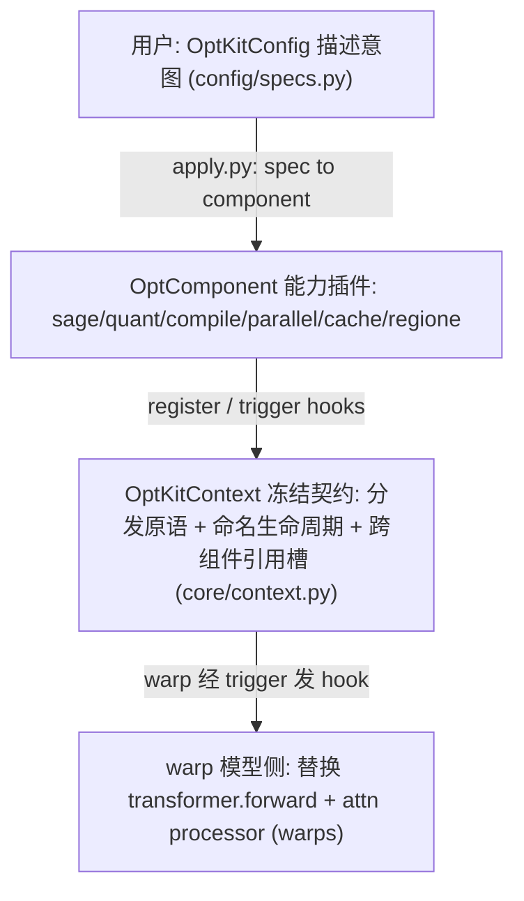
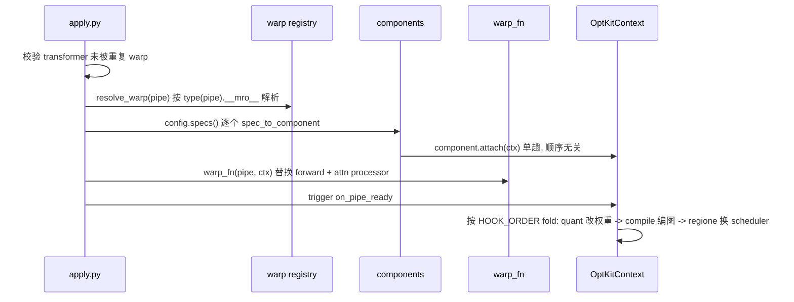

# optkit_v2 主设计文档

- 状态：accepted（描述当前已落地基线）
- 代码根：`optkit_v2/`
- 最近核对：2026-06-24（按仓库实际目录与注册表核对）
- 来源：由 `v2-architecture.md` 导读重组为模块化设计文档；原导读保留

## 1. 系统范围与定位

optkit 是面向生产部署的 diffusion 推理优化工具包。**v1** 按「每模型一个 opt 文件」组织、优化顺序硬编码、跨能力耦合；**v2（当前主线）** 把优化能力重构为**可组合 component 框架**：用户只描述意图，框架负责装配。

统一入口：

```python
from optkit_v2 import OptKitConfig, apply_warp
from optkit_v2.config import SageSpec, QuantSpec, CompileSpec, ParallelSpec, DiCacheSpec

cfg = OptKitConfig(
    sage=SageSpec(),
    quant=QuantSpec(enabled=True, dtype="float8"),
    compile=CompileSpec(enabled=True),
    parallel=ParallelSpec(ulysses_degree=4),
    cache=DiCacheSpec(enabled=True, rel_l1_thresh=0.08),
    world_size=4,
)
ctx = apply_warp(pipe, cfg)            # warp 按 pipe 类名自动解析
images = pipe(prompt="...").images
```

边界：v2 只负责「把优化能力装配进既有 diffusers pipeline」，不实现模型本体；模型侧只写 warp（替换 `transformer.forward` + attn processor），优化能力全在 component 内。

## 2. 三层 + 一契约



核心理念：
- **能力解耦**：每个优化手段是独立 component，任意组合。
- **模型只写 warp**：warp 不知道有哪些 component，component 不知道是哪个模型，二者只经 hook 名 + value/kw 契约耦合。
- **顺序事实源单点**：`core/order.py` 的 `HOOK_ORDER` 是唯一顺序事实源（见 §4）。

## 3. apply_warp 编排流程



关键：顺序敏感的 pipe 变换全部延迟到 `on_pipe_ready`，故 `attach` 顺序完全无所谓。

## 4. 模块地图

| 模块 | 设计文档 | 代码 | 职责 |
| --- | --- | --- | --- |
| 核心框架 | [core-framework](modules/core-framework.md) | `config/` `core/` `apply.py` | Spec 容器、Context 冻结契约、HOOK_ORDER 顺序源、component 基类、apply 编排 |
| 优化组件 | [optimization-components](modules/optimization-components.md) | `components/{sage,quant,compile,cache}` `runtime/lora.py` | Sage 后端替换、FP8/INT8 量化、区域编译、DiCache/MagCache 步级缓存、LoRA 热切换 |
| 序列并行 | [parallel](modules/parallel.md) | `components/parallel/` | Ulysses / Ring / USP 序列并行，统一切分契约，不均匀序列切分 |
| RegionE | [regione](modules/regione.md) | `components/cache/regione/` | 区域感知编辑加速（空间 region partition + 时间 AVDCache），三处协作 |
| 模型 warp | [warps](modules/warps.md) | `warps/transformers/` `warps/pipelines/` | transformer/pipeline 两层 warp，13 个已注册 pipeline，新增模型路径 |

## 5. 跨模块顺序契约（HOOK_ORDER）

为什么不用全局优先级数字？因为**同两个 component 在不同 hook 需要相反顺序**（如 `on_denoise_step_pre` regione 先切、parallel 后切；`on_denoise_step_post` parallel 先 gather、regione 后 restore）。故顺序事实源放在**注册点一侧**，改顺序只动 `order.py`：

| 注册点 | 顺序 | 含义 |
| --- | --- | --- |
| `on_pipe_ready` | `(QUANT, COMPILE, REGIONE)` | 量化早于 compile（编已量化权重），regione 换 scheduler 最后 |
| `replace_dispatch_attention_fn` | `(SAGE, PARALLEL)` | sage 先 replace 整个 dispatch，ring 再 decorate 包裹（保留 sage 加速） |
| `on_backend_enter` | `(PARALLEL, REGIONE)` | Ulysses 先 scatter head，RegionE 的 KV 组装在内层 |
| `on_denoise_step_pre` | regione 先切 edited，parallel 后切 1/cp | |
| `on_denoise_step_post` | parallel 先 gather（unwind），regione 后 restore | |

未登记的 `(注册点, component)` 直接报错（`hook_priority` 抛错）。

## 6. 共享约束（`OptKitConfig.__post_init__` 强校验）

- `cache` 字段**三选一互斥**（DiCache / MagCache / RegionE，从类型上构造不出「同时开两个」）。
- RegionE **不支持 Ring**（ring 的 seq-partition K/V 与 RegionE 全局 cache 不兼容）；只能 `ulysses_degree>1, ring_degree=1`。
- RegionE + Ulysses 必须 `ulysses_anything=True`；RegionE + compile 强制 `dynamic=True`。
- `cp_degree (= ulysses × ring) <= world_size`，需外部已 `dist.init_process_group`（典型 torchrun）。
- **transformer 不做 cpu-offload**（torchao 量化张量与 accelerate 跨设备不兼容）；显存不足靠 FP8 量化缩到常驻。text_encoder 可 group-offload，vae 留 GPU。

## 7. 关联文档

- 原导读（保留）：`../v2-architecture.md`
- 仓库内权威开发文档：`docs/dev-new-optimizer.md`、`docs/v2-regione-design.md`、`docs/v2-regione-cp-design.md`、`docs/dynamic-num-steps-and-pipeline-hooks.md`、`docs/v2-lora-swap-testing.md`
- 项目管理：`../project-management.md`；知识总结：`../knowledge-summary.md`
