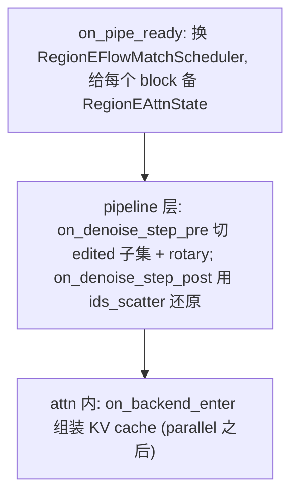

# 模块：RegionE 区域感知编辑加速（regione）

- 状态：accepted（当前已落地基线）
- 代码：`optkit_v2/components/cache/regione/`
- 上游：[main-design](../main-design.md)；相关：[parallel](parallel.md)
- 仓库内详设：`docs/v2-regione-design.md`、`docs/v2-regione-cp-design.md`

## 1. 职责与边界

针对**序列级参考拼接的编辑 pipeline** 的专用加速，两个**正交**维度：

- **空间维（region partition）**：onestep 估计 vs 参考图 latent 算编辑区域；**edited token 逐步迭代，unedited 区域单步预测后冻结**。partition 在 scheduler 里算（latent 空间，`scheduler.py _compute_partition`）。
- **时间维（AVDCache）**：步级缓存，`cache_threshold > 0` 启用（默认 0 关闭）；gamma 由 28 步标定曲线线性插值，支持任意步数。

占用 `OptKitConfig.cache` 字段（与 DiCache/MagCache 三选一互斥）。

## 2. 三处协作（最复杂部分）

1. **RegionE 子集裁剪在 pipeline 层**：`on_denoise_step_pre` 把 `[noise|cond]` 中 noise 按 `edited_ids` 切成 edited 子集（Q 侧降维），rotary 同步切；`on_denoise_step_post` 用 `ids_scatter` 还原。CP 切分位于 transformer 内的 `cp_split_blocks`，因此真实执行链是 RegionE 先裁 edited 子集、CP 再分发，不依赖二者在同一 hook 的优先级。
2. **KV cache 组装在 attn 内**：`on_backend_enter`（内层，parallel 之后）。store 步存 post-rotary full K/V；partial 步从 cache 拼 full K/V（edited 位置写 partial、cond 段整体覆盖）。Q 是 edited 子集而 K/V 是 full → 等价「edited query attend 全部 token」。
3. **换 scheduler**：`on_pipe_ready` 换成 `RegionEFlowMatchScheduler`，给每个 block 准备 `RegionEAttnState`（cond+uncond cache；含 single_transformer_blocks 的模型如 Flux 两段都覆盖）。

## 3. 关键参数（RegionESpec）

`num_inference_steps`、`warmup_step`(6)、`post_step`(2)、`threshold`(0.80，token_selector 相似度阈值，None=关 partition)、`cache_threshold`(0)、`erosion_dilation`、`similarity_type`(cosine)。

## 4. 约束（config `__post_init__` 强校验）

- `threshold` 必须显式设置；要求 `warmup_step < num_inference_steps - post_step`（否则无 partial 加速区间；flux-kontext 须 `STEPS>10`）。
- **不支持 Ring**（ring 的 seq-partition K/V 与全局 cache 不兼容）。
- **+ Ulysses 必须 `ulysses_anything=True`**（Qwen txt/img 序列不保证整除 cp_size），且 `ring_anything` 强制关。
- **+ compile 强制 `dynamic=True`**（partial step 变长序列）。
- **适用范围**：仅序列级参考拼接的编辑 pipeline（Qwen-Edit / Qwen-Edit-Plus / FLUX.1-Kontext / FLUX.2-Klein / Step1X-Edit）。t2i 无参考图、Fill 通道级条件、Inpaint mask 混合**不适用**，apply 时报错拦截；wan 走 cross-mode 透传不适用。
- **显存**：单卡 RegionE 大模型（Qwen 20B，1024 分辨率）32G 放不下，需四卡序列切分。

## 5. 实测

- Qwen-Edit-Plus：u4 + regione 实测 8.36×。
- flux-kontext + dicache 4.92×、qwen u4 + regione 4.14×（不同矩阵基线）。
- ADR-004：RegionE 与 Ring attention 禁止共存，config 层报错（算法不兼容）。
