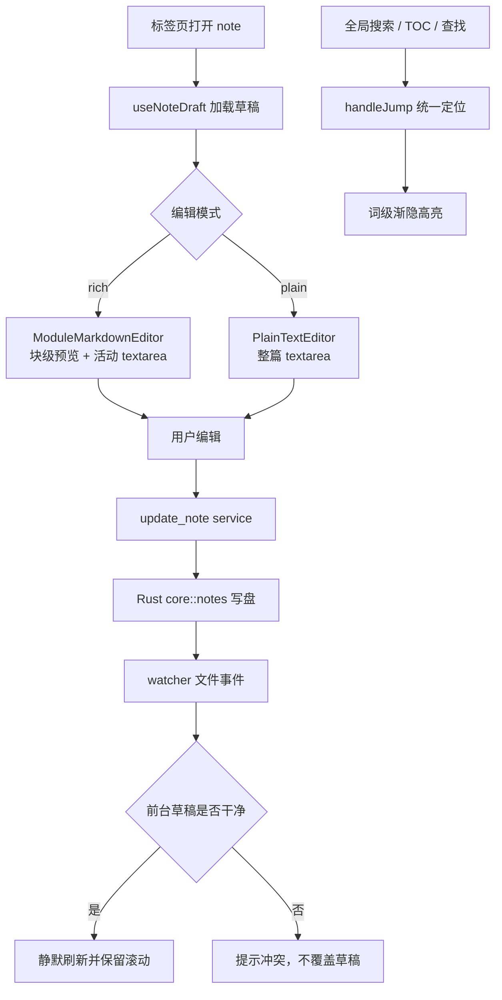

# 编辑器 Editor 模块设计

Last updated: 2026-06-27

Status: implemented

## 目的

提供 Plexus 的 Markdown 编辑体验：自研的双模式编辑器（rich 块模式 / plain 纯文本），均基于 `<textarea>`，支持 KaTeX、Mermaid、TOC、查找、跳转高亮与智能表格预览。

## 职责

- 渲染与编辑单篇笔记的草稿，管理撤销/重做、图片粘贴/拖入。
- rich 模式：把文档切成多个预览块，仅活动块是 textarea（`ModuleMarkdownEditor`）；**列表块进一步下沉到「项级」——活动列表块仅光标所在列表项是 textarea、其余项保持列表渲染**（`ActiveListModule` + `subModules.ts` 的 `splitListItems`，活动态 `{index, subIndex}`；项间 ↑/↓ 导航、行首 Backspace 合并）。plain 模式整篇一个 textarea（`PlainTextEditor`）。
- 表格预览使用 `SmartTablePreview` + `smartTableLayout.ts`：按容器宽度和列内容识别 `status/path/short/text`，状态列不拆英文，路径/URL 自然断点，超宽时贪心压缩可换行列并保留横向滚动；单元格支持简单 inline Markdown。表格编辑态保持整表一个 textarea，并由 `tableEditing.ts` 提供 Tab/Shift+Tab/Enter 单元格导航、自动补行/退出、CJK 宽度源码对齐。
- 查找（⌘F，`EditorFindBar` + `findMatches`/`stepIndex`）与全局检索/TOC 跳转的统一落点（`handleJump`）。
- 跳转后对被检索词做词级渐隐高亮（Custom Highlight API，`findTextRange.ts`/`jumpFlash.ts`）。
- 右键菜单（编辑 + 问 AI），复用通用 `ContextMenu`。

## 边界

- In scope：编辑器 UI 与编辑内纯函数（模块切分、偏移映射、查找、跳转高亮、数学预览）。
- Out of scope：笔记的落盘/CRUD（属 Notes 模块）；笔记树与标签页管理（属 UI Shell）；Markdown 渲染基础组件 KaTeX/Mermaid 封装位于 `src/components/Markdown/`，由本模块消费。

## 界面示意图

编辑器占据主区域 M2，内部分区如下（rich/plain 两模式共用查找条，内容区按模式不同）：

```
┌────────────────────────────────────────────────┐
│ F  EditorFindBar（⌘F 打开，右上角）  [n/total ▲▼✕]│
├──────────────────────────────────────┬─────────┤
│ C  内容区                              │ K  TOC   │
│  · rich 模式：ModuleMarkdownEditor     │ 目录     │
│    文档切成多个预览块 B1/B2/…，         │（可选，  │
│    仅活动块为 <textarea>，其余为预览    │ 大纲跳转）│
│  · plain 模式：PlainTextEditor 整篇     │          │
│    单个 <textarea>                      │          │
└──────────────────────────────────────┴─────────┘
```

| 代号 | 区域 | 组件 | 作用 |
| --- | --- | --- | --- |
| F | 查找条 | `EditorFindBar` | ⌘F 打开；当前/总数计数、↑↓/Enter 环绕导航、Esc 关闭 |
| C | 内容区 | `ModuleMarkdownEditor`（rich）/ `PlainTextEditor`（plain） | 编辑与预览；rich 仅活动块是 textarea |
| B* | 预览块 | （rich 模式内的模块） | 单个 Markdown 块的预览/编辑单元，跳转高亮以块为定位粒度 |
| K | 目录 | `TableOfContents` | 标题大纲，点击经 `handleJump` 定位 |

## 接口与契约

- 入口组件 `MarkdownEditor.tsx`，按模式分派 `ModuleMarkdownEditor` / `PlainTextEditor`。
- `handleJump(pos, query?)`：所有跳转（⌘⇧F 全局定位 / ⌘F 富文本查找 / TOC）的汇聚点；rich 模式滚到目标模块并高亮匹配词，plain 模式选中整行。
- 监听 `uiStore.locateRequest{path,line,query,nonce}`：命中本 path 且已加载时 `handleJump(lineToOffset(draft,line), query)`。
- 草稿钩子 `useNoteDraft` / `useUndoableMarkdown`：对接 Notes 的草稿与持久化。

## 数据与状态

- 编辑器内部状态：当前 query/match index、focusNonce、flash 取消句柄（`flashCancelRef`）。
- 查找开关与 nonce 在 `uiStore`（`findOpen`/`findNonce`/`openFind`/`closeFind`/`toggleFind`）。
- 草稿数据由 Notes/标签页提供，编辑器不直接落盘。

## 运行流程

- 加载：标签页打开 → 取草稿 → 按模式渲染。
- 查找：⌘F 打开 `EditorFindBar` → `findMatches`（大小写不敏感、不重叠）→ `navigateToMatch` 按模式定位（plain 用 `setSelectionRange`、rich 复用 `handleJump`）。
- 跳转高亮：`findNthTextRange` 在渲染文本里 occurrence-aware 重搜第 n 个出现 → 单例 `Highlight` `clear()+add()` 复用 → 滚到 `range.getBoundingClientRect()`、目标定位视口约 1/4 处 → ~10s 渐隐。

## 运行流程图




## 依赖

- `src/components/Markdown/`（KaTeX/Mermaid 封装）。
- `uiStore`（查找/定位请求）、Notes 草稿。
- 通用 `ContextMenu`（`useEditorContextMenu`）。

## 已实现设计变更

- 代码块语法高亮渲染：lowlight/highlight.js 覆盖编辑器预览 + AI 聊天，merge 到 main。
- 块内子块渲染：仅 list 块，`subModules.ts` + `ActiveListModule`，活动态 `{index, subIndex}`，merge `e08cd29`，详见 `changes/2026-06-24-block-subblock-rendering.md`。
- 表格编辑体验：整表 textarea 内单元格导航、自动补行/退出、按 CJK/全角宽度源码对齐，详见 `changes/2026-06-24-table-editing-experience.md`。
- Markdown 表格智能渲染：容器测量、列类型识别、贪心列宽压缩、路径自然断点和简单 inline Markdown，详见 `changes/2026-06-27-smart-table-rendering.md`。

后续可沿同一子块模型扩展 blockquote / 多行 paragraph。

## 风险与开放问题

- 渲染文本 ↔ 源码字符偏移映射仅在行内块可靠，跳转高亮已改为「在渲染文本里 occurrence-aware 重搜」规避；代码高亮若改动块渲染需复核该映射（`renderedOffsetMapping.ts`）。
- WebKit 下 `new Highlight()+set()` 不能可靠抹除上次绘制，故必须复用单例 Highlight。
