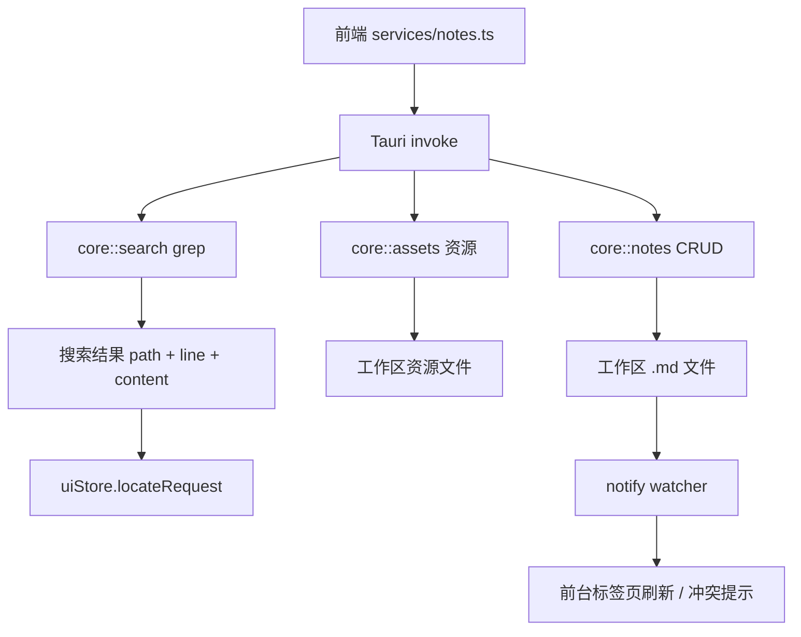

# 笔记 Notes 模块设计

Last updated: 2026-06-23

Status: implemented

## 目的

承载 Plexus 的笔记文件模型：本地 `.md` 文件的 CRUD、目录树、全文检索、图片/资源，以及前台标签页的自动刷新。落盘「真相」在 Rust 端。

## 职责

- 笔记 CRUD 与目录操作（`core::notes`：list/read/create/create_dir/update/delete/move/reveal）。
- 全文检索（`core::search`，基于 grep-regex/grep-searcher/ignore，字面量、限 `.md`、上限 50，返回 `{path,line,content}`）。
- 资源/图片（`core::assets`：粘贴/拖入写资源、读 data URL、聊天图片）。
- 文件监听（`watcher.rs`，notify）：前台笔记被外部改动后，干净状态静默刷新并保留滚动，脏状态弹非破坏性冲突提示。
- 前端笔记树 UI（`components/NoteTree/`）、快速打开（`QuickOpenModal`/`quickOpenNotes`）、全局搜索弹框（`GlobalSearchModal`）、最近笔记（`recentNotes`）。

## 边界

- In scope：笔记文件的读写/检索/监听（Rust）+ 笔记树/快速打开/搜索 UI 与服务封装（前端）。
- Out of scope：编辑器内编辑体验（Editor 模块）；git 同步（Sync 模块）；AI 工具对笔记的调用（AI Tools，经同一组命令）。

## 接口与契约

- 前端 `services/notes.ts`/`assets.ts`/`noteCreation.ts` → Tauri 命令（`list_notes`/`read_note`/`create_note`/`update_note`/`delete_note`/`move_note`/`reveal_note`/`write_asset`/`search_notes`…）。
- `core::notes::resolve(root, rel)`：相对路径解析 —— **空 rel 会塌缩到工作区根目录**，故 `write_file` 拒绝空 `rel` 与目录目标（`AppError::InvalidInput`）。
- 检索命中投递 `uiStore.locateRequest{path,line,query,nonce}` 供 Editor 定位（见 ui-shell / editor）。

## 数据与状态

- 磁盘：工作区内 `.md` 文件为笔记本体；`.plexus/` 存元数据（会话、配置等）。
- 前端：`workspaceStore`（当前工作区与笔记树）、标签页 `tabsStore`、`uiStore`（快速打开/全局搜索开关、定位请求）。
- 会话历史可作为「实锤」排查工具行为：`grep -l "串" .plexus/sessions/*.json` 定位出事会话。

## 运行流程

- 打开笔记：树/快速打开/搜索命中 → 打开标签页 → `read_note` → 交 Editor。
- 写笔记：Editor/AI Tools → `update_note` → Rust 写盘 → watcher 通知前台标签页刷新。
- 检索：⌘⇧F → `search_notes`（grep）→ 扁平结果 + 高亮预览 → 选中投递 locateRequest。

## 运行流程图

## 依赖

- Rust `core::notes`/`core::search`/`core::assets` + `watcher`。
- Editor（消费草稿与定位）、UI Shell（树/弹框宿主）、AI Tools（经同组命令读写）。

## Planned Changes

> 仅列已写 spec、尚未实现的设计变更；当前无此类条目（代码块高亮渲染归 Editor 模块）。

| Date | Change | Status | Spec | Detail |
| --- | --- | --- | --- | --- |
| — | （暂无） | — | — | — |

## 风险与开放问题

- 空相对路径写入风险已在 Rust 层根上防御（见上）。
- 全文检索为字面量、限 `.md`、上限 50，暂不支持正则/范围筛选。
