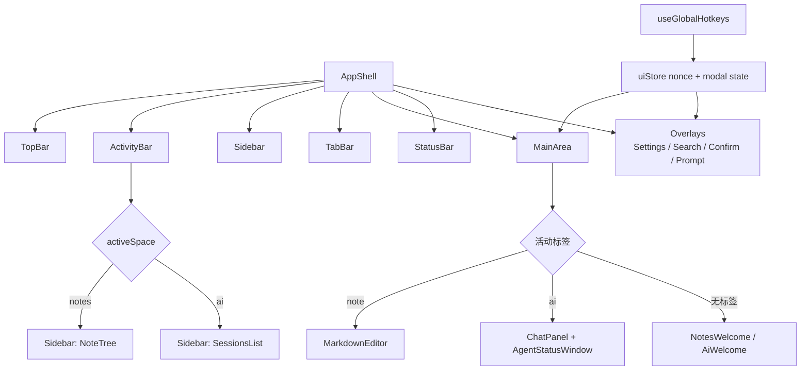

# UI 外壳 UI Shell 模块设计

Last updated: 2026-06-23

Status: implemented

## 目的

组合应用整体布局与导航骨架：活动栏、侧栏、标签页、主区域、状态栏，以及全局快捷键、各类弹框（快速打开/全局搜索/确认/提示）与空状态引导页。是各功能模块 UI 的宿主与编排层。

## 职责

- 布局骨架（`components/Layout/`：`AppShell`、`ActivityBar`、`Sidebar`、`MainArea`、`TabBar`、`TopBar`、`StatusBar`）。
- 空间切换（`activeSpace`：笔记 / AI），`MainArea` 按空间分发笔记编辑器或聊天面板，无标签页时显示引导页（`NotesWelcome`/`AiWelcome`）。
- 弹框：`QuickOpenModal`（⌘P）、`GlobalSearchModal`（⌘⇧F）、`AppConfirmDialog`、`PromptDialog`。
- 全局快捷键（`shortcuts.ts`、`useGlobalHotkeys`）：⌘E/⌘B/⌘S/⌘L/⌘P/⌘F/⌘⇧F，escapeBack 关闭弹框；与原生菜单快捷键经 `menu` 命令对接。

## 边界

- In scope：布局、导航、空间分发、弹框宿主、全局快捷键、空状态引导、设置弹框（`Settings/`）骨架。
- Out of scope：编辑器内部（Editor）、聊天面板内部（AIChat / AI Agent）、笔记树节点逻辑（Notes）、同步设置内容（Sync 的 `GitRemoteSection` 由本模块宿主但逻辑属 Sync）。

## 界面示意图

### 主窗口骨架（`AppShell`）

```
┌──────────────────────────────────────────────────────────┐
│ T  TopBar                                                  │
├────┬───────────────┬───────────────────────────────────────┤
│ A  │ S  Sidebar    │ M1 TabBar                              │
│ 活 │ （sidebarWidth ├───────────────────────────────────────┤
│ 动 │  可调，        │ M2 MainArea                            │
│ 栏 │  sidebarCollapsed                                      │
│    │  可折叠隐藏）  │                                        │
├────┴───────────────┴───────────────────────────────────────┤
│ B  StatusBar                                               │
└──────────────────────────────────────────────────────────┘
```

| 代号 | 区域 | 组件 | 作用 |
| --- | --- | --- | --- |
| T | 顶栏 | `TopBar` | 标题/窗口级控制 |
| A | 活动栏 | `ActivityBar` | 切换 `activeSpace`（笔记 / AI） |
| S | 侧栏 | `Sidebar` | 随空间显示树或会话列表；宽度 `sidebarWidth`、可折叠 `sidebarCollapsed` |
| M1 | 标签栏 | `TabBar` | 已打开标签页/活动标签页 |
| M2 | 主区域 | `MainArea` | 按空间+活动标签分发内容（见下） |
| B | 状态栏 | `StatusBar` | 全局状态展示 |
| O | 叠加层 | `SettingsModal`/`AiConfigModal`/`ConfirmToolDialog`/`PromptDialog`/`AppConfirmDialog`/`QuickOpenModal`/`GlobalSearchModal` + `escape-toast` | 居中/全屏弹框与轻提示 |

### 两个工作空间的 S/M2 内容（按 `activeSpace` 与活动标签）

```
 笔记空间 notes                         AI 空间 ai
┌──────────┬────────────────────┐   ┌──────────┬────────────────────┐
│ S: 笔记树 │ M2: MarkdownEditor │   │ S: 会话   │ M2: ChatPanel       │
│ NoteTree │ （有 note 标签）    │   │ 列表      │  + AgentStatusWindow│
│          │ —— 或 ——           │   │ Sessions  │ （有 ai 标签）       │
│          │ NotesWelcome        │   │ List      │ —— 或 ——            │
│          │ （无标签页）        │   │           │ AiWelcome（无标签页）│
└──────────┴────────────────────┘   └──────────┴────────────────────┘
```

| 空间 | S（侧栏内容） | M2（主区域内容） |
| --- | --- | --- |
| 笔记 notes | `NoteTree`（笔记目录树 + 新建/打开） | note 标签→`MarkdownEditor`；无标签→`NotesWelcome` 引导页 |
| AI ai | `SessionsList`（会话列表 + 新建会话） | ai 标签→`ChatPanel`（叠加 `AgentStatusWindow`）；无标签→`AiWelcome` 引导页 |

> 空间分发逻辑：`Sidebar` 按 `activeSpace` 选择 NoteTree/SessionsList；`MainArea` 按 `activeSpace` + 活动标签 `kind` 选择编辑器/聊天/引导页。

## 接口与契约

- 通过 `uiStore` 协调跨模块 UI 状态：`activeSpace`、快速打开/全局搜索开关、查找开关与 nonce、`locateRequest`（投递给 Editor 定位）。
- nonce 范式：`chatFocusNonce`/`findNonce`/`locateRequest.nonce` 等用递增 nonce 触发一次性副作用（聚焦/定位）。
- 快捷键经 `shortcuts.ts` 集中定义，`useGlobalHotkeys` 绑定；`menu.ts` 同步原生菜单。

## 数据与状态

- `uiStore`：空间、弹框开关、查找/定位请求、focus nonce。
- `tabsStore`：打开的标签页与活动标签页。
- `settingsStore`：通用设置；`appConfirmStore`/`promptStore`/`confirmStore`：弹框队列。

## 运行流程

- 启动渲染：`AppShell` → 按 `activeSpace` 渲染笔记区（标签页 + Editor）或 AI 区（SessionsList + ChatPanel），空则引导页。
- 快捷键：`useGlobalHotkeys` 捕获 → 触发 store 动作（开弹框/切空间/查找）。
- 定位：搜索命中 → `uiStore.locateRequest` → Editor effect 消费。

## 运行流程图




## 依赖

- Editor、AIChat（ChatPanel/SessionsList）、Notes（NoteTree/QuickOpen/GlobalSearch）、Settings/Sync 设置区作为子内容。
- `uiStore`/`tabsStore`/`settingsStore`。

## Planned Changes

> 仅列已写 spec、尚未实现的设计变更；当前无此类条目。

| Date | Change | Status | Spec | Detail |
| --- | --- | --- | --- | --- |
| — | （暂无） | — | — | — |

## 风险与开放问题

- 无全局 ErrorBoundary：子树渲染异常（如 zustand selector 返回新引用导致无限重渲染）会整窗白屏；当前靠 selector 纪律规避，是否补 ErrorBoundary 待定。
