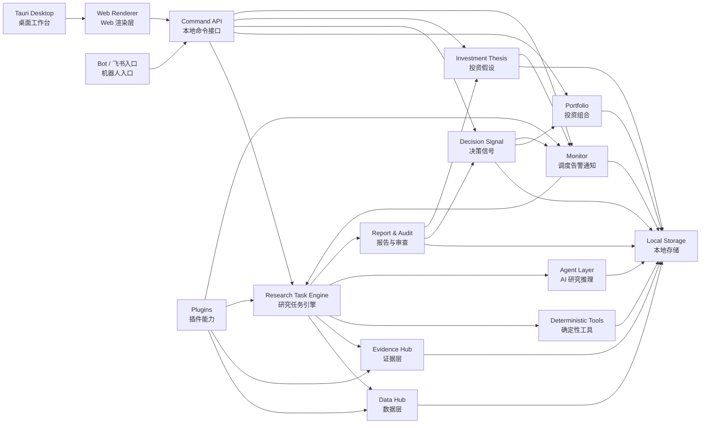
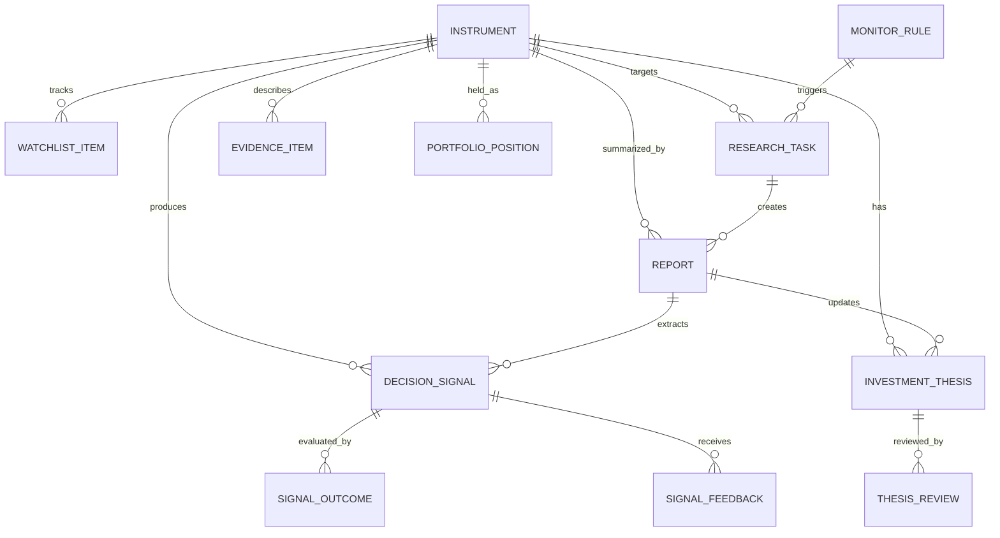
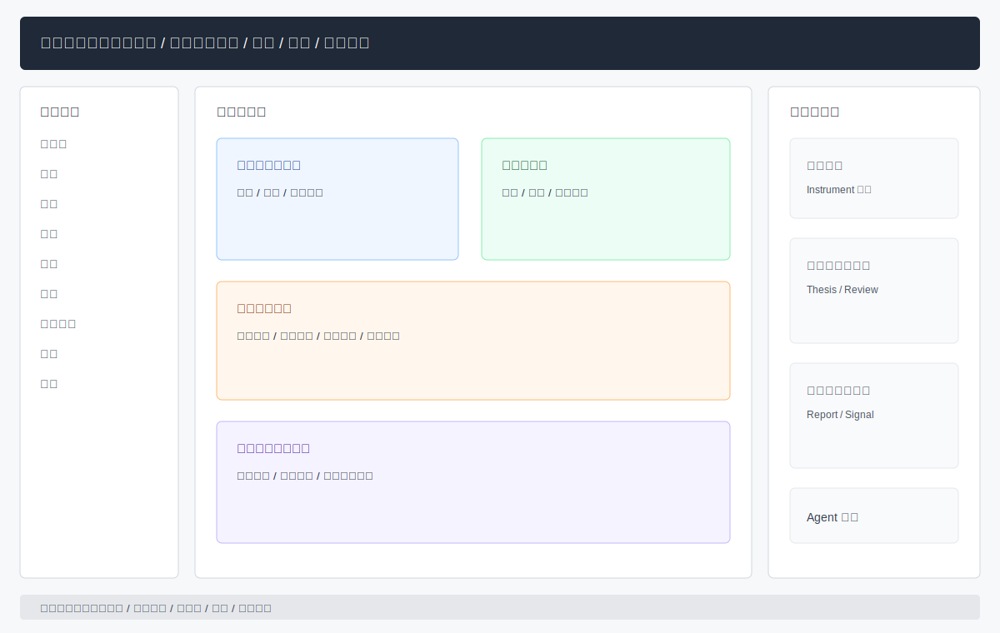
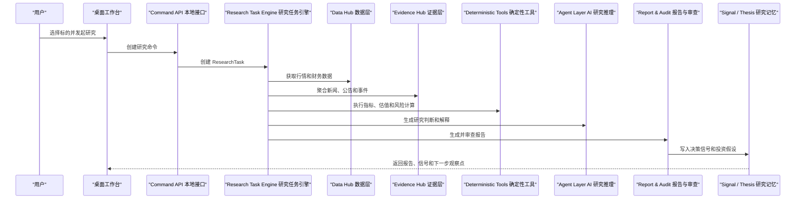
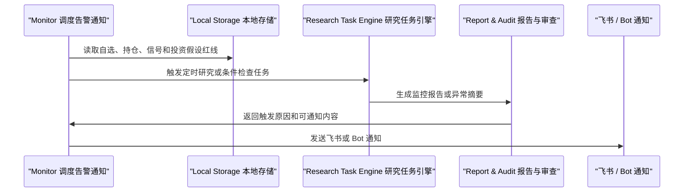
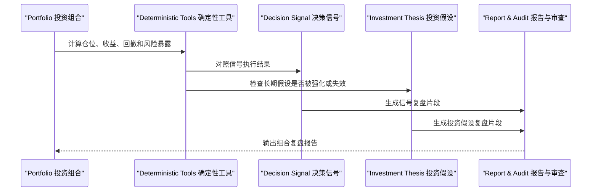
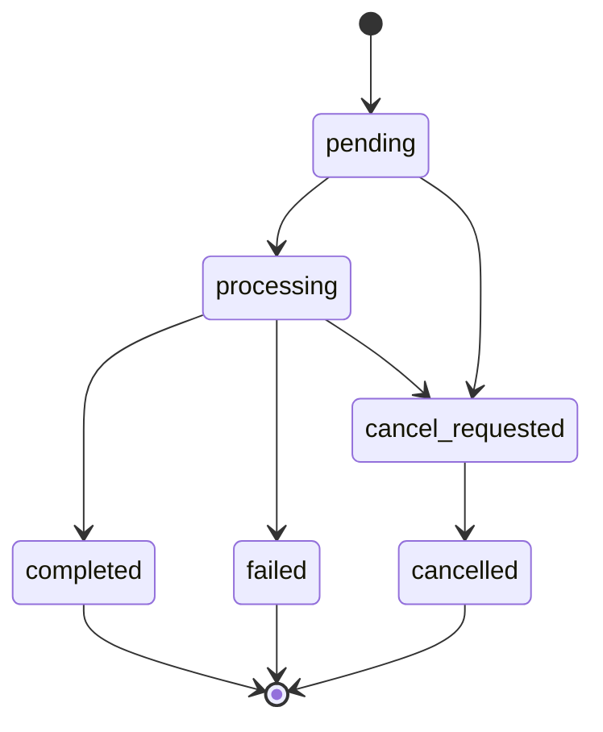
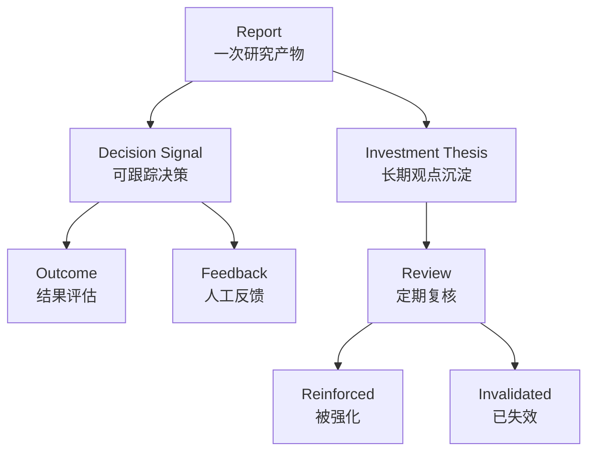

# 股票智能分析 v1 主设计文档

最后更新：2026-06-28

状态：accepted（已接受，用户已确认）

## 概览

本项目 v1 的目标是把当前 demo（演示版本）收敛为个人桌面端优先的 AI 投研工作台。系统面向个人使用，不做复杂 SaaS（软件即服务）后台；桌面端作为主入口，本地 API（应用程序接口）作为能力边界，任务引擎负责编排研究、监控、复盘和插件任务。

核心定位：

- AI Agent（人工智能代理）负责研究、推理、综合、解释和交互。
- Deterministic Tools（确定性工具）负责行情指标、估值、组合风险、数据质量和结果核算。
- Report（报告）是一次研究任务的产物。
- DecisionSignal（决策信号）是从报告或人工输入中提取出来、可跟踪结果的决策。
- InvestmentThesis（投资假设）是中长期研究记忆，用来沉淀观点、跟踪条件和失效规则。
- Instrument（标的）是全局中心实体，股票、ETF（交易型开放式指数基金）、指数、期货、基金、加密资产等都通过它统一关联。

## 系统范围

### 范围内

- 个人桌面端工作台：自选、持仓、研究任务、信号、报告和投资假设。
- 本地 API 和命令层：承接 Web Renderer（Web 渲染层）、Bot（机器人）和桌面命令。
- 多资产标的模型：以 `Instrument`（标的）统一股票、ETF、指数、期货等对象。
- 数据、证据、确定性计算和 AI Agent 分层。
- 报告生成、报告审查、决策信号、长期投资假设、组合复盘。
- 调度、告警、飞书通知和 Bot 通知。
- AlphaSift、图片识别和扩展通知以 Plugin（插件）形式纳入 v1 边界。
- Electron（旧桌面封装）、复杂 Web 后台、SaaS Auth（多用户认证）作为 Legacy/Exit（旧模块退场）边界管理。

### 范围外

- 面向多租户的云端 SaaS 后台。
- 真实交易下单和券商交易执行。
- 高频交易、毫秒级行情、实时盘口撮合。
- 将 AI Agent 作为价格、仓位、估值、风控计算的唯一来源。

## 当前 demo 事实

当前代码已经具备以下基础能力：

| 领域 | 当前事实 |
| --- | --- |
| 服务入口 | `server.py`、`api/app.py`、`api/v1/router.py` 提供 FastAPI（Python Web 接口框架）服务 |
| API 分组 | 已有 `analysis`、`agent`、`portfolio`、`alerts`、`decision-signals`、`intelligence`、`backtest`、`stocks`、`system` 等分组 |
| 存储 | `src/storage.py` 集中定义 SQLite（轻量本地数据库）ORM（对象关系映射）表 |
| 任务 | `src/services/task_queue.py` 提供内存异步分析队列、线程池和 SSE（服务器推送事件） |
| Agent | `src/agent/orchestrator.py` 已有 Technical、Intel、Risk、Specialist、Decision 的顺序多 Agent 编排 |
| 投资组合 | 已有账户、交易、现金、公司行动、持仓、批次、快照、汇率和风险响应模型 |
| 决策信号 | 已有信号创建、状态、结果评估和反馈模型 |
| 告警通知 | 已有告警规则、触发记录、通知尝试和冷却记录 |
| 情报 | 已有资讯源、资讯条目和抓取接口 |
| 桌面 | 已有 Electron 目录，并完成 Tauri 探索目录 |

当前主要缺口是：缺少一等 `Instrument`（标的）、一等 `ResearchTask`（研究任务）、一等 `Report`（报告）和一等 `InvestmentThesis`（投资假设）；报告、信号、长期观点之间的关系也需要明确化。

## 模块地图

| 模块 | 职责 | 状态 | 备注 |
| --- | --- | --- | --- |
| [Desktop Workbench](modules/desktop-workbench.md) | Tauri（桌面应用封装框架）优先的个人工作台 | accepted | |
| [Command API](modules/command-api.md) | Local API（本地接口）与命令入口 | accepted | |
| [Instrument](modules/instrument.md) | 全局标的中心 | accepted | |
| [Watchlist](modules/watchlist.md) | 自选与观察入口 | accepted | |
| [Data Hub](modules/data-hub.md) | 行情、财务、市场数据入口 | accepted | |
| [Evidence Hub](modules/evidence-hub.md) | 新闻、公告、财报、事件证据层 | accepted | |
| [Research Task Engine](modules/research-task-engine.md) | 研究任务编排层 | accepted | |
| [Agent Layer](modules/agent-layer.md) | AI Agent（人工智能代理）研究推理层 | accepted | |
| [Deterministic Tools](modules/deterministic-tools.md) | 确定性计算和校验工具 | accepted | |
| [Report Audit](modules/report-audit.md) | 报告产物和质量准出 | accepted | |
| [Decision Signal](modules/decision-signal.md) | 可跟踪决策信号 | accepted | |
| [Investment Thesis](modules/investment-thesis.md) | 中长期投资假设记忆 | accepted | |
| [Portfolio](modules/portfolio.md) | 投资组合、持仓、风险 | accepted | |
| [Monitor](modules/monitor.md) | 调度、告警、通知 | accepted | |
| [Evaluation](modules/evaluation.md) | 回测和信号复盘 | accepted | |
| [Plugins](modules/plugins.md) | AlphaSift、图片识别和扩展通知 | accepted | |
| [Legacy Boundaries](modules/legacy-boundaries.md) | Electron、SaaS Auth、复杂 Web 后台的弱化边界 | accepted | |

## 全局架构图

下图描述 v1 目标模块关系。图中的“目标”表示经过本轮讨论确认的方向，不代表全部已经在代码中落地。

## 核心数据关系

数据关系解释：

- `Instrument`（标的）是全局中心。
- `ResearchTask`（研究任务）是一次研究、监控、复盘或插件任务。
- `EvidenceItem`（证据条目）统一新闻、公告、财报、事件和外部情报。
- `Report`（报告）是一项任务产物。
- `DecisionSignal`（决策信号）是可跟踪、可评价的行动建议。
- `InvestmentThesis`（投资假设）是长期观点和失效条件。
- `MonitorRule`（监控规则）可以触发新的研究任务。

## 桌面工作台布局

布局说明：

| 区域       | 作用                                                       |
| ---------- | ---------------------------------------------------------- |
| 顶部命令栏 | 全局搜索、创建研究任务、刷新、设置、模型和数据状态         |
| 左侧导航   | 工作台、自选、持仓、任务、报告、信号、投资假设、监控、插件 |
| 中央工作区 | 当前视图的主内容，例如持仓、信号、任务列表和报告阅读       |
| 右侧检查器 | 当前标的的摘要、投资假设、红线、最近报告和 Agent 对话      |
| 底部状态条 | 本地服务、任务运行、数据源、通知和同步状态                 |

## 核心运行链路

### 主动研究链路

### 定时监控链路

### 组合复盘链路

## 状态模型

### 研究任务状态

任务状态沿用当前 demo 的 `pending`（等待）、`processing`（处理中）、`completed`（完成）、`failed`（失败）、`cancel_requested`（请求取消）、`cancelled`（已取消），但 v1 需要让任务持久化，而不是只存在内存队列里。

### 信号和投资假设关系

约定：

- 一份 `Report`（报告）可以产生多个 `DecisionSignal`（决策信号）。
- 多份 `Report`（报告）可以修正同一个 `InvestmentThesis`（投资假设）。
- `DecisionSignal`（决策信号）必须能被 `Outcome`（结果）和 `Feedback`（反馈）评价。
- `InvestmentThesis`（投资假设）必须有 Review（复核）、Invalidated（失效）或 Reinforced（强化）状态。

## 共享约束

- Local-first（本地优先）：默认数据、配置、任务和报告在本地保存。
- Personal-first（个人优先）：不引入复杂多用户权限、租户、计费和管理员后台。
- Modular（模块化）：模块以职责和数据所有权划边界，不以页面或函数临时堆叠为边界。
- Deterministic before AI（先确定性再 AI）：数据抓取、指标、估值、组合核算、风险和报告审查优先由程序完成。
- Agent as researcher（Agent 是研究员）：Agent 可以调用工具、解释结果、提出观点，但不直接替代数据真实性和公式计算。
- Report is not signal（报告不是信号）：报告是内容产物，信号是可跟踪的决策对象。
- Plugin isolation（插件隔离）：插件可以提供能力，但不能成为核心数据模型的隐式依赖。
- Compatibility（兼容）：v1 采用兼容式演进，旧 `stock_code` 字段保留过渡，新结构逐步引入 `instrument_id`。
- No secrets in PM（项目记忆不存密钥）：文档不得记录 token、key、账号密码或私有凭证。

## 跨模块决策

| 日期 | 决策 | 模块 | 备注 |
| --- | --- | --- | --- |
| 2026-06-28 | 采用兼容式演进，不推倒重写 | 全局 | 当前 demo 已有组合、信号、告警、情报、Agent 等基础能力 |
| 2026-06-28 | `Instrument`（标的）作为全局中心实体 | Instrument、Data、Portfolio、Signal、Thesis | 旧 `stock_code` 作为兼容字段保留 |
| 2026-06-28 | v1 全模块覆盖，但用 Core、Built-in、Plugin、Legacy/Exit 区分成熟度 | 全局 | 避免所有模块同等复杂度膨胀 |
| 2026-06-28 | Tauri 作为桌面主线，Electron 后续退场 | Desktop、Legacy | Web Renderer 继续作为桌面 UI 渲染层 |
| 2026-06-28 | 报告、信号、投资假设三层分离 | Report、Signal、Thesis | 报告产出内容，信号跟踪决策，假设沉淀长期观点 |
| 2026-06-28 | 调度和通知合并为 Monitor 模块 | Monitor | v1 默认飞书 + Bot，其他通知渠道走插件 |

## 未决问题

- v1 首批 `instrument_type`（标的类型）是否只开放 `stock`、`etf`、`index`、`future`、`fund`、`crypto`，还是还要加入 `fx`（外汇）和 `bond`（债券）。
- `InvestmentThesis`（投资假设）的默认复核周期需要确认：按周、按月、按财报周期，还是由红线条件触发。
- `Plugin`（插件）是否允许直接写入核心表，还是必须通过 Command API（本地命令接口）写入。
- 旧 `analysis_history`（分析历史）迁移到 `Report`（报告）的策略需要在实现设计阶段单独细化。

## 审查记录

| 日期 | 类型 | 结果 | 备注 |
| --- | --- | --- | --- |
| 2026-06-28 | 自动审查 | reviewed（已审查） | 模块索引路径存在，主图和 SVG 引用基础校验通过；用户已确认，当前状态更新为 accepted（已接受） |

