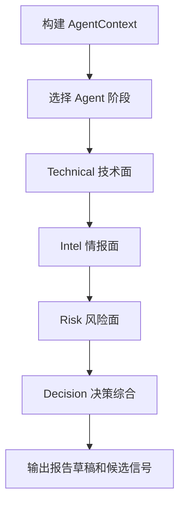

# Agent Layer（AI 研究推理层）设计

最后更新：2026-06-28

状态：accepted（已接受，用户已确认）

## 目的

Agent Layer（AI 研究推理层）负责把数据、证据和确定性工具结果组织成可读、可解释、可追问的研究判断。它是研究员，不是数据源，也不是公式计算器。

## 当前 demo 事实

- `src/agent/orchestrator.py` 已有多 Agent 顺序编排：Technical、Intel、Risk、Specialist、Decision。
- `src/agent/protocols.py` 定义了 `AgentContext`、`AgentOpinion`、`StageResult`、`AgentRunStats`。
- 当前已有 quick、standard、full、specialist 等模式。

## 职责

- 根据任务类型选择 Agent 流程和 skill（技能）策略。
- 调用工具获取或解释数据，但不直接承担数据真实性。
- 生成研究观点、风险点、催化剂、问题清单和报告草稿。
- 记录 provider turn（模型调用轮次）、LLM usage（大模型用量）和 trace（追踪信息）。

## 边界

范围内：推理、综合、解释、提问、生成结构化观点。

范围外：不直接写核心数据库，不做价格和组合核算，不绕过 Report Audit 输出正式报告。

## 接口与契约

- 输入：`ResearchTask`、`EvidencePack`、`ToolResult`、用户上下文。
- 输出：`AgentRun`、`AgentOpinion`、报告草稿、候选信号、候选投资假设更新。
- Agent 输出必须标记置信度、依据和缺失信息。

## 数据与状态

- 继续保留 `conversation_messages`、`conversation_summaries`、`agent_provider_turns`、`llm_usage`。
- Agent 过程数据属于 trace（追踪）和 memory（记忆），不是最终投资结论。

## 运行流程

## 依赖

- Research Task Engine。
- Evidence Hub。
- Deterministic Tools。
- Report Audit。

## 风险与未决问题

- 不同模型输出结构不稳定，必须通过 schema（结构约束）和审查层兜底。
- Agent 不应直接覆盖人工维护的 Investment Thesis，必须生成建议更新。
