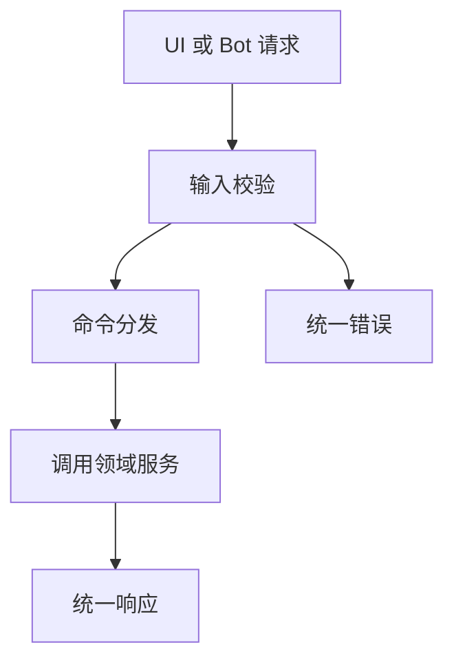

# Command API（本地命令接口）设计

最后更新：2026-06-28

状态：proposed（建议稿，待人工确认）

## 目的

Command API（本地命令接口）是桌面端、Web Renderer（Web 渲染层）、Bot（机器人）和脚本调用核心能力的统一入口。它承接用户意图，转换为稳定的业务命令。

## 当前 demo 事实

- `api/v1/router.py` 已聚合 `auth`、`agent`、`analysis`、`history`、`stocks`、`backtest`、`system`、`usage`、`portfolio`、`alerts`、`decision-signals`、`alphasift`、`intelligence`、`health`。
- `api/app.py` 挂载 `/api/v1`。
- 当前 API 仍以功能端点为主，缺少统一命令语义。

## 职责

- 将 UI、Bot 和脚本请求转换成 `ResearchTask`（研究任务）、Portfolio（投资组合）、Signal（信号）、Thesis（投资假设）等领域命令。
- 负责输入校验、权限边界、错误结构、幂等键和兼容字段。
- 暴露本地服务健康、配置、日志和诊断状态。

## 边界

范围内：请求模型、响应模型、错误码、命令分发、兼容字段映射。

范围外：不直接实现数据源抓取、AI 推理、组合核算和报告生成。

## 接口与契约

- 新接口优先围绕领域资源设计：`Instrument`、`ResearchTask`、`Report`、`DecisionSignal`、`InvestmentThesis`、`Portfolio`、`Monitor`。
- 旧接口可以保留，但内部应逐步转发到新命令。
- 本地个人使用场景可以保留最小认证边界，不引入复杂 SaaS Auth（多用户认证）。

## 数据与状态

- API 本身不拥有业务状态。
- 请求日志、诊断 trace（追踪标识）和错误上下文可落到运行日志或任务记录。

## 运行流程

## 依赖

- Research Task Engine（研究任务引擎）。
- Portfolio、Signal、Thesis、Monitor 等领域服务。
- System Config（系统配置）和运行诊断。

## 风险与未决问题

- 旧 API 字段如 `stock_code` 和新 `instrument_id` 的兼容策略需要单独设计。
- 本地认证边界要足够简单，但不能让桌面端暴露敏感配置。
