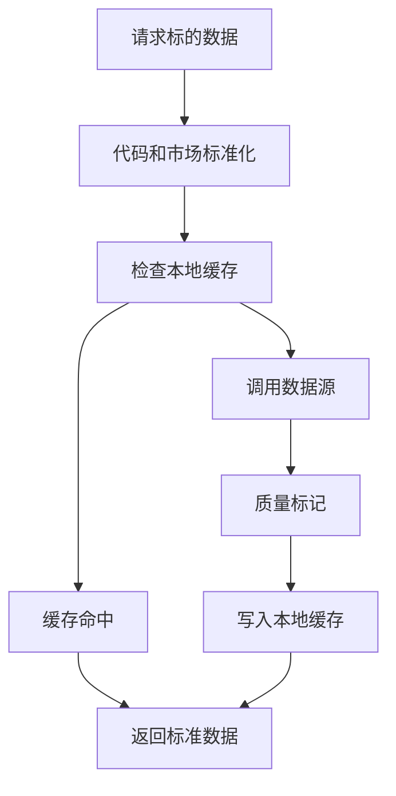

# Data Hub（数据层）设计

最后更新：2026-06-28

状态：proposed（建议稿，待人工确认）

## 目的

Data Hub（数据层）统一管理行情、财务、市场和基础数据源。它负责获取、标准化、缓存、降级和质量标记，不负责给出投资结论。

## 当前 demo 事实

- 当前 `data_provider/` 已包含 AkShare、Tushare、Yahoo Finance、Longbridge、Finnhub 等 fetcher（抓取器）。
- `src/storage.py` 已有 `stock_daily` 和 `fundamental_snapshot` 等表。
- 当前数据源 fallback（失败降级）逻辑分散在服务与 provider 中。

## 职责

- 统一数据源适配、代码标准化、市场识别和币种识别。
- 提供行情、历史 K 线、财务快照、指数和市场上下文。
- 缓存数据并标记来源、时间、完整性和是否过期。
- 单一数据源失败时提供降级路径和明确诊断。

## 边界

范围内：数据获取、标准化、缓存、质量摘要、失败诊断。

范围外：不生成投资观点，不写报告，不发通知。

## 接口与契约

- 输入优先使用 `instrument_id`。
- 输出必须包含 `data_source`（数据来源）、`as_of`（数据时间）、`quality`（质量摘要）。
- 返回数据需要区分“无数据”和“数据源失败”。

## 数据与状态

- 旧 `stock_daily` 可继续作为日线缓存。
- v1 可新增或抽象 `MarketDataSnapshot`（市场数据快照）和 `FundamentalSnapshot`（财务快照）。
- 所有数据写入都应关联 `instrument_id`，旧代码字段保留兼容。

## 运行流程

## 依赖

- Instrument（标的）。
- Local Storage（本地存储）。
- Deterministic Tools（确定性工具）读取 Data Hub 输出进行计算。

## 风险与未决问题

- 不同市场和数据源字段单位不一致，必须在 Data Hub 层统一。
- 公开数据源稳定性有限，错误诊断需要可展示给用户。
