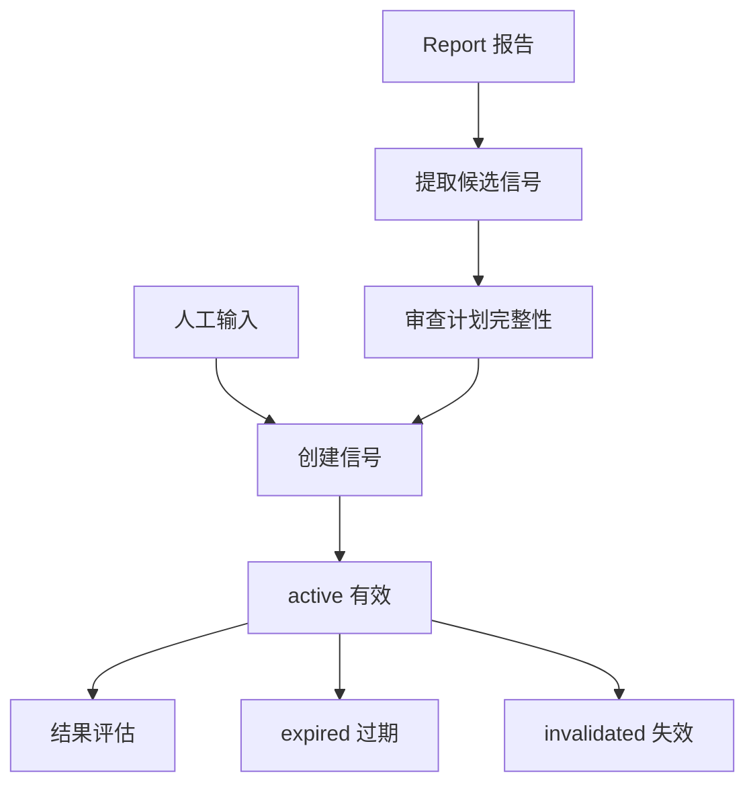

# Decision Signal（决策信号）设计

最后更新：2026-06-28

状态：accepted（已接受，用户已确认）

## 目的

Decision Signal（决策信号）承载可跟踪的短中期行动建议，例如买入、卖出、持有、观察、止损、等待确认。它不是报告正文，而是可以被评估结果的决策对象。

## 当前 demo 事实

- 当前已有 `decision_signals`、`decision_signal_outcomes`、`decision_signal_feedback`。
- API schema（接口结构）已包含来源、状态、周期、入场区间、止损、目标价、失效条件、证据、计划质量和反馈。

## 职责

- 保存来自报告、Agent、告警、市场复盘和人工输入的信号。
- 跟踪信号状态：active（有效）、expired（过期）、invalidated（失效）、closed（关闭）、archived（归档）。
- 保存入场、止损、目标、观察条件、理由、风险和证据。
- 评估信号 outcome（结果）并接收人工 feedback（反馈）。

## 边界

范围内：可跟踪决策、短中期动作、结果评估、反馈。

范围外：不替代 Investment Thesis（长期投资假设），不代表真实下单。

## 接口与契约

- 必须关联 `instrument_id`，兼容保留 `stock_code`。
- 必须记录 `source_type`（来源类型）和可追踪来源，例如 `source_report_id`。
- 带价格计划的信号必须尽量包含 entry（入场）、stop_loss（止损）、target_price（目标价）和 invalidation（失效条件）。

## 数据与状态

当前已有结构可保留并扩展：

- `decision_signals` 作为主表。
- `decision_signal_outcomes` 作为结果评估。
- `decision_signal_feedback` 作为人工反馈。

## 运行流程

## 依赖

- Instrument。
- Report & Audit。
- Deterministic Tools。
- Portfolio 和 Monitor。

## 风险与未决问题

- 长周期信号和 Investment Thesis 容易重叠，需要用 horizon（周期）和状态区分。
- 信号结果评估需要处理停牌、无数据和复权差异。
