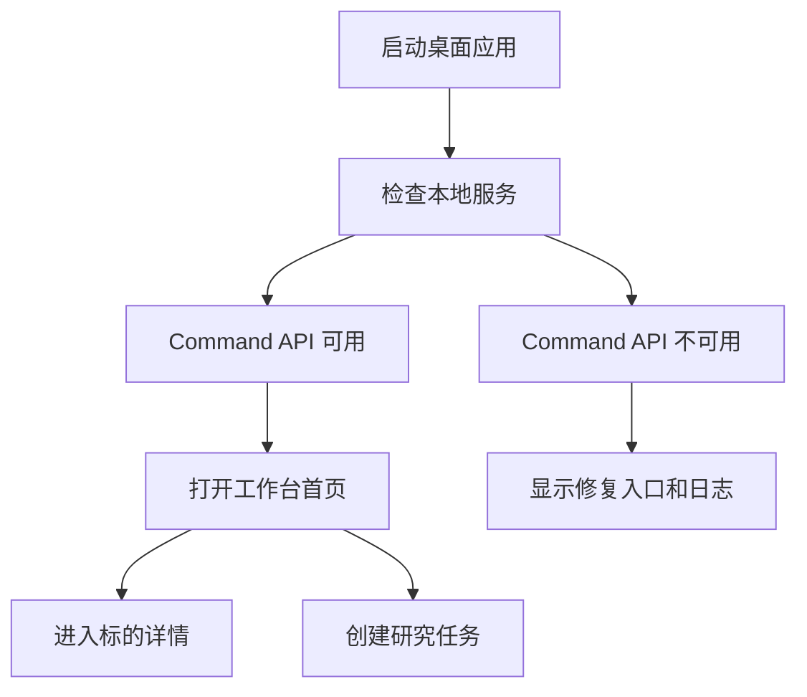

# Desktop Workbench（桌面工作台）设计

最后更新：2026-06-28

状态：accepted（已接受，用户已确认）

## 目的

Desktop Workbench（桌面工作台）是 v1 的主入口。它面向个人使用，把自选、持仓、研究任务、报告、决策信号、投资假设和监控状态放在一个本地优先的工作台里。

## 当前 demo 事实

- 当前仓库已有 `apps/dsa-web/` 作为 Web Renderer（Web 渲染层）。
- 当前仓库已有 `apps/dsa-desktop/` Electron（旧桌面封装）目录。
- 当前工作区已有 `apps/dsa-tauri/` Tauri（桌面应用封装框架）探索目录。

## 职责

- 管理桌面窗口、导航、页面布局和本地服务状态。
- 提供工作台首页：自选、持仓、任务、信号、报告、投资假设、异常提醒。
- 提供标的详情页：行情、证据、报告、信号、投资假设和 Agent 对话。
- 提供任务、监控、插件和系统设置入口。
- 以清晰状态展示数据源、模型、通知和本地服务是否可用。

## 边界

范围内：Tauri 窗口、本地服务启动状态、Web Renderer 承载、桌面导航和主要页面组织。

范围外：不直接做投资计算，不直接抓取数据，不直接写核心业务表；这些能力通过 Command API（本地命令接口）调用。

## 接口与契约

- 调用 Command API 创建任务、查询报告、读取组合、管理信号和投资假设。
- 不直接访问数据库文件。
- 桌面端必须能显示任务运行状态、失败原因和通知状态。

## 数据与状态

- 仅保存 UI（用户界面）偏好、窗口状态、本地服务连接状态和最近访问标的。
- 业务事实以 Local Storage（本地存储）和 API 返回为准。

## 运行流程

## 依赖

- Command API（本地命令接口）。
- Web Renderer（Web 渲染层）。
- Monitor（调度告警通知）提供服务状态和通知状态。

## 风险与未决问题

- Tauri 打包后的 Python 后端启动、日志、退出和端口选择需要在实现设计里细化。
- Electron 退场需要明确迁移时间点，避免长期维护双桌面入口。
