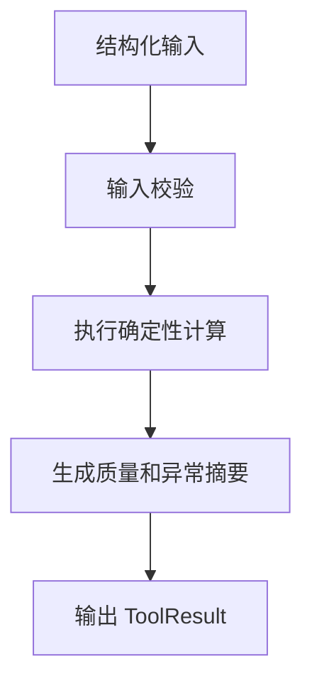

# Deterministic Tools（确定性工具）设计

最后更新：2026-06-28

状态：accepted（已接受，用户已确认）

## 目的

Deterministic Tools（确定性工具）负责所有必须可复现、可计算、可核验的部分，包括技术指标、估值、组合风险、信号结果评估、数据质量和报告一致性辅助检查。

## 当前 demo 事实

- 当前已有技术分析、组合风险、告警指标、回测、信号 outcome（结果评估）等服务雏形。
- 当前许多计算能力分散在 `src/services/` 中。

## 职责

- 计算行情指标、趋势、波动、支撑阻力和成交量指标。
- 计算估值、财务比率和数据完整性。
- 计算组合收益、回撤、集中度、止损风险和汇率影响。
- 计算 DecisionSignal（决策信号）的 outcome（结果）。
- 给 Report Audit 提供可验证事实和不一致提示。

## 边界

范围内：公式、规则、核算、校验、可重复计算。

范围外：不写长篇研究判断，不替代 Agent 的解释和综合。

## 接口与契约

- 输入必须来自 Data Hub、Portfolio 或 Evidence Hub 的结构化数据。
- 输出必须带 `engine_version`（计算引擎版本）、输入摘要和异常说明。
- 不允许静默返回空结果掩盖数据缺失。

## 数据与状态

- 工具结果可以作为 `ToolResult`（工具结果）挂到任务、报告和审查记录。
- 对可复盘结果，例如 signal outcome，应持久化。

## 运行流程

## 依赖

- Data Hub。
- Portfolio。
- Research Task Engine。
- Report Audit。

## 风险与未决问题

- 不同市场的交易日、复权、涨跌停、T+1（当天买入次日才能卖出）等规则需要分市场实现。
- 工具版本变更会影响历史结果，需要保留版本号。
