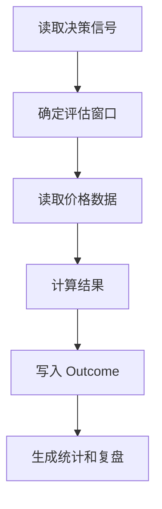

# Evaluation（回测和复盘评估）设计

最后更新：2026-06-28

状态：accepted（已接受，用户已确认）

## 目的

Evaluation（评估）负责回测、信号结果评估和研究质量复盘。v1 中它不是独立膨胀的大型量化平台，而是服务 Decision Signal、Portfolio 和 Report 的复盘能力。

## 当前 demo 事实

- 当前已有 `backtest_results`、`backtest_summaries`。
- 当前已有 `decision_signal_outcomes` 和 outcome 统计响应。

## 职责

- 评估 Decision Signal 在不同 horizon（周期）下的结果。
- 对策略或插件输出做基础回测。
- 为组合复盘提供信号命中率、失效原因和数据不可用原因。
- 保存评估引擎版本和输入摘要。

## 边界

范围内：信号 outcome、基础回测、结果统计、复盘证据。

范围外：不做复杂高频回测，不做真实交易执行，不替代 Portfolio 核算。

## 接口与契约

- 评估必须记录 `engine_version`。
- 对无法评估的信号，明确 `unable_reason`，不能静默跳过。
- 回测结果应能链接到 ResearchTask 和 Report。

## 数据与状态

- 旧 `backtest_*` 表可保留。
- 长期方向是让 backtest result（回测结果）和 signal outcome（信号结果）统一进入 EvaluationResult（评估结果）视角。

## 运行流程

## 依赖

- Data Hub。
- Deterministic Tools。
- Decision Signal。
- Report & Audit。

## 风险与未决问题

- 复权、停牌、涨跌停和市场假日会影响结果，必须记录数据质量。
- 回测能力容易膨胀，需要围绕信号复盘和个人研究保持克制。
