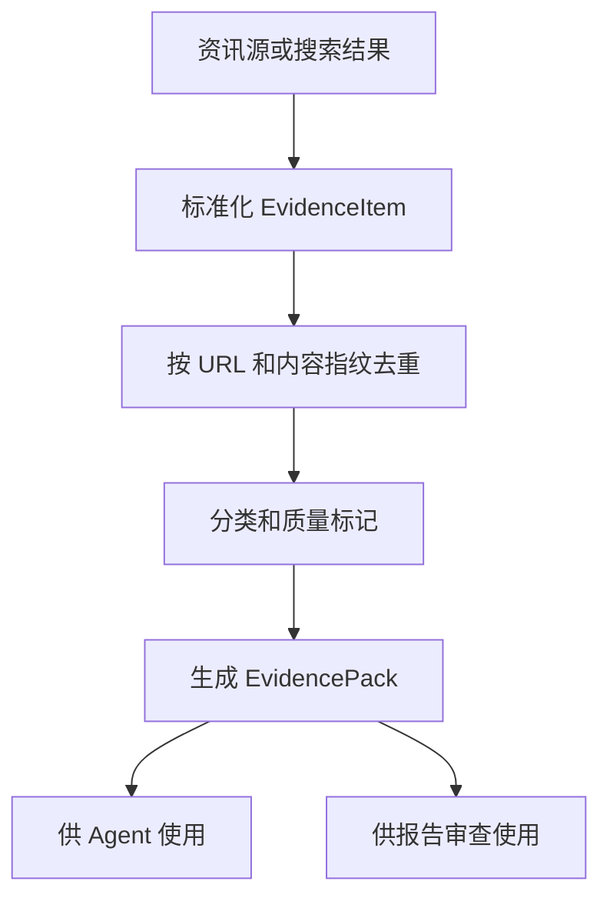

# Evidence Hub（证据层）设计

最后更新：2026-06-28

状态：accepted（已接受，用户已确认）

## 目的

Evidence Hub（证据层）统一管理新闻、公告、资讯源、财报摘要、事件和外部研究材料。它让 Agent 和报告知道“观点依据来自哪里”。

## 当前 demo 事实

- 当前已有 `news_intel`、`intelligence_sources`、`intelligence_items`、`fundamental_snapshot`。
- `api/v1/schemas/intelligence.py` 已支持 RSS（简易信息聚合格式）、Atom（信息聚合格式）和 NewsNow 资讯源。

## 职责

- 聚合可追溯证据，包括标题、摘要、URL、来源、发布时间、抓取时间和适用范围。
- 对证据做去重、过期标记、来源可信度和主题分类。
- 为 Research Task Engine、Agent Layer、Report Audit 提供证据包。

## 边界

范围内：证据采集、证据标准化、证据去重、证据质量和来源追踪。

范围外：不直接生成投资建议，不替代 Report Audit 的逻辑一致性检查。

## 接口与契约

建议输出 `EvidencePack`（证据包）：

| 字段 | 说明 |
| --- | --- |
| `instrument_id` | 标的 ID，可为空表示市场级证据 |
| `items` | 证据条目列表 |
| `coverage` | 覆盖范围，例如新闻、财报、行业、宏观 |
| `quality_summary` | 完整性、时效性和来源摘要 |
| `missing_topics` | 缺失主题，例如没有最新财报或没有公告 |

## 数据与状态

- `EvidenceItem`（证据条目）应统一当前 `news_intel` 和 `intelligence_items` 的语义。
- 原始 payload（载荷）可以保留，但报告和 Agent 使用结构化摘要。

## 运行流程

## 依赖

- Data Hub 提供财务和市场事实。
- Plugins 可提供额外证据来源。
- Report Audit 使用证据检查报告是否有依据。

## 风险与未决问题

- 搜索结果和资讯源可能有重复、低质量或广告内容，需要保留来源和质量标记。
- 证据摘要由 AI 生成时必须保留原始链接，避免不可追溯。
