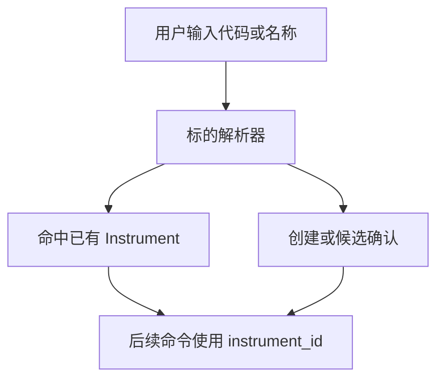

# Instrument（标的）设计

最后更新：2026-06-28

状态：accepted（已接受，用户已确认）

## 目的

Instrument（标的）是 v1 的全局中心实体。股票、ETF（交易型开放式指数基金）、指数、期货、基金、加密资产、外汇和债券等都可以作为标的被研究、持有、监控和沉淀观点。

## 当前 demo 事实

- 当前多数表和接口通过 `stock_code` 或 `symbol` 关联，没有一等 `Instrument` 表。
- 当前存储已有 `stock_daily`、`portfolio_positions`、`decision_signals` 等按代码组织的数据。

## 职责

- 统一标的身份、类型、市场、交易所、币种和扩展元数据。
- 为 Data Hub、Portfolio、Report、Signal、Thesis、Monitor 提供稳定关联点。
- 兼容旧 `stock_code`、`symbol` 字段，避免一次性迁移破坏现有功能。

## 边界

范围内：标的基本信息、类型、市场、交易所、币种、状态、别名和扩展元数据。

范围外：不保存行情明细，不保存报告正文，不保存持仓数量。

## 接口与契约

建议 v1 基础字段：

| 字段 | 说明 |
| --- | --- |
| `id` | 内部主键 |
| `symbol` | 展示和查询代码，例如 `AAPL`、`600519`、`HK00700`、`IF2409` |
| `name` | 名称 |
| `instrument_type` | 标的类型，例如 `stock`、`etf`、`index`、`future`、`fund`、`crypto`、`fx`、`bond` |
| `market` | 市场，例如 `cn`、`hk`、`us`、`global` |
| `exchange` | 交易所或来源 |
| `currency` | 计价币种 |
| `status` | 状态，例如 `active`、`inactive`、`delisted` |
| `metadata_json` | 扩展信息，例如行业、期货合约月份、ISIN（国际证券识别码） |

## 数据与状态

- v1 采用兼容式演进：新增 `instrument_id`，旧 `stock_code` / `symbol` 保留。
- 新写入优先带 `instrument_id`，旧数据通过映射服务补齐。

## 运行流程

## 依赖

- Data Hub 提供市场代码标准化和数据源映射。
- Command API 负责外部输入校验和候选选择。

## 风险与未决问题

- 期货是否拆出独立合约模型暂不在 v1 强制实现；v1 先让每个期货合约作为一个 Instrument。
- 多数据源代码格式差异需要在 Data Hub 中统一处理。
