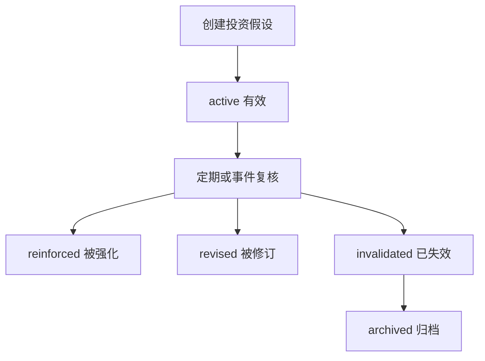

# Investment Thesis（投资假设）设计

最后更新：2026-06-28

状态：proposed（建议稿，待人工确认）

## 目的

Investment Thesis（投资假设）承载中长期研究记忆。它记录为什么关注或持有一个标的、关键假设是什么、哪些证据会强化观点、哪些红线会让观点失效。

## 当前 demo 事实

- 当前 demo 有报告、信号、组合和告警，但没有一等 `InvestmentThesis` 实体。
- 长期观点目前容易散落在报告正文或人工备注中。

## 职责

- 保存标的长期假设、核心逻辑、估值区间、关键跟踪指标、红线和复核周期。
- 接收报告提出的 thesis update（假设更新）建议。
- 被 Monitor 用于定时或事件触发复核。
- 与 Portfolio 结合，解释持仓理由和风险暴露。

## 边界

范围内：长期观点、假设、证据、红线、复核、状态。

范围外：不表示一次性买卖动作，不替代 Decision Signal。

## 接口与契约

建议核心字段：

| 字段 | 说明 |
| --- | --- |
| `id` | 主键 |
| `instrument_id` | 标的 ID |
| `title` | 假设标题 |
| `thesis_body` | 假设正文 |
| `status` | `active`、`watching`、`invalidated`、`archived` |
| `assumptions_json` | 核心假设 |
| `red_lines_json` | 失效红线 |
| `watch_metrics_json` | 跟踪指标 |
| `review_policy_json` | 复核规则 |
| `last_reviewed_at` | 最近复核时间 |
| `next_review_at` | 下次复核时间 |

## 数据与状态

- 每个 Instrument 可以有多个历史 thesis，但默认只有一个 active（有效）主 thesis。
- Thesis 更新建议需要人工确认或明确策略确认，不由 Agent 自动覆盖。

## 运行流程

## 依赖

- Instrument。
- Report & Audit。
- Evidence Hub。
- Monitor。
- Portfolio。

## 风险与未决问题

- 默认复核周期需要确认。
- Agent 更新 thesis 的权限必须谨慎，建议 v1 先只生成建议，不自动改正文。
