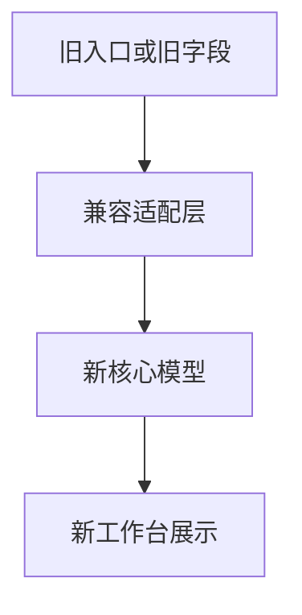

# Legacy Boundaries（旧模块边界）设计

最后更新：2026-06-28

状态：accepted（已接受，用户已确认）

## 目的

Legacy Boundaries（旧模块边界）明确哪些能力在 v1 中保留兼容、弱化或退场，防止系统被旧实现和非主线能力拖重。

## 当前 demo 事实

- 当前已有 Electron（旧桌面封装）目录 `apps/dsa-desktop/`。
- 当前已有 Web 前端能力，但 v1 不定位为复杂 SaaS 后台。
- 当前已有 Auth（认证）接口，但个人桌面端不需要复杂多用户权限体系。
- 当前已有多通知平台代码。

## 职责

- 记录 Electron、复杂 Web 后台、SaaS Auth、多通知渠道等非主线能力的处理策略。
- 为后续实现避免“两个桌面端、两套后台、多个通知主线”提供边界。

## 边界

范围内：兼容、弱化、插件化、退场策略。

范围外：不在本模块实现替换逻辑，不做迁移脚本。

## 接口与契约

| 能力 | v1 策略 |
| --- | --- |
| Electron | 保留兼容，Tauri 稳定后退场 |
| Web 后台 | 保留 Web Renderer，不做复杂 SaaS 管理后台 |
| SaaS Auth | 弱化为本地安全边界和配置保护 |
| 多通知渠道 | 默认飞书 + Bot，其他渠道插件化 |
| 旧 `stock_code` | 作为兼容字段保留，新增 `instrument_id` |
| `analysis_history` | 作为旧报告来源保留，逐步迁移到 `Report` |

## 数据与状态

- 旧字段和旧表不立即删除。
- 新写入优先采用新模型，旧模型通过适配层读取。

## 运行流程

## 依赖

- Instrument。
- Command API。
- Desktop Workbench。
- Report & Audit。

## 风险与未决问题

- 退场策略需要在实现阶段按模块拆分，不能一次性删除旧能力。
- 兼容层过长会造成维护成本，需要设定清晰收敛目标。
