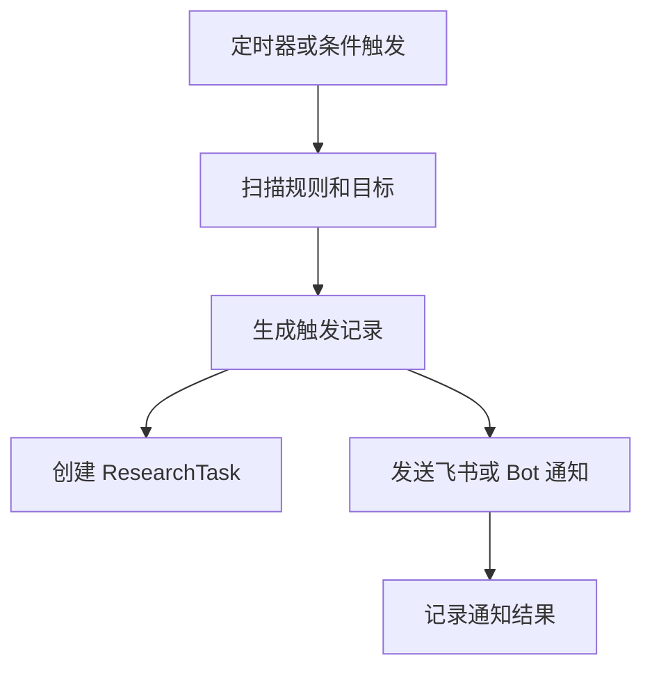

# Monitor（调度、告警、通知）设计

最后更新：2026-06-28

状态：proposed（建议稿，待人工确认）

## 目的

Monitor（调度、告警、通知）统一管理定时任务、条件触发、告警记录和通知发送。它不是核心研究引擎，但负责让系统按时间或事件自动工作。

## 当前 demo 事实

- 当前已有 `alert_rules`、`alert_triggers`、`alert_notifications`、`alert_cooldowns`。
- `api/v1/schemas/alerts.py` 已支持 target scope（目标范围）：单标的、自选、持仓、账户和市场。
- 当前已有调度相关服务和通知诊断。

## 职责

- 管理 `ScheduledJob`（定时任务）和 `MonitorRule`（监控规则）。
- 扫描 Watchlist、Portfolio、DecisionSignal 和 InvestmentThesis 的触发条件。
- 触发 ResearchTask 或发送通知。
- 管理飞书和 Bot 通知，其他渠道通过插件扩展。

## 边界

范围内：调度、条件检查、告警、通知、冷却、重试和通知诊断。

范围外：不做研究推理，不直接生成正式报告，不做组合核算。

## 接口与契约

- 默认通知渠道：飞书 + Bot。
- 通知必须可追踪：记录 channel（渠道）、attempt（尝试次数）、success（是否成功）、error_code（错误码）。
- 单一通知失败不应拖垮主研究流程。

## 数据与状态

- 现有 alert 表可作为 v1 基础。
- 新增 `ScheduledJob` 可统一定时研究、组合复盘、thesis 复核和情报抓取。

## 运行流程

## 依赖

- Research Task Engine。
- Watchlist、Portfolio、Decision Signal、Investment Thesis。
- Notification Routing（通知路由）和 Bot。

## 风险与未决问题

- 定时任务在桌面端关闭时如何处理，需要实现阶段决定：仅运行中触发，还是支持系统后台。
- 通知渠道扩展要走插件边界，避免核心模块持续膨胀。
