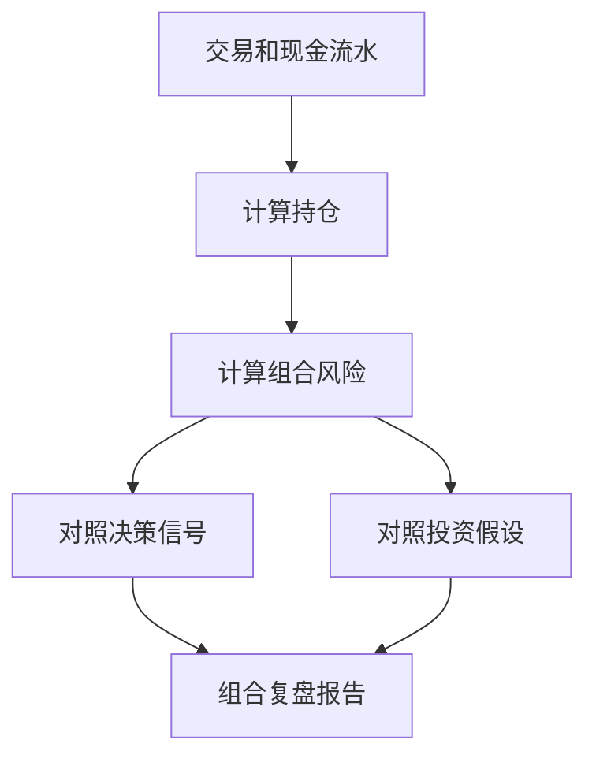

# Portfolio（投资组合）设计

最后更新：2026-06-28

状态：accepted（已接受，用户已确认）

## 目的

Portfolio（投资组合）管理账户、交易、现金、持仓、收益、风险和组合复盘。它是个人投研工作台的资产视角。

## 当前 demo 事实

- 当前已有 `portfolio_accounts`、`portfolio_trades`、`portfolio_cash_ledger`、`portfolio_corporate_actions`、`portfolio_positions`、`portfolio_position_lots`、`portfolio_daily_snapshots`、`portfolio_fx_rates`。
- API schema 已支持账户、交易、现金、公司行动、持仓、导入、汇率刷新、风险响应。

## 职责

- 管理账户、交易、现金流水、公司行动和持仓快照。
- 计算收益、成本、费用、税、汇率、集中度、回撤和止损风险。
- 将持仓与 Decision Signal、Investment Thesis 关联。
- 触发组合复盘任务。

## 边界

范围内：资产记录、持仓计算、风险暴露、组合复盘输入。

范围外：不做真实下单，不替代券商系统，不直接抓行情。

## 接口与契约

- 新记录应关联 `instrument_id`，兼容保留 `symbol`。
- 持仓计算必须可复现，依赖 Deterministic Tools。
- 导入数据需要保留来源、去重标识和错误记录。

## 数据与状态

当前 portfolio 表结构可以保留。v1 重点是补齐与 Instrument、Signal、Thesis 的关系。

## 运行流程

## 依赖

- Instrument。
- Data Hub 提供价格和汇率。
- Deterministic Tools 负责核算。
- Report & Audit 负责复盘报告。

## 风险与未决问题

- 多市场、多币种和公司行动会影响成本和收益，需要保留清晰计算版本。
- 个人项目不应把 Portfolio 做成复杂券商系统。
