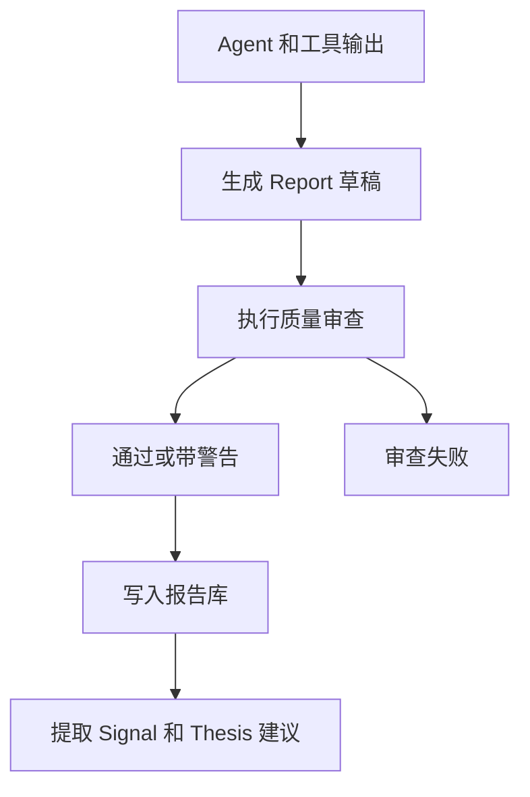

# Report & Audit（报告与审查）设计

最后更新：2026-06-28

状态：accepted（已接受，用户已确认）

## 目的

Report & Audit（报告与审查）负责把研究任务产出变成可阅读、可追溯、可复盘的正式报告，并在报告进入工作台和通知前执行质量准出。

## 当前 demo 事实

- 当前已有 `analysis_history` 保存分析历史和报告结果。
- 当前已有报告渲染服务和模板，如 `src/services/report_renderer.py`、`templates/report_markdown.j2`。
- 当前报告不是一等 `Report` 实体，和信号、假设的关系需要强化。

## 职责

- 管理 `Report`（报告）实体、结构化正文、Markdown（轻量标记文本）和渲染结果。
- 执行数据完整性、证据引用、逻辑一致性、风险提示和缺失项审查。
- 从报告中提取或确认 DecisionSignal（决策信号）和 InvestmentThesis（投资假设）更新建议。
- 为通知和桌面展示提供摘要版本。

## 边界

范围内：报告生成、报告审查、报告版本、摘要、报告与信号/假设关系。

范围外：不负责调度任务，不直接抓数据，不直接替代人工接受投资假设更新。

## 接口与契约

建议 `Report` 核心字段：

| 字段 | 说明 |
| --- | --- |
| `id` | 报告 ID |
| `task_id` | 来源研究任务 |
| `instrument_id` | 标的 ID，可为空表示组合或市场报告 |
| `report_type` | 报告类型 |
| `content_markdown` | Markdown 正文 |
| `content_json` | 结构化正文 |
| `audit_status` | 审查状态，例如 `passed`、`warning`、`failed` |
| `data_quality_summary` | 数据质量摘要 |
| `created_at` | 创建时间 |

## 数据与状态

- 旧 `analysis_history` 可以作为兼容来源，逐步迁移到 `Report`。
- 报告审查结果需要持久化，不能只存在渲染页面里。

## 运行流程

## 依赖

- Research Task Engine。
- Agent Layer。
- Deterministic Tools。
- Evidence Hub。
- Decision Signal 和 Investment Thesis。

## 风险与未决问题

- 报告审查规则需要避免过度阻断：缺少部分证据时可以 warning（警告），但关键计算错误必须 failed（失败）。
- 报告格式变化会影响 Web 和桌面展示，需要独立兼容策略。
