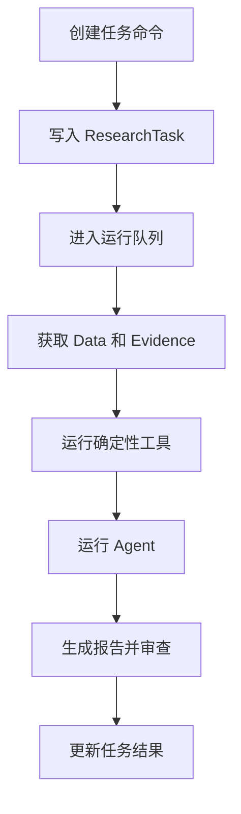

# Research Task Engine（研究任务引擎）设计

最后更新：2026-06-28

状态：proposed（建议稿，待人工确认）

## 目的

Research Task Engine（研究任务引擎）负责把用户命令、定时任务、组合复盘和插件任务统一编排成可追踪、可取消、可复盘的研究任务。

## 当前 demo 事实

- `src/services/task_queue.py` 已有内存异步分析队列，包含 `pending`、`processing`、`completed`、`failed`、`cancel_requested`、`cancelled` 状态。
- 当前队列按股票代码去重，并通过线程池执行任务，通过 SSE（服务器推送事件）广播进度。
- 当前任务不是完整持久化的一等对象。

## 职责

- 管理 `ResearchTask` 的创建、状态、进度、取消、重试和结果链接。
- 编排 Data Hub、Evidence Hub、Deterministic Tools、Agent Layer 和 Report Audit。
- 支持主动研究、定时监控、组合复盘、回测评估和插件任务。
- 提供任务日志、诊断 trace（追踪标识）和错误摘要。

## 边界

范围内：任务生命周期、编排、进度、去重、失败策略、结果关联。

范围外：不直接做指标计算，不直接写报告正文，不直接发送通知。

## 接口与契约

建议 `ResearchTask`（研究任务）核心字段：

| 字段 | 说明 |
| --- | --- |
| `id` | 任务 ID |
| `task_type` | 任务类型，例如 `single_research`、`portfolio_review`、`thesis_check`、`news_pulse`、`backtest` |
| `instrument_id` | 目标标的，可为空表示组合或市场级任务 |
| `status` | 生命周期状态 |
| `trigger_source` | 触发来源，例如 `desktop`、`bot`、`schedule`、`alert`、`plugin` |
| `input_json` | 输入参数 |
| `result_ref` | 输出对象引用，例如报告 ID |
| `trace_id` | 诊断追踪标识 |

## 数据与状态

- v1 需要新增持久化任务记录，内存队列只作为运行时执行器。
- 任务完成后应链接 `Report`、`DecisionSignal`、`InvestmentThesis` 或 `EvaluationResult`。

## 运行流程

## 依赖

- Command API。
- Data Hub、Evidence Hub、Deterministic Tools、Agent Layer、Report Audit。
- Monitor 可触发任务。

## 风险与未决问题

- 长任务失败后的恢复和重试策略需要实现设计细化。
- 任务去重不能只按 `stock_code`，需要按 `task_type + instrument_id + 参数摘要` 判断。
