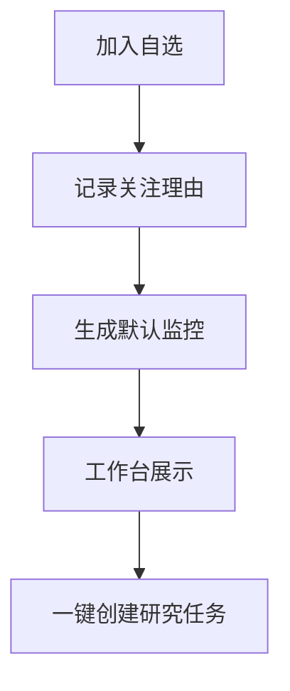

# Watchlist（自选）设计

最后更新：2026-06-28

状态：accepted（已接受，用户已确认）

## 目的

Watchlist（自选）是个人工作台的日常入口。它表示用户关注但不一定持有的标的集合，并为定时监控、主动研究和异常提醒提供目标列表。

## 当前 demo 事实

- `api/v1/schemas/history.py` 中已有 `WatchlistRequest` 和 `WatchlistResponse` 等自选相关模型。
- 当前自选能力更偏页面辅助，还没有和 `Instrument`（标的）、任务、投资假设形成完整闭环。

## 职责

- 管理用户自选标的、分组、关注原因、优先级和监控偏好。
- 为工作台首页提供观察列表。
- 为 Monitor（调度告警通知）提供定时扫描目标。
- 为 Research Task Engine（研究任务引擎）提供批量研究入口。

## 边界

范围内：自选列表、分组、排序、关注理由、默认研究频率、默认告警策略。

范围外：不保存真实持仓数量，不替代 Portfolio（投资组合）。

## 接口与契约

- 自选项必须关联 `instrument_id`。
- 可选保留 `symbol` 作为兼容展示字段。
- 自选项可以关联默认 Monitor Rule（监控规则）和 Investment Thesis（投资假设）。

## 数据与状态

建议实体：`WatchlistItem`（自选项）。

| 字段 | 说明 |
| --- | --- |
| `id` | 主键 |
| `instrument_id` | 标的 ID |
| `group_name` | 分组名 |
| `priority` | 优先级 |
| `watch_reason` | 关注原因 |
| `default_task_profile` | 默认研究任务类型 |
| `enabled` | 是否启用 |

## 运行流程

## 依赖

- Instrument（标的）。
- Monitor（调度告警通知）。
- Research Task Engine（研究任务引擎）。

## 风险与未决问题

- 自选和投资假设的关系需要保持轻量：没有 thesis 的自选也必须可用。
