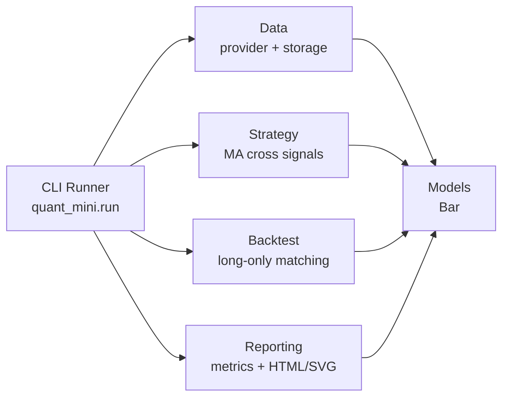
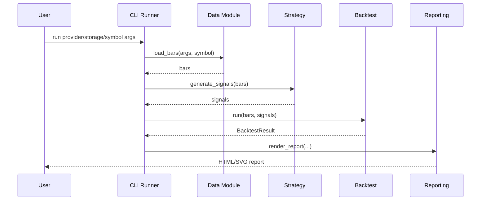

# 量化 Main Design

最后更新：2026-06-24

状态：draft

## 概览

量化项目当前是一个本地可运行的最小研究闭环：数据获取 -> 策略信号 -> 回测撮合 -> 绩效分析 -> HTML/SVG 报告。当前代码以 `quant_mini.run` 作为命令行入口，默认使用 DuckDB + Parquet 存储，保留 CSV 回退路径，并通过 AkShare 作为可选真实 A 股数据源。

## 系统范围

- 当前范围：单策略、单标的回测闭环，本地缓存、本地报告、可选 AkShare 数据源。
- 当前不包含：实盘交易、账户撮合、多策略组合、任务调度、数据服务 API、可视化交互前端。

## 模块地图

| 模块 | 职责 | 设计文档 | 状态 | 备注 |
| --- | --- | --- | --- | --- |
| Data | 数据源接入、CSV 缓存、DuckDB/Parquet 存储 | architecture/modules/data.md | draft | `quant_mini/data.py` |
| Strategy | 双均线交叉信号生成 | architecture/modules/strategy.md | draft | `quant_mini/strategy.py` |
| Backtest | 长仓撮合、现金/持仓/成交/权益曲线 | architecture/modules/backtest.md | draft | `quant_mini/backtest.py` |
| Reporting | 绩效指标和 HTML/SVG 报告 | architecture/modules/reporting.md | draft | `performance.py`, `report.py` |
| CLI Runner | 命令行参数解析和闭环编排 | architecture/modules/cli-runner.md | draft | `quant_mini/run.py` |

## 模块关系图

## 核心流程

## 共享约束

- 默认运行路径依赖 DuckDB + Parquet；CSV 是无 DuckDB 环境的回退路径。
- AkShare 是可选依赖，真实数据获取失败时应保护已有缓存并输出友好错误。
- 模型对象通过 `Bar`、`Signal`、`Trade`、`EquityPoint` 传递，当前未引入 pandas 作为内部核心模型。
- 报告保持静态 HTML/SVG，避免引入前端构建链。
- 项目记忆不得记录任何 token、key 或账号信息。

## 跨模块决策

| 日期 | 决策 | 模块 | 备注 |
| --- | --- | --- | --- |
| 2026-06-19 | 先做无 key、本地可运行的最小闭环 | 全部 | 先验证架构，再接入真实数据源 |
| 2026-06-19 | AkShare 作为可选 provider | Data, CLI Runner | 默认 sample 流程保持低依赖 |
| 2026-06-19 | 默认存储升级为 DuckDB + Parquet | Data, CLI Runner | 支持后续多标的、多区间研究 |

## 开放问题

- A 股交易规则尚未模块化，T+1、涨跌停、停牌等约束需要进入 Backtest 设计。
- 多标的研究和组合回测的边界尚未设计。
- 数据质量校验还需要进一步明确字段、空数据、成交量单位和日期范围规则。
