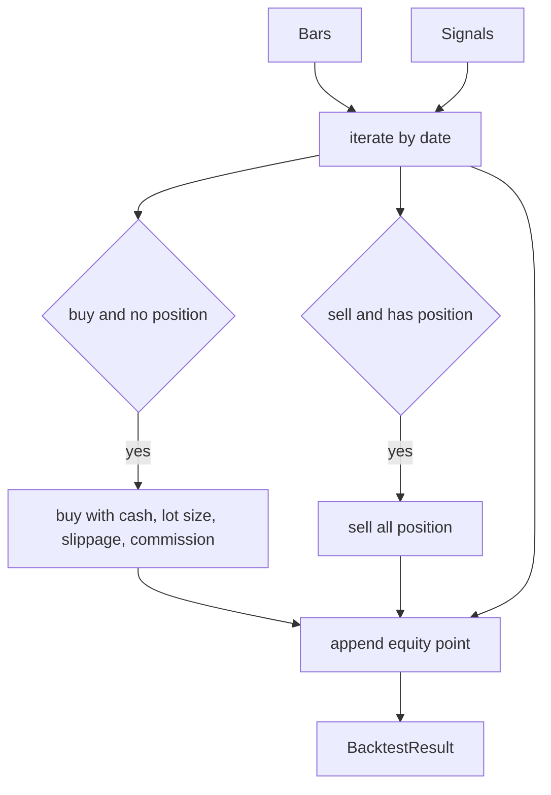

# Backtest 模块设计

最后更新：2026-06-24

状态：draft

## 目的

Backtest 模块负责把行情和策略信号转换为成交、现金/持仓状态和权益曲线。

## 职责

- 执行简单多头撮合。
- 处理手续费、滑点和 100 股手数。
- 生成 `Trade` 和 `EquityPoint`。
- 输出 `BacktestResult` 给绩效和报告模块。

## 边界

- 范围内：撮合、现金、持仓、成交、权益曲线。
- 范围外：数据获取、信号生成、指标计算、报告渲染。

## 接口和契约

- `LongOnlyBacktester(symbol, initial_cash, commission_rate, slippage_rate, lot_size)`
- `run(bars, signals) -> BacktestResult`

## 数据和状态

- 内部状态包括现金、持仓数量、成交列表、权益曲线。
- 当前按 bar 日期匹配信号，同一天信号在该 bar 收盘价附近成交。

## 运行流程

## 依赖

- 输入依赖 `Bar` 和 `Signal`。
- 输出依赖 `Trade`、`EquityPoint`、`BacktestResult`。

## 风险和开放问题

- 当前还没有 T+1、涨跌停、停牌、交易日历等 A 股交易规则。
- 当前撮合模型不区分开盘/收盘成交时点，也不支持部分成交或订单生命周期。
