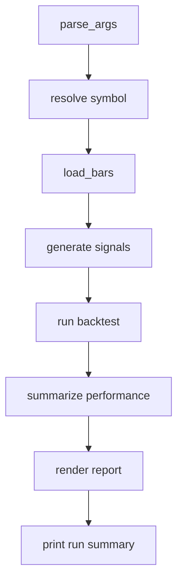

# CLI Runner 模块设计

最后更新：2026-06-24

状态：draft

## 目的

CLI Runner 模块负责解析命令行参数并编排最小量化闭环。

## 职责

- 解析 provider、storage、symbol、start/end、均线窗口、AkShare retry 等参数。
- 选择数据加载路径。
- 调用策略、回测、绩效、报告模块。
- 输出运行摘要和报告路径。

## 边界

- 范围内：命令行入口和流程编排。
- 范围外：具体 provider 实现、策略计算、撮合细节、报告 HTML 样式细节。

## 接口和契约

- `python -m quant_mini.run`
- `load_bars(args, symbol)` 根据 storage 路由到 CSV 或 Parquet。

## 运行流程

## 依赖

- 依赖所有核心模块，是当前应用的组合入口。

## 风险和开放问题

- 当前仍是单次运行入口，尚未支持批量参数实验或组合研究任务。
