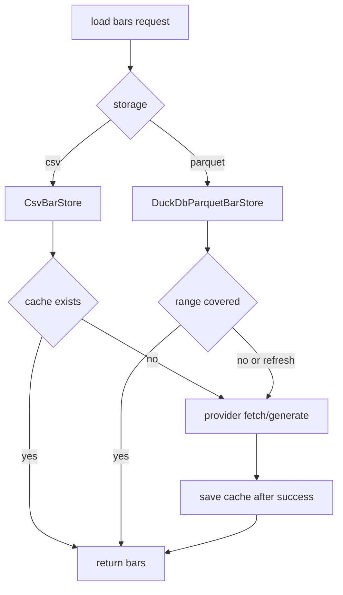

# Data 模块设计

最后更新：2026-06-24

状态：draft

## 目的

Data 模块负责把行情数据转换为内部 `Bar` 序列，并通过本地存储降低重复拉取成本。

## 职责

- 生成可复现 sample OHLCV 数据。
- 通过 AkShare 获取 A 股日线数据。
- 提供 CSV 缓存回退路径。
- 提供 DuckDB/Parquet 按标的存储和日期区间查询。
- 在刷新失败时保护已有缓存。

## 边界

- 范围内：provider、缓存、存储、日期区间查询、依赖缺失友好错误。
- 范围外：策略逻辑、撮合规则、绩效分析、报告渲染。

## 接口和契约

- `SampleDataProvider.get_bars(symbol, start, periods) -> List[Bar]`
- `AkShareProvider.get_bars(symbol, start, end) -> List[Bar]`
- `CsvBarStore.load_or_create(...) -> List[Bar]`
- `DuckDbParquetBarStore.load_or_create(symbol, start, end, bars, refresh=False) -> List[Bar]`
- `DuckDbParquetBarStore.load_many(symbols, start, end) -> Dict[str, List[Bar]]`

## 数据和状态

- CSV 缓存位于 `data/*.csv`。
- Parquet 缓存位于 `data/bars/<symbol>.parquet`。
- 内部传递模型是 `Bar`，不把 pandas 暴露为核心契约。

## 运行流程

## 依赖

- 标准库：CSV、日期、路径。
- 可选依赖：AkShare、DuckDB。

## 风险和开放问题

- AkShare 上游不稳定，需要继续完善错误分类和数据字段校验。
- 多标的查询目前是逐标的调用 `load`，后续可优化为更批量化的 DuckDB 查询。
