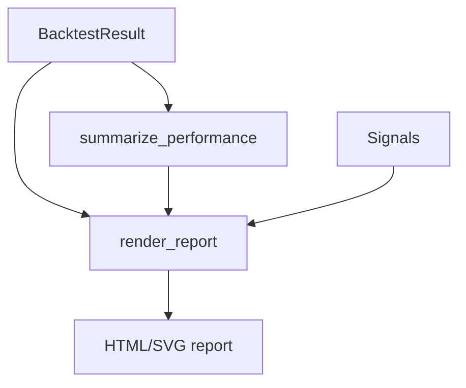

# Reporting 模块设计

最后更新：2026-06-24

状态：draft

## 目的

Reporting 模块负责把回测结果转换为绩效摘要和静态 HTML/SVG 报告。

## 职责

- 计算总收益、年化收益、最大回撤、夏普比率和交易次数。
- 渲染资金曲线、信号表和成交表。
- 输出本地 HTML 报告。

## 边界

- 范围内：指标计算、静态报告渲染。
- 范围外：数据获取、策略、撮合、交互式前端。

## 接口和契约

- `summarize_performance(equity_curve, trade_count) -> PerformanceSummary`
- `render_report(output_path, result, summary, signals) -> None`

## 运行流程

## 依赖

- 输入依赖 `BacktestResult`、`EquityPoint`、`Signal`。
- 输出为本地 HTML 文件。

## 风险和开放问题

- 当前报告是静态 HTML，不支持交互筛选或多标的组合展示。
