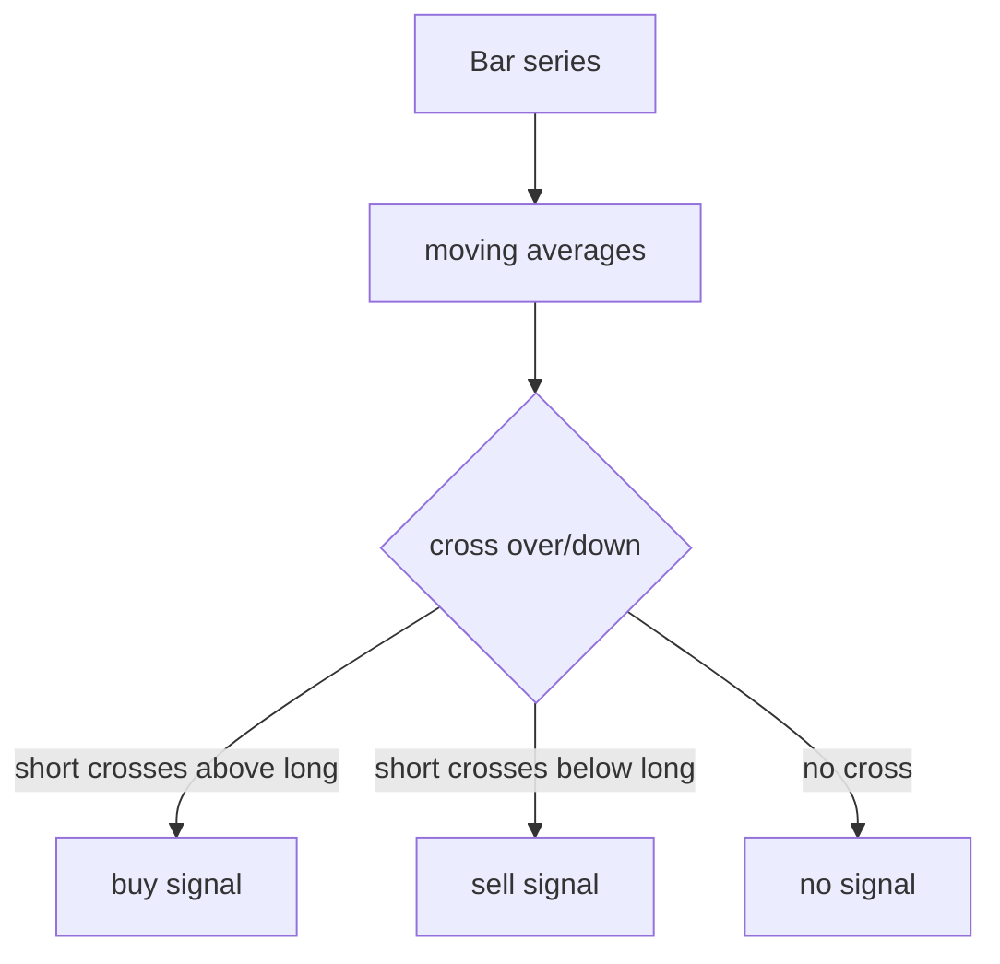

# Strategy 模块设计

最后更新：2026-06-24

状态：draft

## 目的

Strategy 模块负责根据行情 `Bar` 生成交易信号，当前实现为双均线交叉策略。

## 职责

- 计算移动平均。
- 生成 `buy` / `sell` 信号。
- 保持策略逻辑与数据获取、撮合、报告解耦。

## 边界

- 范围内：信号计算和信号原因描述。
- 范围外：资金管理、交易规则、绩效评估、报告展示。

## 接口和契约

- `MovingAverageCrossStrategy(symbol, short_window, long_window)` 要求短周期小于长周期。
- `generate_signals(bars) -> List[Signal]` 输出按日期生成的策略信号。

## 运行流程

## 依赖

- 输入依赖 `Bar`。
- 输出依赖 `Signal`。

## 风险和开放问题

- 当前只有单策略，参数实验和多策略组合尚未设计。
