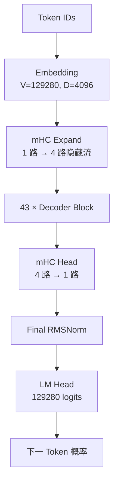
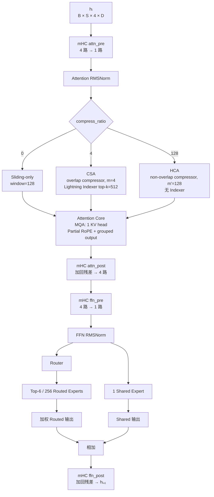

> 这篇笔记把 DeepSeek‑V4‑Flash 的结构图、MoE 工作机制和当前单机部署中的显存分层放在一起。重点不是记参数表，而是理解一个 Token 为什么会经过这些模块，以及为什么专家权重可以放在 GPU、内存和 SSD 的不同层级。
>
> 更新：2026-08-02

## 0. V4‑Flash 43 层结构图


这张图是本笔记的主图，后续内容按图中的数据流展开：

- 左侧：Embedding → mHC Expand → 43 个 Decoder Block → mHC Head → LM Head；
- 右侧：一个 Decoder Block 的完整展开；
- 上半部分：`compress_ratio=0/4/128` 对应三种 Attention；
- 下半部分：Router、Top‑6/256 Routed Expert、Shared Expert 和加权合并；
- 黑色回路：mHC 在 Attention 和 MoE/FFN 前后的残差流；
- 底部图例：当前单机部署中 GPU、CPU/RAM、SSD 的职责。

阅读方法是先看左侧的 43 层重复关系，再沿右侧单层从上到下追踪一个 Token。后文的 Prefill、Decode、MoE 路由和存储分层都对应这张图中的具体模块。

## 1. 一句话理解模型

DeepSeek‑V4‑Flash 是一个 **43 层、全层采用 MoE 的 Decoder-only 模型**。每一层都包含：

1. mHC 多路残差连接；
2. 混合注意力；
3. 一个 Router；
4. 6 个 Routed Expert 加 1 个 Shared Expert。

模型共有 256 个 Routed Expert，但每个 Token 在每一层只选择其中 6 个。因此：

- 总参数量很大，约 284B；参考[官方模型卡](https://huggingface.co/deepseek-ai/DeepSeek-V4-Flash)；
- 单个 Token 的激活参数约 13B；
- “激活 6 个专家”是 **每层 6 个**，不是整个模型只使用 6 个专家；
- 43 层合计会产生 `43 × 6 = 258` 次 Routed Expert 调用，另外每层还有 1 个 Shared Expert。

官方配置中的核心参数是：隐藏维度 4096、43 层、256 个 Routed Expert、每 Token 激活 6 个 Routed Expert、每层 1 个 Shared Expert、4 路 Hyper-Connection。参考：[官方 inference/config.json](https://huggingface.co/deepseek-ai/DeepSeek-V4-Flash/blob/main/inference/config.json)。

## 2. 从输入到输出



43 个 Block 的外形相同，但参数不共享。每层自己的 Attention、Router、256 个 Routed Expert 和 Shared Expert 都是独立参数。

### Prefill

Prefill 处理一段输入序列，例如代码文件、对话历史或工具结果：

1. 所有输入 Token 一起进入 Embedding；
2. 经过 43 个 Block；
3. 每个 Block 为每个 Token 做一次路由；
4. Attention 同时建立局部和压缩后的状态；
5. 最后一层输出 logits，并保存后续 Decode 要使用的 KV/压缩状态。

Prefill 可以利用 Token 之间的批量并行，因此通常更适合 GPU。

### Decode

Decode 每次只生成一个新 Token，但这个 Token 仍然要顺序通过全部 43 层：

1. 读取上一步的 KV/压缩状态；
2. 在每层重新执行 Attention；
3. 在每层重新选择 6 个 Routed Expert；
4. 加上 Shared Expert 的结果；
5. 经过 LM Head 得到下一个 Token。

因此 Decode 的瓶颈不是“模型是否能启动”，而是每一层的串行调度、专家权重访问和 CPU/GPU 往返。

## 3. 一个 Block 的实际顺序



标准残差连接在 V4 中被 mHC 替代。mHC 保持 4 路隐藏流，通过 `pre / post / comb` 三组混合权重，在 Attention 和 FFN 前后进行压缩、扩展和残差合并。它不是简单的 `x + sublayer(x)`。

## 4. V4‑Flash 的三种 Attention

这里不要把 V4 的 Attention 直接叫作 Qwen3.5 的“线性注意力”。V4 使用的是 **局部滑窗 + 压缩注意力** 的混合结构：

| 类型 | 配置 | 工作方式 | 是否使用 Indexer |
|---|---:|---|---|
| Sliding-only | `ratio=0` | 只看最近 128 个 Token | 否 |
| CSA | `ratio=4` | 重叠压缩，每 4 个 Token 形成压缩单元 | 是，Top-K=512 |
| HCA | `ratio=128` | 非重叠高压缩，每 128 个 Token 形成压缩单元 | 否 |

按当前 Flash inference 配置解析，主干 43 层大致是：

- L0、L1：Sliding-only；
- L2、L4、L6 … L42：CSA，共 21 层；
- L3、L5、L7 … L41：HCA，共 20 层；
- 配置数组的最后一项 `ratio=0` 用于可选的 MTP-1 层，不属于主干 43 层。

三种 Attention 都共享一些基础设计：

- 1 个 KV Head，即 Multi-Query Attention；
- 部分 RoPE；
- Attention Sink；
- 滑动窗口分支；
- 分组低秩输出投影。

CSA 的额外步骤是 Lightning Indexer：先给压缩后的历史位置打分，再只取 Top-K 位置进入稀疏 Attention。HCA 没有 Indexer，所有压缩位置都参与 Attention。

## 5. MoE 到底做了什么

### 5.1 Router

Router 接收当前 Token 的隐藏向量 `x ∈ R^4096`，计算它与 256 个专家的亲和度，然后选择 Top-6：

```text
scores = Router(x)
indices = topk(scores, k=6)
weights = normalize(scores[indices]) × 1.5
```

前 3 层使用 Hash-MoE：专家编号来自冻结的 `token_id → expert_id` 查表，但仍然会计算选中专家的权重。后续层使用正常的分数路由，亲和度函数是 `sqrt(softplus(score))`。

### 5.2 Routed Expert

每一个 Routed Expert 都是一个 SwiGLU 风格的 FFN，包含三组矩阵：

```text
gate = W1(x)
up   = W3(x)
y    = SiLU(gate) × up
out  = W2(y)
```

V4 还对 gate 和 up 做 clamping，避免极端值破坏数值稳定性。6 个选中的 Routed Expert 分别计算后，乘以 Router 权重，再加到一起。

### 5.3 Shared Expert

Shared Expert 不参加 256 选 6 的竞争，而是每个 Token、每一层都执行一次。它提供稳定的共享通路，避免所有信息都依赖稀疏路由：

```text
MoE output = Σ(weightᵢ × RoutedExpertᵢ(x)) + SharedExpert(x)
```

这也是为什么“只把 Routed Expert 放在 CPU”仍然很慢：Shared Expert 虽然只有 1 个，但 Routed Expert 在 43 层中会不断被访问。

## 6. 为什么总参数很大但显存不需要放全量专家

全模型的 Routed Expert 槽位数为：

```text
43 layers × 256 experts = 11008 layer-expert slots
```

单个 Token 在每层只访问 6 个 Routed Expert，所以计算是稀疏的；但不同 Token、不同层可能访问不同专家。因此需要区分三种概念：

1. **参数总量**：所有专家权重的总和；
2. **单 Token 激活量**：当前 Token 实际执行的专家和主干计算；
3. **缓存工作集**：在一段编码请求中反复命中的专家集合。

部署时不需要把 11008 个专家同时放进显存，但需要保证当前高频专家能够快速访问。

## 7. 对当前机器的存储分层

当前机器是 RTX 4070 Ti SUPER 16 GiB、主机内存 32 GiB、WSL 可见约 30 GiB，服务内存上限 24 GiB。适合采用三级分层：

| 层级 | 放置内容 | 访问方式 |
|---|---|---|
| GPU | Embedding、mHC、全部 Attention、Router、Shared Expert、LM Head、少量热点 Routed Expert | 常驻显存，避免每层同步传输 |
| CPU/RAM | 大多数冷 Routed Expert | Safetensors mmap + AVX2，传输 activation/result |
| SSD | 全部模型分片、连续 expert pack | 启动映射、后台预取，不进入逐 Token 同步路径 |

当前服务加载非专家主干后约占 11.75 GiB，运行时显存约 13.5 GiB，剩余空间不能全部拿来装专家，还要留给 KV、CUDA workspace、allocator 碎片和请求缓冲。

因此正确的优先级是：

```text
GPU：主干必经路径 + Shared Expert + 热点 Routed Expert
RAM：冷 Routed Expert
SSD：模型来源和后台预取
```

不要为了多放几个专家，把 Attention、Router 或 LM Head 移到 CPU；它们每个 Token、每一层都会执行，CPU/GPU 往返会抵消专家缓存收益。

## 8. 和当前实验的关系

之前的 `kt-num-gpu-experts=0` 基线把 Routed Expert 全部留在 CPU mmap，模型可以启动，但 Decode 只有约 `0.3–0.4 token/s`。这说明：

- MoE 的“稀疏激活”不等于 CPU 读取就足够快；
- SSD 不能放进每个 Token 的同步路径；
- GPU 专家缓存必须按真实 `(layer, expert_id)` 热度选择，而不是简单地每层放前 N 个专家；
- 先保留 GPU 主干，再用剩余显存做热点专家缓存，才是合理顺序。

下一步的实现顺序应当是：

1. 记录编码 Agent 请求的真实路由分布；
2. 生成静态热点专家列表；
3. 用 1 GiB 左右显存做 FP8 热点专家 POC；
4. 将 GPU 命中和 CPU miss 分开执行并合并；
5. 再考虑 MXFP4 软件解码、异步预取和推测解码；
6. 最后单独验收 128K 上下文和 Agent 工具调用。

## 9. 常见误解

### “MoE 就是只加载几个专家”

不是。模型仍然需要所有专家的权重来源；只是每个 Token 只执行少数专家。冷专家可以留在 CPU/SSD，但访问延迟仍然会影响 Decode。

### “Top-6 表示整个请求只用 6 个专家”

不是。Top-6 是每层、每个 Token 的选择。43 层会产生最多 258 个 Routed Expert 选择。

### “HCA/CSA 就是线性注意力”

不准确。它们通过压缩和稀疏选择降低长上下文成本，但仍属于 V4 的压缩注意力体系；不能直接等同于 Qwen3.5 的 Gated DeltaNet。

### “总参数 284B 就需要 284B 参数的显存”

不一定。MoE 的关键是总参数、激活参数和缓存工作集不同。单机部署可以用 GPU + RAM + SSD 分层，但速度取决于每个 Token 实际访问权重的带宽和调度延迟。

## 参考

- [DeepSeek‑V4‑Flash 官方模型卡](https://huggingface.co/deepseek-ai/DeepSeek-V4-Flash)
- [DeepSeek‑V4‑Flash 官方 inference/config.json](https://huggingface.co/deepseek-ai/DeepSeek-V4-Flash/blob/main/inference/config.json)
- [DeepSeek‑V4‑Flash 官方 inference/model.py](https://huggingface.co/deepseek-ai/DeepSeek-V4-Flash/blob/main/inference/model.py)
- [Hugging Face Transformers：DeepSeek‑V4 架构说明](https://huggingface.co/docs/transformers/model_doc/deepseek_v4)
