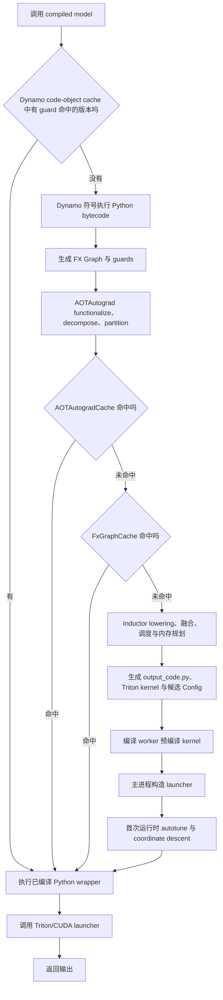
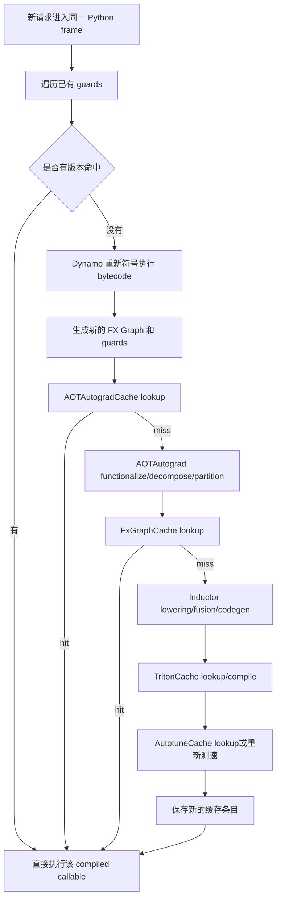

本文基于 PyTorch 2.8，聚焦 `torch.compile(backend="inductor")` 在 GPU 推理场景中的完整生命周期。当前 Qwen 项目采用 `fullgraph=False`、`dynamic=True`，因此本文也重点解释局部图、动态形状、缓存复用和重编。

核心结论：`torch.compile()` 本身通常只安装一个惰性 JIT 包装器；真正的图捕获和编译发生在第一次带真实输入执行时。后续调用先验证 guards，命中后直接运行已有编译结果；全部 guard 失败才会重新捕获 FX 图。Dynamo 重编、Inductor 缓存 miss、Triton binary 重编和 autotune 重新测速是四件不同的事情。

## 一、整体流程



这里有两个“第一次”需要区分：

```text
函数第一次执行：
    Dynamo 捕获 FX 图，AOTAutograd 和 Inductor 编译图

某个 Triton kernel 第一次真正执行：
    CachingAutotuner 可能才完成候选配置测速和最终 launcher 选择
```

PyTorch 2.8 官方说明，`torch.compile` 的编译结果按 Python code object 缓存；同一 frame 可以对应多个带不同 guards 的编译版本。[torch.compile API](https://docs.pytorch.org/docs/2.8/generated/torch.compile.html)

## 二、stage1：`torch.compile()` 安装惰性入口

调用：

```python
compiled_model = torch.compile(
    model,
    backend="inductor",
    fullgraph=False,
    dynamic=True,
)
```

这一刻通常不会遍历真实输入，也不会生成最终 Triton binary。它主要完成：

```text
1. 建立 Dynamo eval-frame 包装器
2. 保存 backend、dynamic、fullgraph、mode 等配置
3. 将后续 Python frame 交给 Dynamo 检查和捕获
```

真实 trace 发生在 `compiled_model(inputs)` 第一次执行时，而不是执行 `torch.compile()` 时。[Dynamo Deep-Dive](https://docs.pytorch.org/docs/2.8/torch.compiler_dynamo_deepdive.html)

这是一项优秀设计：模型初始化不必立即准备所有输入形状；编译器可以根据真实 dtype、device、shape、stride 和 Python 分支生成更有针对性的代码。

## 三、stage2：Dynamo 捕获 Python frame

Dynamo 通过 CPython Frame Evaluation API 接管 frame，符号执行 Python bytecode。Tensor 被包装成 Proxy/FakeTensor，执行到 PyTorch 算子时，不立即做真实大规模计算，而是在 FX Graph 中记录节点。

```text
Python bytecode
    ↓ 符号执行
FX Graph
    placeholder → call_function/call_module → output
```

Dynamo 同时产生 guards。guards 是“当前编译结果仍然有效”的运行时条件，常见内容包括：

```text
Tensor：
    类型、device、dtype、rank、shape、stride、layout、requires_grad

Python：
    int/bool/string 常量、对象类型、对象 identity、字典版本

运行环境：
    grad mode、autocast、默认 device、torch function mode

Module：
    参与控制流或图结构的属性、hook 状态、相关全局变量
```

guards 是正确性的基础。Dynamo 可以为当前条件积极特化，而不用假设未来所有输入都相同；未来条件变化时，再选择其他版本或重编。[PyTorch 2.8 Troubleshooting：Guards](https://docs.pytorch.org/docs/2.8/torch.compiler_troubleshooting.html#guards)

### Graph break 不是重编

当 Dynamo 遇到不能安全捕获的 Python 逻辑时，`fullgraph=False` 会产生 graph break：

```text
编译前半段 FX 图
    ↓
回到 eager Python 执行不支持的部分
    ↓
继续捕获后半段，形成另一个 FX 图
```

这不会立即表示“同一张图重新编译”，而是一次调用被拆成多个编译区域。它保证兼容性，但减少跨区域融合机会，并增加 Python/launcher 开销。[PyTorch 2.8 Troubleshooting：Graph break](https://docs.pytorch.org/docs/2.8/torch.compiler_troubleshooting.html#graph-break)

## 四、stage3：AOTAutograd 整理图

Dynamo 输出的 FX Graph 继续进入 AOTAutograd。AOTAutograd 的主要职责不是生成 CUDA kernel，而是把上游图整理成更适合后端编译的形式：

```text
1. functionalization
   将可处理的 mutation/view 语义转换成函数式表达

2. decomposition
   将复杂高层算子分解到后端更容易处理的 ATen 算子集合

3. autograd tracing
   训练场景生成 forward/backward 图

4. partition
   决定 forward 保存哪些中间值，backward 重算哪些值
```

纯推理且关闭梯度时，没有需要执行的 backward 图，但 functionalization、decomposition 和运行时 wrapper 仍可能参与。PyTorch 对 PT2 栈的定义是：Dynamo 负责捕获，FX 是图表示，AOTAutograd 提供 functionalized/decomposed 图，Inductor 负责生成目标代码。[PyTorch 2.8 export 架构说明](https://docs.pytorch.org/docs/2.8/export.html#existing-frameworks)

## 五、stage4：Inductor lowering、优化和调度

Inductor 接收 AOTAutograd 处理后的 FX Graph，使用 FakeTensor 和 SymInt 推导 shape、stride、layout 和依赖关系，然后进行：

```text
图级重写：
    pattern matching、常量折叠、冗余节点消除

算子选择：
    ATen fallback、Triton kernel、外部库或模板 kernel

融合：
    pointwise + pointwise
    pointwise + reduction
    prologue/epilogue 与模板算子融合

调度：
    决定 kernel 边界、读写依赖和执行顺序

布局与内存：
    stride/layout 选择、中间 buffer 复用、必要的 copy

代码生成：
    GPU 生成 Python wrapper、Triton/CUDA kernel
    CPU 通常生成 C++/OpenMP 代码
```

融合是 Inductor 最重要的收益之一。多个 eager 算子被合成一个 kernel 后，中间值可以留在寄存器或片上存储中，减少显存读写和 kernel launch。[PyTorch 2.8 Getting Started](https://docs.pytorch.org/docs/2.8/torch.compiler_get_started.html)

Inductor 最终会生成类似 `output_code.py` 的 Python wrapper。wrapper 负责分配输出、调用外部算子、计算 grid，并串联多个已编译 kernel。

## 六、stage5：Triton kernel 编译

一个 Inductor kernel 不一定只有一种执行配置。reduction kernel 可能有多组候选：

```text
Config A:
    XBLOCK=1
    R0_BLOCK=512
    num_warps=16

Config B:
    XBLOCK=1
    R0_BLOCK=4096
    num_warps=8
```

`CachingAutotuner.precompile()` 负责把候选 Config 变成可执行候选：

```text
configs
    ↓ _precompile_worker()
_precompile_config(config)
    ↓
CompileResult
    ↓ make_launcher()
Launcher
```

### `_precompile_config(config)`

它把一个明确的 Config 合并进编译元数据：

```text
Triton 源码
constexpr：XBLOCK、R0_BLOCK 等
num_warps / num_stages
GPU compute capability
Triton/编译器配置
```

随后调用 Triton compiler，得到 PTX/Cubin 等 binary 和 `CompileResult`。

### `make_launcher()`

它把 binary、grid、constexpr、stream、shared memory 等包装为可直接执行的 Python launcher。到此，kernel 已经具备运行条件。

### worker 与主进程

PyTorch 可以在编译 worker 中提前编译候选配置。为了把对象 pickle 回主进程，`prepare_for_pickle()` 会清掉不可序列化的 JITFunction 成员和 launcher；主进程必要时通过 `_reload_kernel()` 恢复源码对象并重新建立 launcher。这让多个 kernel 的编译能够并行，降低大型模型的冷启动墙钟时间。

对应实现见 [PyTorch 2.8 `triton_heuristics.py`](https://github.com/pytorch/pytorch/blob/v2.8.0/torch/_inductor/runtime/triton_heuristics.py)。

## 七、stage6：首次运行时 autotune

`CachingAutotuner.run()` 是每个编译 kernel 的运行入口。PyTorch 2.8 的主要流程是：

```python
if len(launchers) == 0:
    precompile()

if len(launchers) > 1:
    autotune_to_one_config()

if coordinate_descent_tuning and not config.found_by_coordesc:
    coordinate_descent_tuning()

return launcher(...)
```

`autotune_to_one_config()` 会在真实 GPU 上反复运行候选 launcher，选择实测最快者。coordinate descent 再围绕当前配置修改 block、warp 等参数，编译并测试邻近配置。

autotune 是硬件感知优化：相同数学图在不同 GPU、驱动、Triton 版本和 shape 下，最优 tile 可能不同。代价是首次运行时间长，而且相近配置可能因计时噪声选出不同结果。

## 八、stage7：后续稳定运行

同一进程后续调用通常按下面的快速路径执行：

```text
调用 Python frame
    ↓
检查 code-object cache 中每个版本的 guards
    ↓ 命中
执行已改写 bytecode / compiled callable
    ↓
执行 output_code.py wrapper
    ↓
调用已经选定的 launcher
```

不会再次进行：

```text
Dynamo trace
AOTAutograd partition
Inductor lowering/codegen
Triton autotune
```

前提是 guard 命中，且相应缓存和 launcher 仍然有效。

## 九、缓存体系

PyTorch Compile 不是一个单一缓存，而是分层缓存。每层缓存不同阶段的产物，所以“缓存命中”必须说明命中了哪一层。

### 1. Dynamo code-object cache：同进程最快路径

```text
key：Python code object
entry：guards + 编译后的 callable/改写 bytecode
范围：主要是当前进程内
```

一次 frame 可以保存多个版本：静态 shape 版本、动态 shape 版本、不同 Python 分支版本等。运行时依次验证 guards，命中即复用。

PyTorch 2.8 默认单组相关缓存的 `recompile_limit=8`，全局累计保护值为 `256`；达到限制后通常停止继续为该代码生成版本并回退 eager，防止无限重编。[PyTorch 2.8 Dynamo config](https://github.com/pytorch/pytorch/blob/v2.8.0/torch/_dynamo/config.py)

### 2. AOTAutogradCache：跨进程复用 AOT 结果

```text
key：Dynamo FX Graph、输入元数据、AOT/Inductor 全局配置等
value：forward/backward 对应的 FxGraphCache key + 重建 runtime wrapper 所需元数据
```

命中后可以跳过重复的 AOTAutograd dispatch/partition，并通过 FxGraphCache 恢复 Inductor 编译结果。PyTorch 2.8 默认开启本地 AOTAutograd cache，但某些不可序列化结构会绕过缓存。[AOTAutogradCache 源码](https://github.com/pytorch/pytorch/blob/v2.8.0/torch/_functorch/_aot_autograd/autograd_cache.py)

### 3. FxGraphCache：跨进程复用 Inductor 图编译

```text
key 输入：
    FX GraphModule
    tensor/input 元数据
    system settings
    Inductor 配置
    编译环境相关信息

value：
    compiled graph 元数据
    生成代码的磁盘位置
    symbolic shape guards
```

同一个 FX Graph hash 下可以有多个 guards 版本。读取时逐个验证 symbolic guards；命中后重建 compiled callable，并把缓存中的 guards 加回当前 ShapeEnv。全部 guard 不匹配才编译新版本。[PyTorch 2.8 FxGraphCache 源码](https://github.com/pytorch/pytorch/blob/v2.8.0/torch/_inductor/codecache.py#L1055-L1080)

### 4. PyCodeCache：复用生成的 wrapper 模块

Inductor 对生成的 Python source 取 hash，写入缓存目录；同进程再次加载同一路径时，`PyCodeCache` 还会复用已经 import 的 module。

```text
source code
    ↓ hash
磁盘上的 .py 文件
    ↓ import
内存 ModuleType
```

它减少生成 wrapper、写文件和重复 import 的成本，但不能替代 Dynamo guards 或 FxGraphCache。

### 5. TritonCache：复用 kernel binary

Triton 根据 kernel 源码、constexpr Config、目标架构和编译器环境缓存 PTX/Cubin 等产物。完全相同的 kernel/config/架构可以跳过真正的 Triton 编译。

不同 Config 即使源码一样，也会得到不同 binary：

```text
同一源码 + R0_BLOCK=512  → binary A
同一源码 + R0_BLOCK=4096 → binary B
```

### 6. AutotuneCache：复用“哪一个 Config 最快”的结论

TritonCache 解决“这个配置是否已经编译”，AutotuneCache 解决“多个配置应该选哪一个”。

PyTorch 2.8 的 AutotuneCache 使用生成 kernel 文件名/源码 hash、候选 Config hash、Torch/Triton backend hash 等信息定位结果。命中后候选列表可以直接缩减到最佳 Config，避免再次 benchmark。[PyTorch 2.8 AutotuneCache 源码](https://github.com/pytorch/pytorch/blob/v2.8.0/torch/_inductor/runtime/autotune_cache.py)

### 7. `TORCHINDUCTOR_CACHE_DIR`

主要磁盘缓存统一放在：

```bash
export TORCHINDUCTOR_CACHE_DIR=/app/cache/torch_inductor
```

未单独设置 `TRITON_CACHE_DIR` 时，Inductor 通常也会把 Triton 缓存放在对应缓存树下。PyTorch 官方缓存说明将 FxGraph、AOTAutograd、Triton、Autotune 等都视为可组合的模块化缓存，并校验 PyTorch、Triton 和 GPU 等兼容条件。[Compile Time Caching](https://docs.pytorch.org/tutorials/recipes/torch_compile_caching_tutorial.html)

当前 Qwen 项目把已预热的 `/app/cache/torch_inductor` 打成 tar 包，在容器启动时解压。这是“预置磁盘缓存”，不是把 Python 进程内的 Dynamo cache 序列化下来。

## 十、跨进程缓存如何复用

新进程没有旧进程内存中的 Dynamo code-object cache，因此通常仍要执行 Dynamo 捕获，生成 FX Graph 和 guards。之后才逐层命中磁盘缓存：

```text
新进程第一次调用
    ↓
Dynamo 重新得到等价 FX Graph
    ↓
AOTAutogradCache 命中：跳过 AOT 编译
    或
FxGraphCache 命中：跳过 Inductor lowering/codegen
    ↓
PyCodeCache 加载已有 output_code.py
    ↓
TritonCache 加载已有 binary
    ↓
AutotuneCache 加载最佳 Config
    ↓
执行
```

因此“用了缓存包”不等于启动时完全没有 trace；它主要消除后端编译、kernel 编译和 autotune 成本。

## 十一、什么叫重编

### 1. Dynamo recompile

严格意义的 `torch.compile` 重编是：当前 code object 的所有已编译版本都 guard 失败，Dynamo 重新执行原始 bytecode、捕获新 FX Graph，并新增一个 guards + callable 版本。

常见触发条件：

```text
输入变化：
    shape、rank、dtype、device、stride、layout、requires_grad

Python 值变化：
    控制分支使用的 int/bool/string
    list/dict 长度或内容
    对象类型或 identity

模型状态变化：
    train/eval、grad mode、autocast
    参与图结构或分支的 Module 属性
    hook、全局变量或闭包值

动态形状仍被特化：
    shape-dependent 分支
    0/1 特殊维度
    不支持 symbolic shape 的算子
    超出原 symbolic bounds
```

### 2. Inductor/FxGraph cache miss

Dynamo 可能捕获出逻辑等价的图，但以下信息变化会让 FxGraphCache key 或 guards 不匹配：

```text
FX Graph 结构变化
输入元数据变化
Inductor 配置变化
Torch/Triton 版本变化
目标 GPU 或系统环境变化
缓存目录为空、被清理或没有随包发布
```

此时会重新走 Inductor lowering、融合、调度和代码生成，但不一定代表 Dynamo 的同一 frame 已发生 guard failure。

### 3. Triton kernel recompile

已有 wrapper 指向的 Triton binary 缺失，或者源码、Config、GPU 架构、Triton backend hash 改变时，会重新调用 Triton compiler。图级缓存可能命中，但 kernel binary 层仍然 miss。

### 4. autotune rerun

候选 kernel binary 可能都已存在，但最佳配置的 AutotuneCache 没命中，`CachingAutotuner.run()` 仍会重新 benchmark/coordinate descent。

这也是为什么冷启动耗时必须拆分：

```text
Dynamo/AOT 时间
Inductor codegen 时间
Triton compile 时间
autotune benchmark 时间
首个真实 inference 时间
```

## 十二、重编后的完整路径



重编不会覆盖旧版本；通常会给同一 code object 增加另一个带 guards 的版本。以后输入可能分别命中不同版本。

## 十三、动态形状与当前项目

当前项目设置：

```python
compile_enable_dynamic = True
```

其目标是让宽高或 token 数量以 SymInt 进入图，使一份 compiled graph 覆盖多个输入尺寸。它减少的是“shape 不同就必然生成一张新静态图”，但不能保证零重编。

仍可能重编的情况包括：

```text
shape 进入 Python/control-flow 分支
某算子强制 specialization
rank、dtype、device 或 stride class 改变
0/1 维度触发特殊语义
新的 shape 超出已有 guards/bounds
新 shape 生成不同 kernel size_hints
```

PyTorch 2.8 默认模式会先对静态形状特化，发现 shape guard 失败后尝试把变化维度标记为动态；显式 `dynamic=True` 则一开始尽量生成动态图。[PyTorch 2.8 torch.compile：dynamic](https://docs.pytorch.org/docs/2.8/generated/torch.compile.html)

## 十四、这套架构优秀的地方

### 正确性与性能通过 guards 解耦

编译器可以为当前条件大胆特化，guards 保证只有合法输入才能复用。性能优化不需要牺牲 Python 语义。

### Graph break 提供渐进式兼容

不支持的 Python 逻辑不会要求整个模型重写；可编译部分仍然获得收益。代价是融合边界增加，但工程接入成本显著降低。

### 分层 IR 使职责清晰

```text
Dynamo：理解 Python
FX：表达图
AOTAutograd：整理 mutation/autograd 语义
Inductor：优化和代码生成
Triton：生成 GPU kernel
```

每一层可以独立演进和缓存，也便于定位问题发生在哪一层。

### 融合直接针对 GPU 的真实瓶颈

很多模型并非算力不足，而是显存带宽和 launch 开销占主导。融合减少中间 tensor 落显存和 Python/CUDA launch 次数。

### 多层缓存允许精细复用

图完全相同可以命中 FxGraphCache；图缓存 miss 时，某些 Triton binary 仍可能命中；binary 都存在但最佳配置未知时，只需重新 autotune。无需每次从最上层全部重做。

### autotune 允许硬件感知

编译器不必用一套静态经验规则覆盖所有 GPU 和 shape，而可以在目标硬件上选择真正更快的 tile/warp 配置。

## 十五、排查重编和缓存

```bash
# guard 内容
TORCH_LOGS="guards" python app.py

# 哪个 guard 触发重编
TORCH_LOGS="recompiles" python app.py

# 动态 shape 创建和 specialization
TORCH_LOGS="dynamic,recompiles" python app.py

# graph break
TORCH_LOGS="graph_breaks" python app.py

# 输出 Inductor 调试目录和 output_code.py
TORCH_COMPILE_DEBUG=1 python app.py

# 实验性关闭 Inductor 缓存，测真实冷编译
TORCHINDUCTOR_FORCE_DISABLE_CACHES=1 python app.py
```

判断问题时先回答：

```text
是 Dynamo guard failure 吗？
是 AOT/FxGraph cache miss 吗？
是 Triton binary cache miss 吗？
还是只重新执行了 autotune？
```

只有区分这四层，才能正确解释首包耗时、重复编译和多卡数值差异。
