# 四大开源大语言模型架构详解与 PD 分离部署

> 更新日期：2025年
> 涵盖模型：DeepSeek V4、GLM-5.1、MiniMax M2.7、Kimi K2.6

---

## 目录

- [1. 模型概览](#1-模型概览)
- [2. DeepSeek V4 架构详解](#2-deepseek-v4-架构详解)
- [3. GLM-5.1 架构详解](#3-glm-51-架构详解)
- [4. MiniMax M2.7 架构详解](#4-minimax-m27-架构详解)
- [5. Kimi K2.6 架构详解](#5-kimi-k26-架构详解)
- [6. MLA 多头潜在注意力详解](#6-mla-多头潜在注意力详解)
- [7. MoE 混合专家架构](#7-moe-混合专家架构)
- [8. PD 分离部署架构](#8-pd-分离部署架构)
- [9. 关键参数对比表](#9-关键参数对比表)

---

## 1. 模型概览

| 模型 | 总参数量 | 激活参数量 | Transformer 层数 | 隐藏维度 | 上下文长度 |
|------|---------|-----------|----------------|---------|-----------|
| **DeepSeek V4-Pro** | 1.6T | 49B | 61 | 7168 | 1M |
| **DeepSeek V4-Flash** | 284B | 13B | 43 | 4096 | 1M |
| **GLM-5.1** | 754B | 40B | 78 | 12288 | 200K |
| **MiniMax M2.7** | 456B | 45.9B | 32 | 4096 | 200K |
| **Kimi K2.6** | 1T | 32B | 61 | 7168 | 262K |

---

## 2. DeepSeek V4 架构详解

### 2.1 核心架构特点

- **MLA (Multi-head Latent Attention)**：低秩 KV 压缩，显著降低 KV Cache 显存
- **CSA + HCA 混合注意力**：Compressed Sparse Attention + Heavily Compressed Attention
- **mHC (Manifold-Constrained Hyper-Connections)**：新型残差连接，解决深层数值不稳定
- **DeepSeekMoE**：256/384 路由专家 + 1 共享专家，Top-6 激活

### 2.2 V4-Pro 完整数据流

```mermaid
flowchart TD
    subgraph Input["输入层"]
        A[输入文本] --> B[Tokenization<br/>BPE 128K vocab]
        B --> C[Embedding<br/>vocab_size → hidden=7168]
    end

    subgraph TransformerBlock["61 × Transformer Block"]
        direction LR
        D1["Block 0"] --> D2["Block 1"] --> D3["..."] --> D61["Block 60"]
    end

    subgraph SingleBlock["Block i 结构"]
        direction TB
        E[Pre-LayerNorm<br/>RMSNorm] --> F["MLA<br/>Multi-head Latent Attention"]
        F --> F1[残差连接]
        F1 --> G[Post-LayerNorm]
        G --> H["DeepSeekMoE FFN"]
        H --> I[残差连接<br/>Block_output]
    end

    subgraph MLA_Detail["MLA 内部结构"]
        J[Q/K/V 投影] --> J1["Latent Space<br/>dim=512"]
        J1 --> J2[RoPE on Q]
        J2 --> J3[Q@K^T/√d]
        J3 --> J4[Softmax]
        J4 --> J5[@V → O_proj]
        J5 --> J6[Output hidden=7168]
    end

    subgraph MoE_Detail["DeepSeekMoE 内部结构"]
        K[Router] --> K1[384 Expert Scores]
        K1 --> K2[Top-6 Selection]
        K2 --> K3["+ 1 Shared Expert<br/>所有Token经过"]
        K3 --> K4["每个专家<br/>intermediate=18432"]
    end

    C --> D1
    D61 --> L[Final RMSNorm]
    L --> M[LM Head]
    M --> N[Softmax]
    N --> O[输出 Token]

    style Input fill:#e1f5fe
    style TransformerBlock fill:#fff3e0
    style SingleBlock fill:#e8f5e9
    style MLA_Detail fill:#fce4ec
    style MoE_Detail fill:#f3e5f5
```

### 2.3 CSA + HCA 混合注意力详解

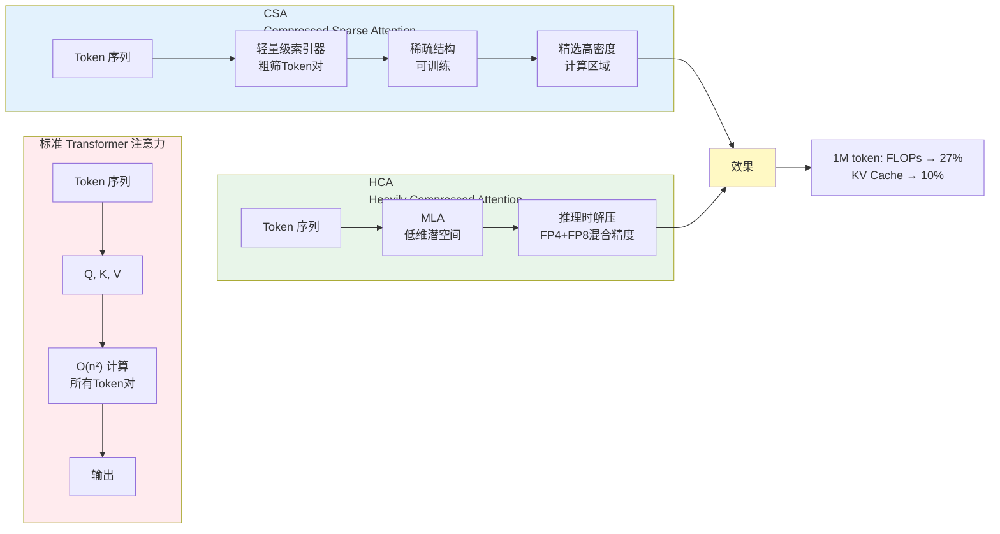

### 2.4 V4-Flash 配置

| 配置项 | 值 |
|--------|-----|
| Transformer 层数 | 43 |
| 隐藏维度 | 4096 |
| Query 头数 | 64 |
| KV 头数 | 1 (GQA) |
| 路由专家数 | 256 |
| 激活专家数 | 6 + 1 shared |
| CSA 压缩率 | 4 |
| HCA 压缩率 | 128 |

---

## 3. GLM-5.1 架构详解

### 3.1 核心架构特点

- **GlmMoeDSA**：Gated DeltaNet 线性注意力 + 标准注意力 + 稀疏 MoE
- **Dense-then-MoE 模式**：前 3 层密集 FFN 热身，后 75 层切换到 MoE
- **DeepSeek Sparse Attention**：借鉴 DeepSeek 稀疏注意力设计
- **MTP Head**：Multi-Token Prediction 推测解码加速

### 3.2 完整数据流

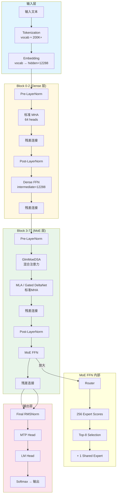

### 3.3 Gated DeltaNet 结构

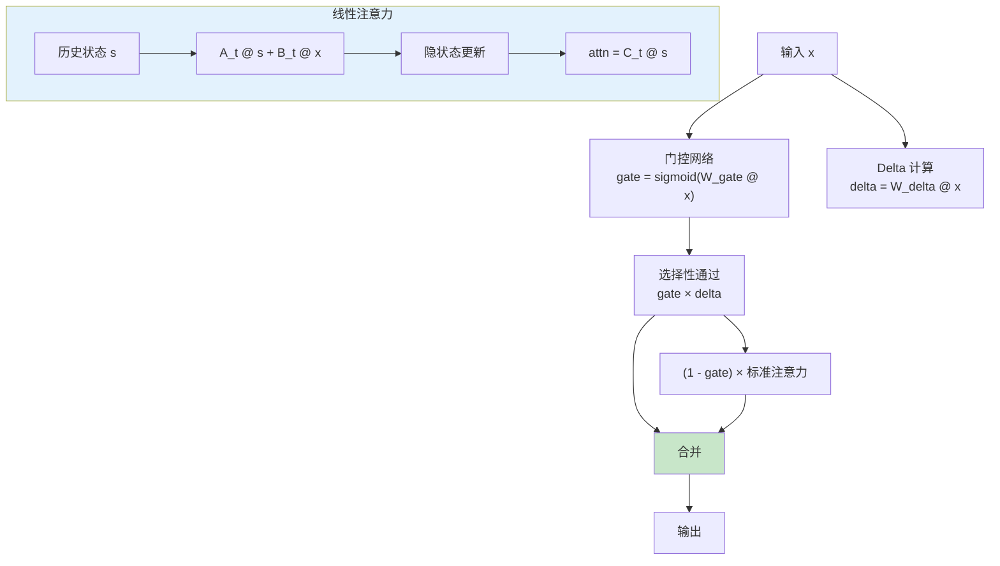

### 3.4 关键配置

| 配置项 | 值 |
|--------|-----|
| Transformer 层数 | 78 |
| 隐藏维度 | 12288 |
| Attention Heads | 64 |
| KV Heads | 64 (Full attention) |
| 前 3 层 FFN | Dense (intermediate_size=12288) |
| 后 75 层 FFN | MoE (256 experts, top-8 routing) |
| 上下文长度 | 200K |

---

## 4. MiniMax M2.7 架构详解

### 4.1 核心架构特点

- **Lightning Attention + Softmax Attention**：混合注意力架构
- **32 个 MoE 专家**：总参数 456B，激活 45.9B
- **Full Attention + RoPE**：稳定长上下文处理
- **128K 滑动窗口**：适合长序列

### 4.2 完整数据流

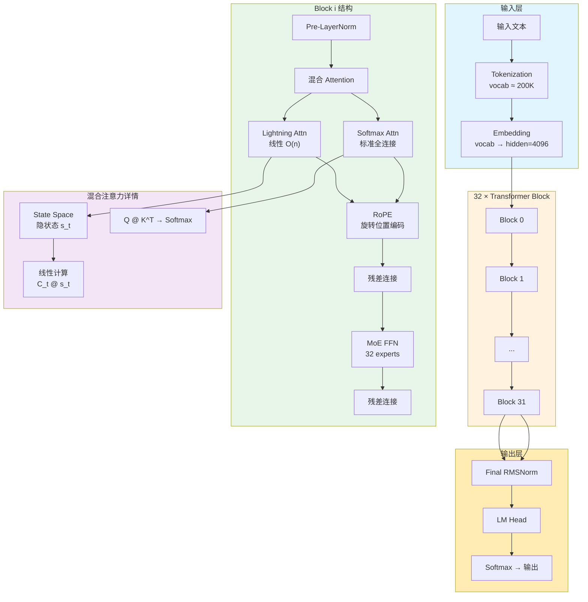

### 4.3 Lightning Attention 结构

```mermaid
flowchart LR
    subgraph StateSpace["State Space Model"]
        A[输入 x_t] --> B["B_t @ x_t"]
        A --> C["A_t @ s_{t-1}"]
        C --> D[状态更新]
        B --> D
        D --> E[隐状态 s_t]
        E --> F["C_t @ s_t"]
        F --> G[输出 attn(x_t)]
    end

    subgraph Comparison["与 Softmax Attention 对比"]
        H[Lightning] --> J[O(n) 线性]
        K[Softmax] --> L[O(n²)]
    end

    G --> M[合并输出]

    style StateSpace fill:#e3f2fd
    style J fill:#c8e6c9
    style L fill:#ffcdd2
```

### 4.4 关键配置

| 配置项 | 值 |
|--------|-----|
| Transformer 层数 | 32 |
| 隐藏维度 | 4096 |
| Attention Heads | 32 |
| KV Heads | 8 (GQA) |
| Head Dim | 128 |
| 专家数 | 32 |
| 上下文长度 | 200K |

---

## 5. Kimi K2.6 架构详解

### 5.1 核心架构特点

- **DeepSeek-V3 主干 + MLA**：继承 DeepSeek 的低秩压缩技术
- **原生多模态**：内置 MoonViT encoder，支持图像输入
- **384 路由专家 + 1 共享专家**：Top-8 + shared expert 架构
- **Agentic 能力**：工具调用、thinking mode、结构化输出

### 5.2 完整数据流

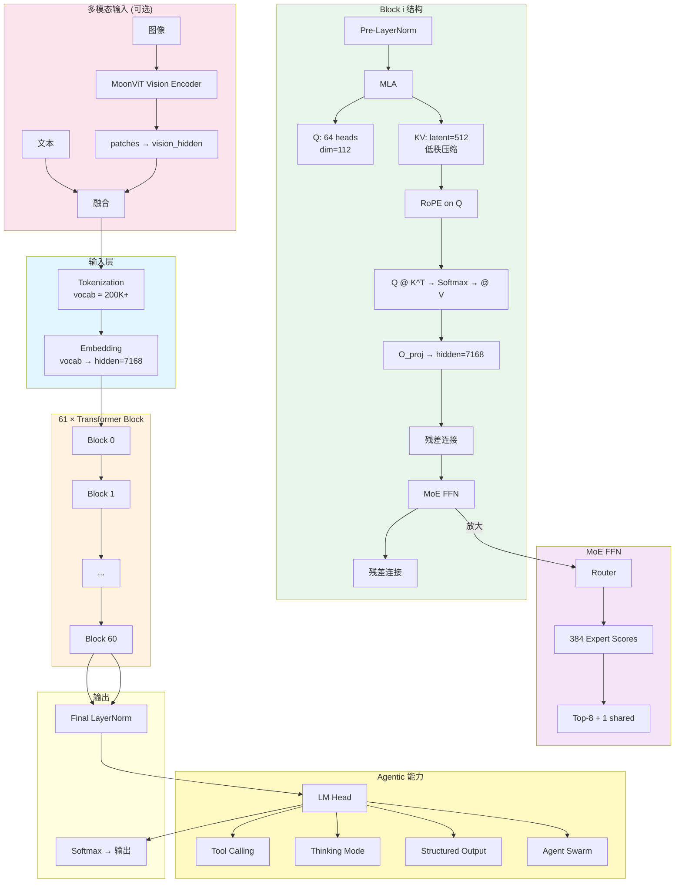

### 5.3 关键配置

| 配置项 | 值 |
|--------|-----|
| Transformer 层数 | 61 |
| 隐藏维度 | 7168 |
| Attention Heads | 64 |
| Head Dim | 112 |
| 路由专家数 | 384 |
| 激活专家数 | 8 + 1 shared |
| 上下文长度 | 262.1K |
| 多模态 | Native (MoonViT) |

---

## 6. MLA 多头潜在注意力详解

### 6.1 标准 MHA vs MLA

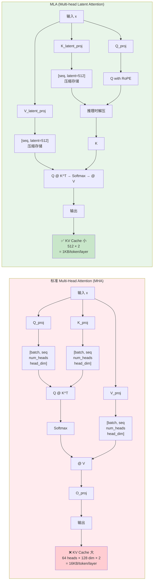

### 6.2 KV Cache 大小对比

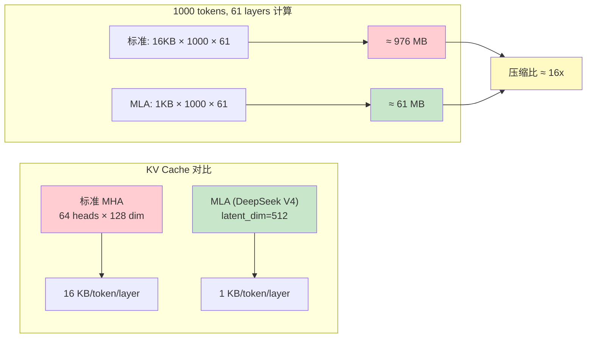

---

## 7. MoE 混合专家架构

### 7.1 MoE 结构

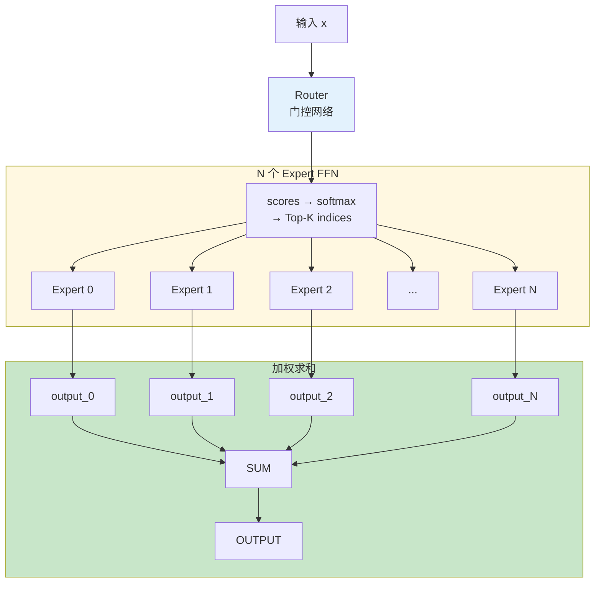

### 7.2 各模型 MoE 配置

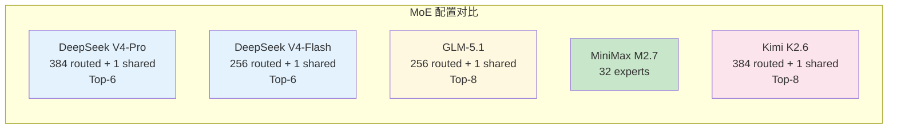

### 7.3 MoE 的资源优势

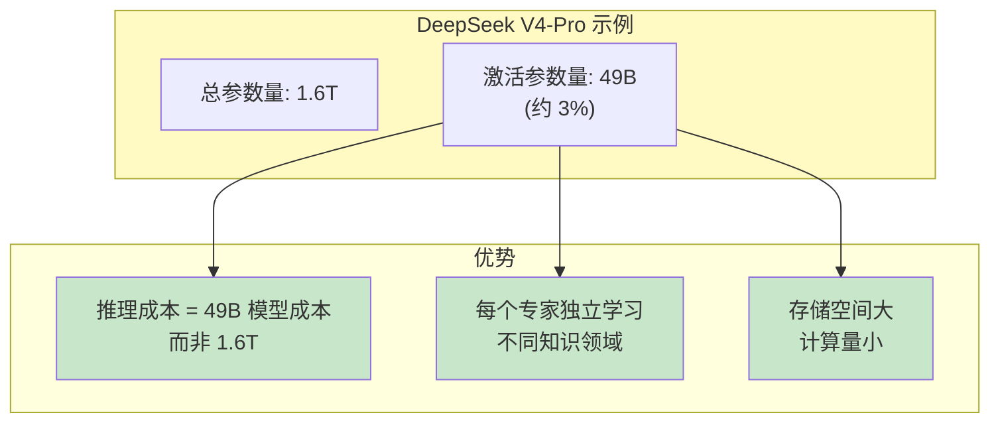

---

## 8. PD 分离部署架构

### 8.1 为什么需要 PD 分离

| 阶段 | 计算特点 | 资源需求 | 瓶颈 |
|------|---------|---------|------|
| **Prefill** | 密集计算，批量矩阵运算 | GPU 计算资源 | 算力 |
| **Decode** | 内存密集，KV Cache 读写 | GPU 显存带宽 | 显存容量 |

### 8.2 PD 分离架构图

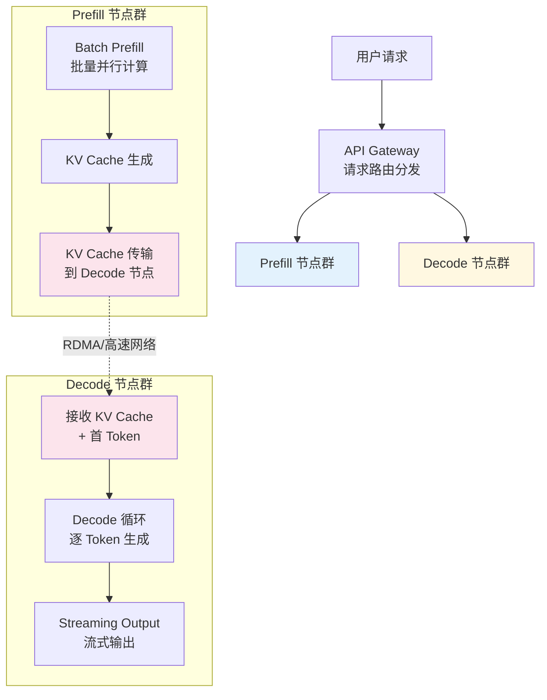

### 8.3 单请求完整数据流

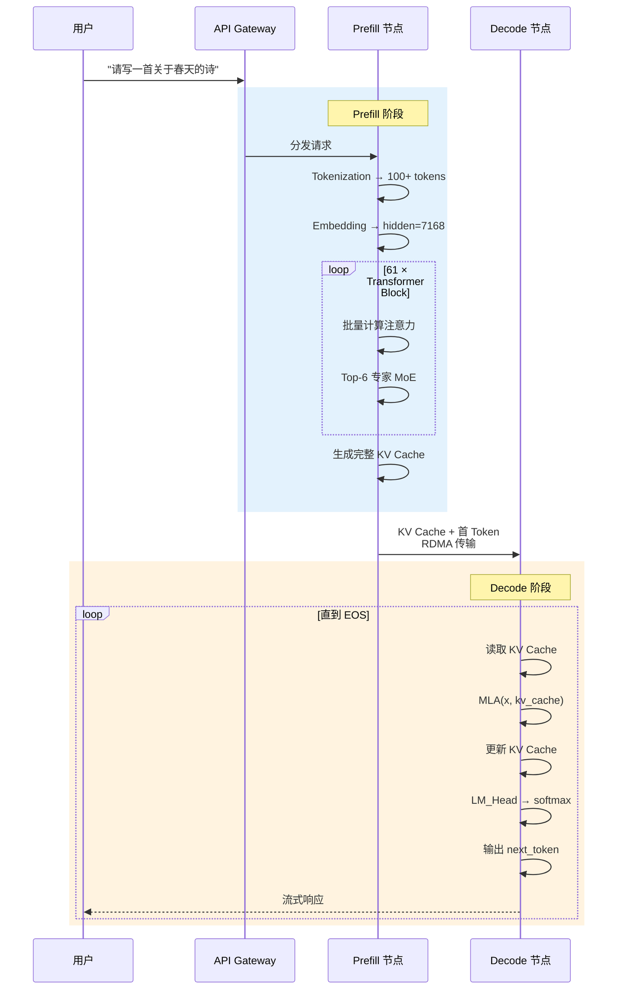

### 8.4 KV Cache 传输计算

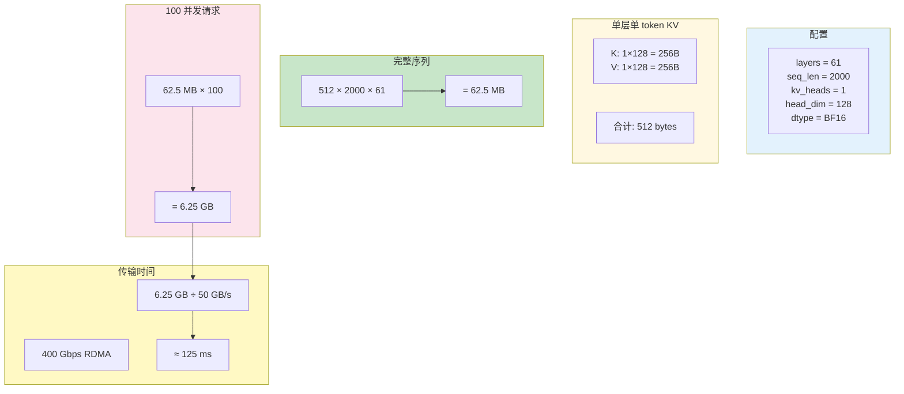

### 8.5 Prefill vs Decode 节点硬件配置

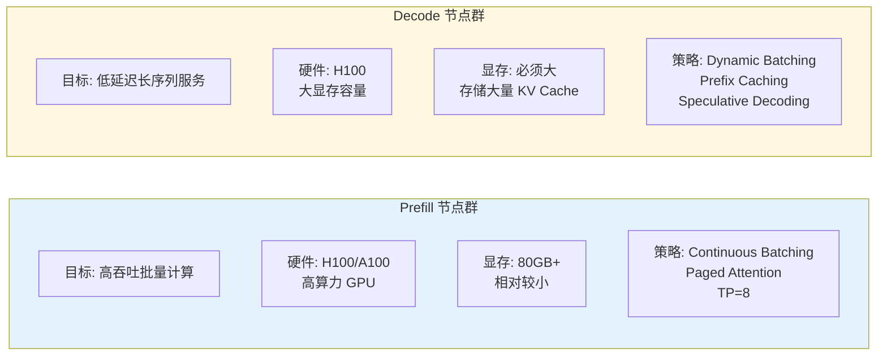

### 8.6 PD 分离变体

#### Prefix Caching 优化

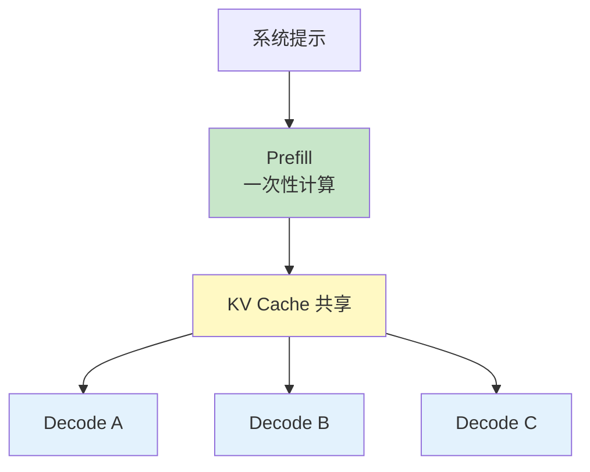

#### 投机解码配合 PD 分离

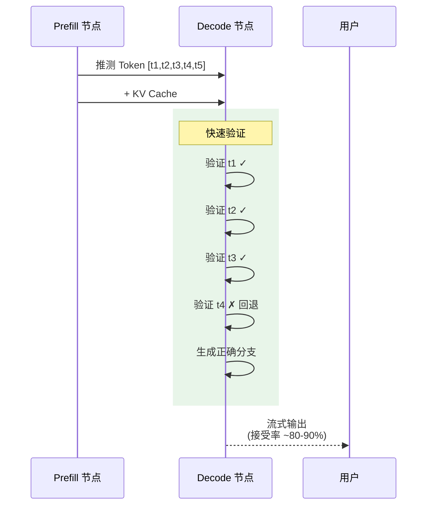

---

## 9. 关键参数对比表

| 参数 | DeepSeek V4-Pro | DeepSeek V4-Flash | GLM-5.1 | MiniMax M2.7 | Kimi K2.6 |
|------|-----------------|------------------|---------|--------------|-----------|
| **总参数量** | 1.6T | 284B | 754B | 456B | 1T |
| **激活参数量** | 49B | 13B | 40B | 45.9B | 32B |
| **Transformer 层数** | 61 | 43 | 78 | 32 | 61 |
| **隐藏维度** | 7168 | 4096 | 12288 | 4096 | 7168 |
| **Attention Heads** | 128 | 64 | 64 | 32 | 64 |
| **Head Dimension** | 512 | 512 | 192 | 128 | 112 |
| **KV Heads (GQA)** | 1 | 1 | 64 | 8 | 1 |
| **MLA latent_dim** | 512 | 512 | 512 | N/A | 512 |
| **MoE 专家总数** | 384 | 256 | 256 | 32 | 384 |
| **激活专家数** | 6 + 1 shared | 6 + 1 shared | 8 + 1 shared | - | 8 + 1 shared |
| **上下文长度** | 1M | 1M | 200K | 200K | 262K |
| **多模态** | ❌ | ❌ | ❌ | ❌ | ✅ |
| **注意力类型** | MLA + CSA/HCA | MLA + CSA/HCA | MLA + Gated DeltaNet | Lightning + Softmax | MLA |

---

## 附录: 术语表

| 术语 | 含义 |
|------|------|
| MLA | Multi-head Latent Attention，低秩 KV 压缩注意力 |
| MoE | Mixture of Experts，混合专家架构 |
| GQA | Grouped Query Attention，分组查询注意力 |
| RoPE | Rotary Position Embedding，旋转位置编码 |
| CSA | Compressed Sparse Attention，压缩稀疏注意力 |
| HCA | Heavily Compressed Attention，重度压缩注意力 |
| mHC | Manifold-Constrained Hyper-Connections，流形约束超连接 |
| MTP | Multi-Token Prediction，多 token 预测 |
| PD | Prefill-Decode，推理两阶段分离 |
| KV Cache | Key-Value Cache，注意力计算的缓存 |
| FFN | Feed-Forward Network，前馈网络 |