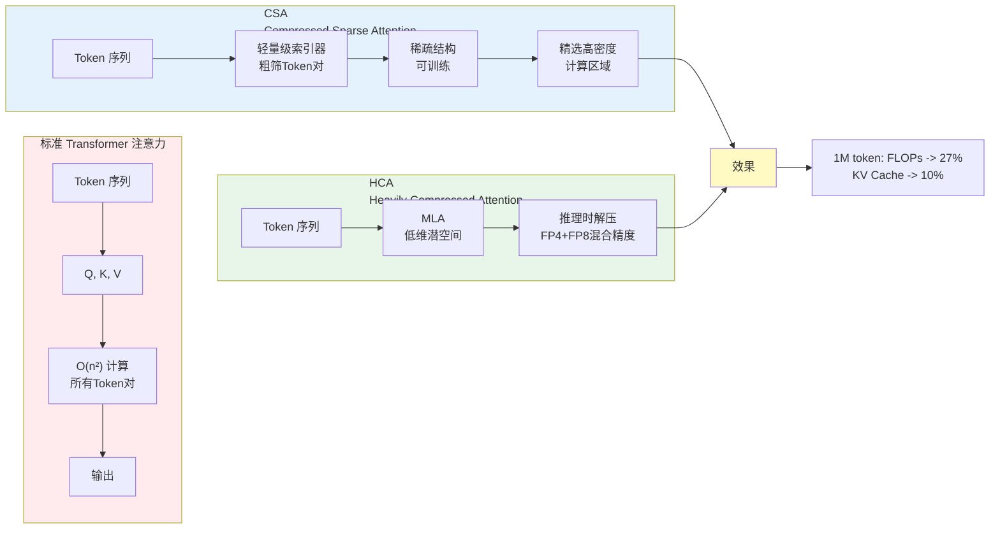
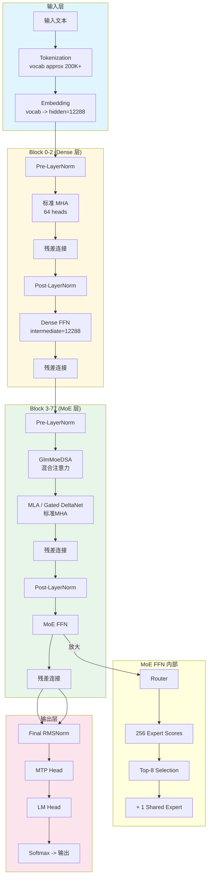
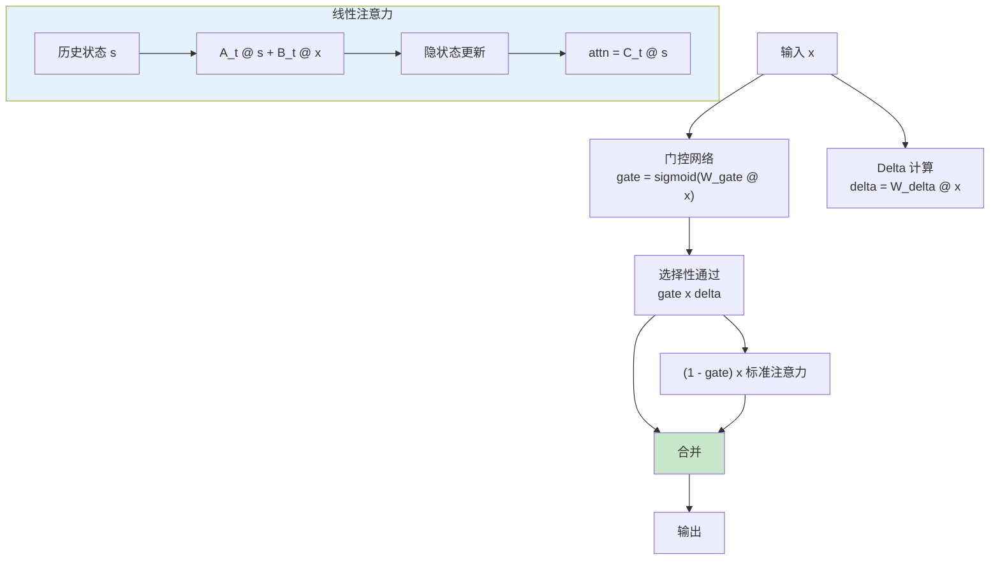
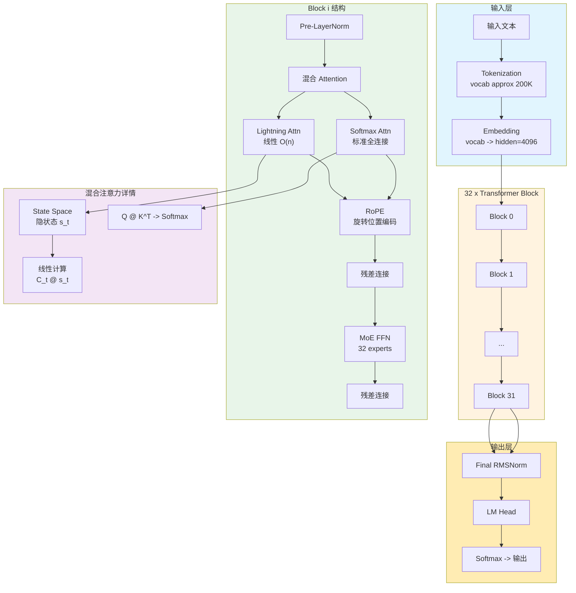
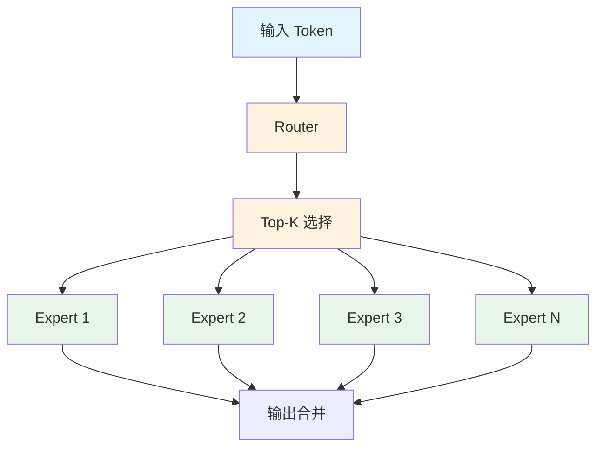
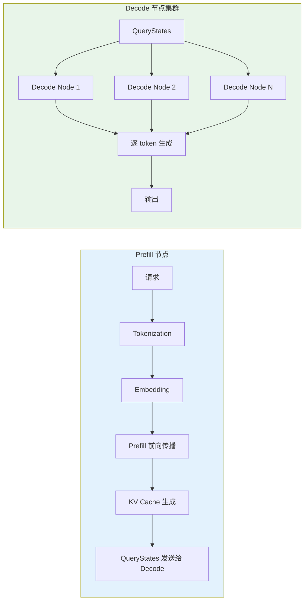

# 四大开源大语言模型架构详解与 PD 分离部署

> 更新日期：2025年
> 涵盖模型：DeepSeek V4、GLM-5.1、MiniMax M2.7、Kimi K2.6

***

## 目录

* [1. 模型概览](#1-模型概览)

* [2. DeepSeek V4 架构详解](#2-deepseek-v4-架构详解)

* [3. GLM-5.1 架构详解](#3-glm-51-架构详解)

* [4. MiniMax M2.7 架构详解](#4-minimax-m27-架构详解)

* [5. Kimi K2.6 架构详解](#5-kimi-k26-架构详解)

* [6. MLA 多头潜在注意力详解](#6-mla-多头潜在注意力详解)

* [7. MoE 混合专家架构](#7-moe-混合专家架构)

* [8. PD 分离部署架构](#8-pd-分离部署架构)

* [9. 关键参数对比表](#9-关键参数对比表)

***

## 1. 模型概览

| 模型                    | 总参数量 | 激活参数量 | Transformer 层数 | 隐藏维度  | 上下文长度 |
| --------------------- | ---- | ----- | -------------- | ----- | ----- |
| **DeepSeek V4-Pro**   | 1.6T | 49B   | 61             | 7168  | 1M    |
| **DeepSeek V4-Flash** | 284B | 13B   | 43             | 4096  | 1M    |
| **GLM-5.1**           | 754B | 40B   | 78             | 12288 | 200K  |
| **MiniMax M2.7**      | 456B | 45.9B | 32             | 4096  | 200K  |
| **Kimi K2.6**         | 1T   | 32B   | 61             | 7168  | 262K  |

***

## 2. DeepSeek V4 架构详解

### 2.1 核心架构特点

* **MLA (Multi-head Latent Attention)**：低秩 KV 压缩，显著降低 KV Cache 显存

* **CSA + HCA 混合注意力**：Compressed Sparse Attention + Heavily Compressed Attention

* **mHC (Manifold-Constrained Hyper-Connections)**：新型残差连接，解决深层数值不稳定

* **DeepSeekMoE**：256/384 路由专家 + 1 共享专家，Top-6 激活

<br />

### 2.2 V4-Pro 完整数据流

```

subgraph TransformerBlock["61 × Transformer Block"]
    direction LR
    D1["Block 0"] --> D2["Block 1"] --> D3["..."] --> D61["Block 60"]
end

subgraph SingleBlock["Block i 结构"]
    direction TB
    E[Pre-LayerNorm<br/>RMSNorm] --> F["MLA<br/>Multi-head Latent Attention"]
    F --> F1[残差连接]
    F1 --> G[Post-LayerNorm]
    G --> H["DeepSeekMoE FFN"]
    H --> I[残差连接<br/>Block_output]
end

subgraph MLA_Detail["MLA 内部结构"]
    J[Q/K/V 投影] --> J1["Latent Space<br/>dim=512"]
    J1 --> J2[RoPE on Q]
    J2 --> J3["Q @ K^T / sqrt(d)"]
    J3 --> J4[Softmax]
    J4 --> J5[@V -> O_proj]
    J5 --> J6[Output hidden=7168]
end

subgraph MoE_Detail["DeepSeekMoE 内部结构"]
    K[Router] --> K1[384 Expert Scores]
    K1 --> K2[Top-6 Selection]
    K2 --> K3["+ 1 Shared Expert<br/>所有Token经过"]
    K3 --> K4["每个专家<br/>intermediate=18432"]
end

C --> D1
D61 --> L[Final RMSNorm]
L --> M[LM Head]
M --> N[Softmax]
N --> O[输出 Token]

style Input fill:#e1f5fe
style TransformerBlock fill:#fff3e0
style SingleBlock fill:#e8f5e9
style MLA_Detail fill:#fce4ec
style MoE_Detail fill:#f3e5f5
```

### 2.3 CSA + HCA 混合注意力详解



### 2.4 V4-Flash 配置

| 配置项            | 值            |
| -------------- | ------------ |
| Transformer 层数 | 43           |
| 隐藏维度           | 4096         |
| Query 头数       | 64           |
| KV 头数          | 1 (GQA)      |
| 路由专家数          | 256          |
| 激活专家数          | 6 + 1 shared |
| CSA 压缩率        | 4            |
| HCA 压缩率        | 128          |

***

## 3. GLM-5.1 架构详解

### 3.1 核心架构特点

* **GlmMoeDSA**：Gated DeltaNet 线性注意力 + 标准注意力 + 稀疏 MoE

* **Dense-then-MoE 模式**：前 3 层密集 FFN 热身，后 75 层切换到 MoE

* **DeepSeek Sparse Attention**：借鉴 DeepSeek 稀疏注意力设计

* **MTP Head**：Multi-Token Prediction 推测解码加速

### 3.2 完整数据流



### 3.3 Gated DeltaNet 结构



### 3.4 关键配置

| 配置项             | 值                                |
| --------------- | -------------------------------- |
| Transformer 层数  | 78                               |
| 隐藏维度            | 12288                            |
| Attention Heads | 64                               |
| KV Heads        | 64 (Full attention)              |
| 前 3 层 FFN       | Dense (intermediate\_size=12288) |
| 后 75 层 FFN      | MoE (256 experts, top-8 routing) |
| 上下文长度           | 200K                             |

***

## 4. MiniMax M2.7 架构详解

### 4.1 核心架构特点

* **Lightning Attention + Softmax Attention**：混合注意力架构

* **32 个 MoE 专家**：总参数 456B，激活 45.9B

* **Full Attention + RoPE**：稳定长上下文处理

* **128K 滑动窗口**：适合长序列

### 4.2 完整数据流



### 4.3 Lightning Attention 结构

Mermaid 渲染失败：Parse error on line 9:
flowchart LR
subgraph StateSpace\["State Space Model"]
A\[输入 x\_t] --> B\["B\_t @ x\_t"]
A --> C\["A\_t @ s\_{t-1}"]
C --> D\[状态更新]
B --> D
D --> E\[隐状态 s\_t]
E --> F\["C\_t @ s\_t"]
F --> G\[输出 attn(x\_t)]
end

```
subgraph Comparison["与 Softmax Attention 对比"]
    H[Lightning] --> J[O(n) 线性]
    K[Softmax] --> L[O(n^2)]
end

G --> M[合并输出]

style StateSpace fill:#e3f2fd
style J fill:#c8e6c9
style L fill:#ffcdd2
```

### 4.4 关键配置

| 配置项             | 值       |
| --------------- | ------- |
| Transformer 层数  | 32      |
| 隐藏维度            | 4096    |
| Attention Heads | 32      |
| KV Heads        | 8 (GQA) |
| Head Dim        | 128     |
| MoE 专家数         | 32      |
| 激活专家数           | 8       |
| 上下文长度           | 200K    |

***

## 5. Kimi K2.6 架构详解

### 5.1 核心架构特点

* **MoE 结构**：1T 总参数量，激活 32B

* **61 层 Transformer**：深层次架构

* **7168 隐藏维度**：与 DeepSeek V4-Pro 相同配置

* **LongContext**：262K 上下文长度

### 5.2 架构特点

* **稀疏 MoE**：大量专家路由

* **GQA + RoPE**：高效的 KV 压缩和位置编码

* **分层注意力**：不同层使用不同注意力策略

### 5.3 关键配置

| 配置项             | 值       |
| --------------- | ------- |
| Transformer 层数  | 61      |
| 隐藏维度            | 7168    |
| Attention Heads | 64      |
| KV Heads        | 8 (GQA) |
| 总参数量            | 1T      |
| 激活参数量           | 32B     |
| 上下文长度           | 262K    |

***

## 6. MLA 多头潜在注意力详解

### 6.1 核心思想

MLA 通过低秩分解压缩 Key-Value 矩阵，显著降低 KV Cache 显存占用：

```
原始 KV: [seq_len, num_heads, head_dim]
压缩后: [seq_len, num_latents]
num_latents << num_heads * head_dim
```

### 6.2 压缩优势

| 指标          | 标准 MHA                 | MLA          |
| ----------- | ---------------------- | ------------ |
| KV Cache 维度 | num\_heads × head\_dim | num\_latents |
| 压缩比         | 1x                     | \~12x        |
| 显存节省        | -                      | \~90%        |

### 6.3 RoPE 兼容性

MLA 需特殊处理 RoPE，因为压缩后无法直接应用旋转位置编码：

1. Q 在低维空间应用 RoPE
2. K 不使用 RoPE（压缩后位置信息丢失）
3. 解码时重建完整 K 用于注意力计算

***

## 7. MoE 混合专家架构

### 7.1 MoE 基本原理



### 7.2 各模型 MoE 配置对比

| 模型                | 专家总数 | 激活专家 | 共享专家 | Top-K          |
| ----------------- | ---- | ---- | ---- | -------------- |
| DeepSeek V4-Pro   | 384  | 6    | 1    | Top-6 + shared |
| DeepSeek V4-Flash | 256  | 6    | 1    | Top-6 + shared |
| GLM-5.1           | 256  | 8    | 1    | Top-8 + shared |
| MiniMax M2.7      | 32   | 8    | 1    | Top-8          |
| Kimi K2.6         | -    | -    | -    | -              |

### 7.3 共享专家机制

共享专家（Shared Expert）所有 token 都经过，无论路由结果：

```
FFN_output = sum(activated_expert_outputs) + shared_expert_output
```

这确保基础能力由共享专家维护，防止路由失败时能力退化。

***

## 8. PD 分离部署架构

### 8.1 Prefill-Decode 分离原理



### 8.2 分离优势

1. **负载均衡**：Prefill  Compute-bound，Decode  Memory-bound
2. **独立扩展**：根据请求模式分别扩缩容
3. **KV 传输优化**：只传输 QueryStates，而非完整 KV Cache
4. **批处理优化**：不同阶段使用不同 batch size

### 8.3 部署配置建议

| 阶段      | GPU 配置   | 显存占用           | Batch Size |
| ------- | -------- | -------------- | ---------- |
| Prefill | H100 80G | 高（KV Cache 大）  | 较小         |
| Decode  | H100 80G | 低（共享 KV Cache） | 较大         |

***

## 9. 关键参数对比表

### 9.1 模型规模对比

| 模型                | 总参数量 | 激活参数  | 层数 | 隐藏维度  | 专家数 | 激活专家 |
| ----------------- | ---- | ----- | -- | ----- | --- | ---- |
| DeepSeek V4-Pro   | 1.6T | 49B   | 61 | 7168  | 384 | 6+1  |
| DeepSeek V4-Flash | 284B | 13B   | 43 | 4096  | 256 | 6+1  |
| GLM-5.1           | 754B | 40B   | 78 | 12288 | 256 | 8+1  |
| MiniMax M2.7      | 456B | 45.9B | 32 | 4096  | 32  | 8    |
| Kimi K2.6         | 1T   | 32B   | 61 | 7168  | -   | -    |

### 9.2 注意力配置对比

| 模型                | Q Heads | KV Heads | Head Dim | 注意力类型                | 上下文  |
| ----------------- | ------- | -------- | -------- | -------------------- | ---- |
| DeepSeek V4-Pro   | 64      | 8 (GQA)  | 128      | MLA + CSA + HCA      | 1M   |
| DeepSeek V4-Flash | 64      | 1 (GQA)  | 64       | MLA + CSA + HCA      | 1M   |
| GLM-5.1           | 64      | 64       | 192      | MLA + Gated DeltaNet | 200K |
| MiniMax M2.7      | 32      | 8 (GQA)  | 128      | Lightning + Softmax  | 200K |
| Kimi K2.6         | 64      | 8 (GQA)  | 128      | -                    | 262K |

### 9.3 FFN 配置对比

| 模型                | FFN 类型    | Intermediate Size | 专家路由        | Top-K |
| ----------------- | --------- | ----------------- | ----------- | ----- |
| DeepSeek V4-Pro   | MoE       | 18432             | 384 experts | 6     |
| DeepSeek V4-Flash | MoE       | -                 | 256 experts | 6     |
| GLM-5.1           | Dense+MoE | 12288/12288       | 256 experts | 8     |
| MiniMax M2.7      | MoE       | -                 | 32 experts  | 8     |
| Kimi K2.6         | MoE       | -                 | -           | -     |

***

## 附录：Mermaid 语法注意事项

1. **特殊符号**：节点标签中的 `@`、`^`、`/` 等符号可能触发解析错误，应使用引号包裹
2. **箭头语法**：Mermaid 中 `-->` 是标准连接符，避免使用 `<--` 等可能冲突的语法
3. **引号使用**：包含空格或特殊字符的标签必须用双引号 `"` 包裹
4. **Unicode 兼容**：部分 Unicode 符号（如 √）可能在部分渲染器不支持，建议用文本替代

