> 本文边界：这是 Qwen 双卡异步推理的项目特定 TorchInductor autotune 配置方案，不是 Python/Torch 编译栈的通用原理；现归入 [单机部署 qwen3.5-9b](./单机部署%20qwen3.5-9b.md) 实验目录。
>
> 相关笔记：[Torch编译Inductor原理.md](../../编程语言/Python/Torch编译Inductor原理.md) 解释通用 Inductor 内部实现；[PyTorch 2.8 torch.compile 全流程、缓存与重编.md](../../编程语言/Python/PyTorch%202.8%20torch.compile%20全流程、缓存与重编.md) 记录版本特定缓存与重编。

本文记录 Qwen 双卡异步推理中 TorchInductor autotune 配置固化方案。目标是在保留动态 FP8、SageAttention 和 `torch.compile` 的前提下，让单卡基线、双卡 GPU 0 和 GPU 1 对同一个 Triton kernel 使用相同 launch config，消除 reduction 累加顺序不同导致的效果分叉。

核心结论：固化的不是模型、随机数或整份 Cubin，而是每个 Triton kernel 最终采用的 `XBLOCK/R0_BLOCK/num_warps/num_stages` 等调度参数。线上仍可在每张卡上独立加载或编译 binary，但不再各自测速选择配置。

## 一、问题来源

双卡方案在一个进程内初始化两份相同的 Qwen Pipeline：

```text
GPU 0：整图 Pipeline
GPU 1：小人脸 Pipeline
```

两份 Pipeline 的模型权重、LoRA、输入参数和 Generator 状态可以保持一致，但开启动态 FP8、SageAttention 和 Compile 后，GPU 0 与 GPU 1 的输出曾不能逐像素一致。

此前逐层诊断得到：

```text
1. 第一处数值分叉出现在未量化的 transformer block 0

2. 首个分叉 kernel 是融合 SiLU 和两个 addmm 的 reduction kernel：
   triton_red_fused_addmm_0

3. 两卡输入和权重一致，但该 kernel 输出 hash 不同

4. 动态 FP8 的 torchao 配置会全局开启 Inductor 的
   coordinate_descent_tuning；目标 reduction 路径同时启用了
   dynamic_scale_rblock

5. GPU 0、GPU 1 独立进行 autotune，可能选择不同的
   R0_BLOCK、num_warps 或 reduction tile
```

动态 FP8 本身不是第一处不同；它通过全局开启 coordinate descent，让未量化 block 也进入更积极的 reduction 配置搜索。`dynamic_scale_rblock` 是该 Inductor reduction 路径中同时存在的机制，不是 torchao setter 明确写入的配置项。

## 二、为什么配置不同会改变结果

以 reduction 为例：

```text
配置 A：
    R0_BLOCK=512
    num_warps=16
    将 3072 个元素拆成较多小块再归约

配置 B：
    R0_BLOCK=4096
    num_warps=8
    使用另一种线程与 warp reduction tree
```

两者实现同一个数学表达式，但浮点加法不满足严格结合律：

```text
(a + b) + c 可能不等于 a + (b + c)
```

tile 和 warp 改变后，元素分组与累加树发生变化，BF16/FP32 低位可能不同。扩散模型会在多个 block 和 denoise step 中继续使用该结果，小差异可以逐步传播到最终像素。

问题不是“相同 GPU 天生不确定”，而是两次 Compile/autotune 做出了不同调度决策。

## 三、为什么 PyTorch 自带 AutotuneCache 没有完全复用

PyTorch 2.8 的 `AutotuneCache` 使用生成 kernel 文件名/源码 hash、Config hash、Torch/Triton backend hash 等信息定位最佳配置。[PyTorch 2.8 AutotuneCache](https://github.com/pytorch/pytorch/blob/v2.8.0/torch/_inductor/runtime/autotune_cache.py)

当前双卡场景中，两个编译上下文生成的 wrapper 带有不同 `DeviceProperties(index=0/1)`。由此生成的文件和缓存 key 不同，GPU 1 无法直接命中 GPU 0 的 autotune 结果，只能在 GPU 1 上重新测速。

相邻 Config 性能很接近时，benchmark 噪声足以让两张卡选择不同配置。自带缓存仍然有效，但它没有提供当前项目需要的“忽略 device index、按 kernel 本体跨卡共享选择结果”。

这是根据 PyTorch 缓存 key 机制和本项目产物作出的推导；自定义固化表就是补充一层跨设备的 Config 决策缓存。

## 四、方案总览

```mermaid
flowchart LR
    subgraph C[采集阶段：认可的单卡基线]
        C1[安装 collector Hook] --> C2[正常 Compile/autotune]
        C2 --> C3[记录每个 kernel 最终 launcher.config]
        C3 --> C4[生成 autotune_pin.json]
    end

    C4 --> P[与 torch_inductor 缓存一起打包发布]

    subgraph R[运行阶段：单卡和双卡共用]
        R1[Compile 前加载配置表] --> R2[Hook CachingAutotuner.run]
        R2 --> R3[按 kernel key 查表]
        R3 --> R4[复用或编译指定 Config]
        R4 --> R5[launchers 只保留一个]
        R5 --> R6[跳过 benchmark 与 coordinate descent]
    end

    P --> R1
```



方案分成两种模式：

```text
collect：
    让认可的单卡基线正常 autotune，记录最终实际使用的 Config

pin：
    单卡、GPU 0、GPU 1 查同一张表，强制使用已记录 Config
```

## 五、Hook 安装位置

算法加载模型时，在 `apply_opt_to_qwenimage_pipe()` 之前调用：

```python
autotune_pin.maybe_install_from_env()
```

仓库位置：

```text
plugins/aiflashlight_v2src/qwen_edit_algorithm_single_parsing.py
```

顺序必须是：

```text
安装 Hook
    ↓
应用动态 FP8 / Sage / torch.compile
    ↓
执行 warmup，触发实际 Compile 和 kernel 首次运行
```

如果在 warmup 之后才安装，已经运行过 autotune 的 `CachingAutotuner` 不会重新进入配置选择阶段。

## 六、真正被修改的 PyTorch 函数

项目真正 monkey-patch 的只有：

```python
torch._inductor.runtime.triton_heuristics.CachingAutotuner.run
```

实现位于：

```text
plugins/aiflashlight_v2src/autotune_pin.py
```

核心结构：

```python
original = CachingAutotuner.run

def patched(self, *args, **kwargs):
    first = not self._autotune_pin_seen

    if first and pin_mode:
        if not self.launchers:
            self.precompile()
        apply_pin(self)

    result = original(self, *args, **kwargs)

    if first and collect_mode:
        record(self)

    return result
```

`precompile()`、`_precompile_config()`、`make_launcher()`、`coordinate_descent_tuning()` 没有被替换；固化逻辑只是改变了进入原始 `run()` 前的 tuner 状态。

## 七、为什么选择 `CachingAutotuner.run()`

PyTorch 2.8 可能在 compile worker 中预编译 kernel，再把 `CachingAutotuner` pickle 回主进程。为了序列化，`prepare_for_pickle()` 会清掉：

```text
tuner.fn.fn
tuner.fn.__globals__
tuner.launchers
```

因此 Hook 构造函数或 worker 编译阶段并不能稳定拿到最终在业务进程执行的 launcher。

`CachingAutotuner.run()` 则满足：

```text
1. 每个 Triton kernel 真正执行前必经
2. 已经知道当前 GPU 和真实输入
3. 位于 benchmark 与 coordinate descent 之前
4. worker 清空 launcher 后，run 会在主进程恢复执行态
```

PyTorch 2.8 原始顺序为：

```python
if len(self.launchers) == 0:
    self.precompile()

if len(self.launchers) > 1:
    self.autotune_to_one_config()

if coordinate_descent_tuning and not config.found_by_coordesc:
    self.coordinate_descent_tuning(...)

return launcher(...)
```

对应源码：[PyTorch 2.8 `triton_heuristics.py`](https://github.com/pytorch/pytorch/blob/v2.8.0/torch/_inductor/runtime/triton_heuristics.py)。

## 八、kernel key 如何生成

不能直接使用 kernel 函数名：GPU 0、GPU 1 的 kernel 编号和生成文件可能不同。当前实现使用：

```python
source = tuner.fn.src.strip()
normalized_source = remove_function_name(source)

key = sha256(
    str(tuner.size_hints)
    + normalized_source
)
```

key 保留：

```text
Triton kernel 函数体
size_hints
```

key 忽略：

```text
生成的 kernel 函数名
kernel 编号
外层 wrapper 文件路径
外层 DeviceProperties index
```

当前实现只显式移除了函数名。它之所以能跨卡，是因为 `tuner.fn.src` 是 Triton 函数体，device index 位于外层 metadata，而不在这段函数体中。

边界：如果未来 PyTorch/Triton 把 device 信息或其他不影响语义的信息写进 `fn.src`，key 会变化并产生 miss；如果两个逻辑上不应共享的 kernel 恰好拥有相同函数体与 `size_hints`，则会共享同一条 Config。

## 九、配置表记录什么

`_config_to_entry()` 记录：

```text
config.kwargs：
    XBLOCK
    R0_BLOCK
    其他 constexpr block 参数

config metadata：
    num_warps
    num_stages
    num_ctas
```

概念形式：

```text
kernel_hash:
    XBLOCK = 1
    R0_BLOCK = 4096
    num_warps = 8
    num_stages = 1
```

它不保存：

```text
模型权重
输入 tensor
随机数状态
动态 FP8 activation scale
PTX/Cubin 字节
完整 Inductor wrapper
```

## 十、采集流程

采集脚本：

```text
tools/collect_autotune_pin.py
```

运行方式：

```bash
cd /app
PYTHONPATH=/app python tools/collect_autotune_pin.py \
    --output /app/cache/autotune_pin.json \
    --image <含小人脸的测试图>
```

流程：

```text
stage1：设置 AUTOTUNE_PIN_COLLECT

stage2：在导入并编译 Qwen 前安装 collector Hook

stage3：加载单卡 Qwen，执行 1024×1024 warmup

stage4：原始 CachingAutotuner.run 正常执行
        precompile → benchmark → coordinate descent → launcher

stage5：patched run 在原始 run 返回后读取 launchers[0].config

stage6：执行 face_crop_flag=0 和 1
        覆盖整图和小人脸分支

stage7：按 kernel key 去重并写入 autotune_pin.json

stage8：配置表与本次 torch_inductor 缓存一起打包
```

记录发生在原始 `run()` 之后，因此保存的是本次真实执行过的最终 Config，不是初始候选或理论默认值。

当前采集脚本明确使用 `1024×1024` 参数和一张含小人脸图片。它验证了当时测试路径，但不能自动证明所有线上尺寸和分支都已覆盖。

## 十一、运行时固化流程

`run.sh` 对 5090 单卡和双卡都解压：

```text
aistyleplus_inductor_cache_torch280_5090x2.tar.gz
```

其中包含：

```text
/app/cache/torch_inductor/...
/app/cache/autotune_pin.json
```

随后导出：

```bash
export AUTOTUNE_PIN_TABLE=/app/cache/autotune_pin.json
```

每个 Triton tuner 第一次执行时：

```text
stage1：如果 launchers 为空，调用原始 precompile()

stage2：计算 kernel key 并查 autotune_pin.json

stage3：如果已有 launcher 的 config 与固化项相同
        直接复用该 launcher

stage4：如果现有候选不包含固化 config
        从模板重建 Config
        必要时通过 _reload_kernel() 恢复 JITFunction
        调用 _precompile_config(config)
        调用 make_launcher()

stage5：在对应 GPU 的 DeviceGuard 中建立 launcher

stage6：强制设置
        tuner.launchers = [pinned_launcher]
        config.found_by_coordesc = True

stage7：进入 PyTorch 原始 run()
        launcher 数量为1，跳过 benchmark
        found_by_coordesc=True，跳过 coordinate descent

stage8：执行 pinned launcher
```

## 十二、各函数的角色

```text
maybe_install_from_env：
    根据环境变量选择 collect 或 pin 模式

install_collector：
    开启采集模式并安装 run Hook

install_pin：
    读取配置表，开启固化模式并安装 run Hook

_install_run_patch：
    全进程替换 CachingAutotuner.run，且只替换一次

_kernel_key：
    生成跨 device index 的 kernel 身份

_config_to_entry：
    将 Triton Config 序列化为配置表条目

_entry_to_config：
    使用当前 Config 类重建固化 Config

_record：
    采集原始 autotune 最终 launcher.config

_apply_pin：
    查表并累计 pinned/missed/failed

_force_config：
    复用或编译指定 Config，替换 tuner.launchers

precompile：
    PyTorch 原生函数，将候选 Config 预编译成 CompileResult/launcher

_precompile_config：
    PyTorch 原生函数，将一份指定 Config 编译成 CompileResult

make_launcher：
    将 compiled binary 和 config 包装成可执行 launcher

_reload_kernel：
    恢复 worker pickle 时被清掉的 Triton JITFunction

autotune_to_one_config：
    原生 benchmark 选择函数；固化成功后被跳过

coordinate_descent_tuning：
    原生邻域搜索函数；通过 found_by_coordesc=True 跳过
```

## 十三、配置表与普通 Compile 缓存的关系

两个产物解决不同问题：

```text
torch_inductor 缓存：
    解决“图、wrapper 和这个 kernel binary 是否已经生成”
    主要目标是减少冷启动编译时间

autotune_pin.json：
    解决“多个合法 Config 最终必须选哪一个”
    主要目标是跨卡数值路径一致
```

只带 Inductor 缓存而不带固化表：

```text
GPU 1 可能因 device-specific cache key 重新 autotune
仍可能选择不同 reduction Config
```

只带固化表而没有 binary 缓存：

```text
可以强制选择相同 Config
但每张卡仍可能需要编译对应 binary，冷启动更慢
```

因此当前缓存包同时携带两者。

## 十四、为什么单卡也必须使用同一配置表

效果基线由“计算公式 + launch Config”共同决定。双卡都固化，但单卡仍独立 autotune，单卡可能选到另一份 Config，最终仍然无法逐 bit 对齐。

所以 5090 单卡和双卡统一使用带配置表的 `5090x2` 包：

```text
单卡基线 → 固化表 Config
双卡 GPU 0 → 同一 Config
双卡 GPU 1 → 同一 Config
```

`5090x2` 只是当前包名；它实际已经成为 5090 单卡和双卡共同的 Compile 产物包。

## 十五、这个方案保证什么

在以下条件全部成立时，它消除当前已定位的 autotune 调度分叉：

```text
GPU 型号和计算架构一致
Torch、Triton、Optkit、SageAttention 版本一致
模型结构、权重和 LoRA 状态一致
输入数据和处理参数一致
Generator 初始状态一致
kernel 源码与 size_hints 能命中同一条表项
所有相关 kernel 的 pin 均成功
```

它不独立保证：

```text
不同模型版本仍一致
随机数逻辑错误时仍一致
不同 GPU 架构使用同一配置仍合法或最优
新尺寸、新分支自动被配置表覆盖
其他非 autotune 的非确定性被消除
```

## 十六、失败路径

当前实现采用“失败后继续运行”：

```text
配置表没有 key：
    missed += 1
    保留原始 launchers
    原始 run 继续 autotune

固化 Config 重建或编译失败：
    failed += 1
    原始 run 继续 autotune

固化成功：
    pinned += 1
```

这保证服务可运行，但不能保证效果一致。当前只在 warmup 后打印：

```text
autotune pin stats {'pinned': ..., 'missed': ..., 'failed': ...}
```

而且 stats 是进程级累计值。两份 Pipeline 顺序加载时，第二次日志包含第一张卡的数据，不是每卡独立统计。

## 十七、现有实验记录

以下结果来自分支提交说明，尚未在本文撰写时重新上机复核：

```text
提交 08d6711：
    固化前双卡逐像素一致率约 6.54%
    固化后 GPU 0、GPU 1 逐 bit 一致
    并与采集时的单卡基线逐 bit 一致
    warmup 约 124.8s/83.1s → 26.6s/17.8s

提交 6685085：
    采集表约 70 个 kernel
    运行时每份模型约 65 次 pin，missed=0
    两卡逐像素一致率 100%

提交 082edfb：
    单卡也改用带配置表的 5090x2 包
    单卡、GPU 0、GPU 1 三份输出逐像素一致率 100%
    有缓存时单卡 warmup 记录约 10.7s
```

这些数据证明该方案在当时的 RTX 5090、Torch 2.8、指定模型与测试输入上有效，不等价于覆盖所有线上 shape。

## 十八、当前风险

### 配置表不是启动硬门槛

`run.sh` 找不到新缓存包或配置表时只告警并继续启动；算法 miss/failed 也不会拒绝接流。若逐 bit 一致是部署要求，这个语义不够严格。

### 缺少版本 manifest

当前 JSON 只有 kernel key 和 Config，没有记录：

```text
GPU 型号与 compute capability
Torch/Triton/CUDA 版本
Optkit/SageAttention 版本
模型和 LoRA 版本
代码 commit
Inductor 关键配置
采集 shape 与分支
```

错误或过期的表可能被加载，直到出现 miss、compile failure 或效果异常才被发现。

### 覆盖范围有限

采集脚本目前明确覆盖一张图、`1024×1024` 整图和小人脸开关。虽然当前项目使用 `dynamic=True`，新的宽高、token 数或 shape bounds 仍可能生成不同 `size_hints` 或新 kernel。

### Hook 使用私有 API

以下接口都属于 PyTorch/Triton 内部实现：

```text
CachingAutotuner.run
_precompile_config
_reload_kernel
launcher.config.found_by_coordesc
```

升级 Torch 或 Triton 后必须重新审计函数签名、pickle 生命周期和 Config 字段。

### Hook 是进程全局的

替换的是 `CachingAutotuner` 类方法，不只影响 Qwen。当前进程中其他 Inductor kernel 也会查这张表；未命中时虽然会回到原生路径，但会增加 missed，且可能掩盖表的真实覆盖率。

## 十九、建议的完整发布约束

如果目标是“效果必须一致”，更合理的约束是：

```text
stage1：缓存包必须存在，否则 5090 双卡初始化失败

stage2：配置表 manifest 必须匹配当前运行环境

stage3：两份模型 warmup 后要求 failed=0

stage4：对规定的整图、小脸和线上尺寸集合执行覆盖 warmup

stage5：覆盖完成后要求 missed=0

stage6：再开放服务流量
```

如果允许线上出现未见 shape，则需要继续监控运行期 `missed`；只在初始化后打印一次 stats 不足以发现首个真实请求触发的新 kernel。

## 二十、重新采集的触发条件

出现以下任一变化，应重新生成 Inductor 缓存和 autotune 固化表，并作为同一个版本发布：

```text
Torch、Triton、CUDA、驱动或 Optkit 升级
GPU 型号/架构变化
Transformer 结构或量化范围变化
SageAttention 实现变化
Compile 配置变化
LoRA 注入方式导致图结构变化
支持的新输出尺寸触发新 kernel
原配置表出现 missed/failed
性能基线需要重新选择
```

配置表和 binary 缓存应来自同一次认可的采集，不应将旧表叠加到新缓存包。

## 二十一、验证清单

### 配置层

```text
单卡、GPU 0、GPU 1 对同一 kernel 计算出相同 key
三者查到的 Config 完全一致
pinned 符合预期，missed=0，failed=0
首个分叉 kernel 的 launcher Config 明确一致
```

### 数据层

```text
权重 hash 一致
LoRA 状态一致
Pipeline 参数一致
输入预处理结果一致
Generator state 一致
```

### 结果层

```text
首个分叉 block 输入逐 bit 一致
首个分叉 kernel 输出逐 bit 一致
每个 denoise step 的 latent 逐 bit 一致
最终 RGB/输出文件解码后逐像素一致
```

### 性能层

```text
记录无缓存冷编译时间
记录只有 Inductor 缓存的 warmup 时间
记录 Inductor 缓存 + pin 表的 warmup 时间
记录稳定推理耗时
确认固化 Config 没有造成明显运行性能退化
```

## 二十二、方案定位

这是一套“跨独立 Compile 上下文共享 autotune 决策”的兼容层。它比复制模型权重更接近真实问题，也比关闭动态 FP8、Compile 或 coordinate descent 更能保留当前性能优化。

它的长期价值取决于三点：

```text
配置表身份是否可靠
采集覆盖是否完整
miss/failed 是否成为可执行的发布门槛
```

如果这三点没有建立，固化表只是一次实验产物；建立后，它才是可维护的 Compile 发布资产。
