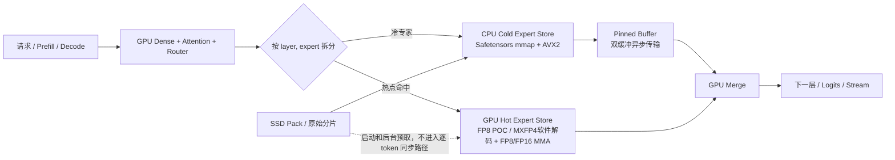

# 第三章：DeepSeek-V4-Flash 混合专家推理方案

> **方案状态**：开发方案，尚未实现 GPU 热点专家路径。当前远端推理服务已停止；CPU mmap 基线已完成，GPU 专家 `N=1` 尝试已因后端限制回滚。
>
> **本章替代内容**：本章替换旧的“SSD 按 token 按需加载”方案。SSD 只承担启动、映射和冷数据存储，不进入逐 token 的关键路径。
>
> **更新时间**：2026-08-01

## 1. 目标与结论先行

目标是在当前单机上让 DeepSeek-V4-Flash 达到个人编码 Agent 可用的解码速度：

- 单用户、单并发优先；目标解码速度 **10–20 token/s**，其中 10 token/s 是必须达到的目标，15–20 token/s 是冲刺目标。
- 最终接口目标为 **128K 上下文 / 16K 最大输出**。性能验收分层进行：先 4K/256，再 16K，最后才验收 128K/16K；不能用长上下文的配置值代替真实测量。
- 保留 OpenAI-compatible API、流式输出、工具调用和 JSON 输出能力，最后接入 pi code agent。

第一性原理结论：当前 `kt-num-gpu-experts=0` 的 CPU-only MXFP4 mmap 路径可以启动，但实测只有约 **0.3–0.4 token/s**，与目标相差一个数量级以上。仅靠 CPU 线程、SSD 顺序读取或扩大 mmap，无法达到 10–20 token/s；必须把高频专家的计算和权重放到 GPU，CPU 只处理冷专家。

## 2. 已确认的机器与模型边界

| 项目 | 当前值 |
|---|---|
| 远端 | `yiko@192.168.31.107` |
| CPU | Intel Core i5-13600KF，14 核 / 20 线程，支持 AVX2、AVX-VNNI；无 AVX-512/AMX |
| GPU | NVIDIA RTX 4070 Ti SUPER，16 GiB 显存，Ada SM89；原生 FP8 Tensor Core，可存储/软件解码 MXFP4，但不具备原生 MXFP4 block-scaled Tensor Core MMA |
| 主机内存 | 32 GB DDR5；WSL 可见 30 GB |
| 服务内存上限 | systemd transient unit：`MemoryHigh=22G`、`MemoryMax=24G`、`MemorySwapMax=0` |
| Swap | 0；不能把 swap 当作模型内存 |
| 模型 | DeepSeek-V4-Flash，43 层，隐藏维 4096，256 个路由专家/层，top-6，1 个 KV head |
| 权重 | 46 个 Safetensors 分片，`159617149040` bytes，约 148.655 GiB |
| 代码目录 | `/home/yiko/workspace/deepseek-v4-flash-serve` |
| KTransformers | `/home/yiko/workspace/deepseek-v4-flash-serve/src/ktransformers-0.6.3` |
| CPU 权重路径 | `KT_MXFP4_MMAP=1` + `KT_MXFP4_BACKEND=avx2` |

当前权重已经下载到远端，模型不是“等待下载”的状态。远端服务目前没有运行，`30000` 端口不提供可用推理入口；这是有意保留的安全基线，不在未验收的混合路径上覆盖稳定配置。

### SM89 的精度边界

这里必须区分“能保存 4 bit 数据”和“Tensor Core 原生执行 MXFP4”。SM89 可以把 DeepSeek 的 E2M1 + UE8M0 权重放在显存或主存，也可以在自定义 CUDA kernel 中解包、应用 scale，再调用 Ada 的 FP8/FP16 Tensor Core；但它没有 Blackwell 的原生 MXFP4 block-scaled MMA 指令。CUDA 的 FP4 类型/转换接口在非目标架构上会走软件 emulation，不能把它当作硬件 MXFP4 吞吐。

因此本章后文将“GPU 内 MXFP4”统一解释为：**MXFP4 存储 + CUDA 融合解码 + FP8/FP16 Tensor Core GEMM**。真正的原生 MXFP4 Tensor Core 路径需要 Blackwell SM100/SM101 或 GeForce Blackwell SM120，不能在当前 SM89 上直接复现。

## 3. 基线实验与失败边界

### 3.1 CPU mmap 基线

基线环境的关键开关如下：

```bash
cd /home/yiko/workspace/deepseek-v4-flash-serve
export KT_MXFP4_MMAP=1
export KT_MXFP4_BACKEND=avx2
export KT_KERNEL_CPU_VARIANT=avx2
# 关键限制：先不把专家放进 GPU
bin/run-server --kt-num-gpu-experts 0
```

使用单并发、上下文 4096、关闭 thinking 的短请求做干净重启后的测量：

| 输出 token | 端到端时间 | curl 时间 | 观察 |
|---:|---:|---:|---|
| 1 | 1.438 s | 1.458 s | 含启动/首 token 固定开销，不能代表稳定解码 |
| 4 | 13.252 s | 13.746 s | 约 0.30 token/s |
| 8 | 25.345 s | 26.020 s | 约 0.32 token/s |
| 16 | 37.334 s | 38.369 s | 约 0.43 token/s |

结论是 CPU mmap 路径在数值上可用、服务层可用，但不满足编码 Agent 的交互速度。模型权重通过文件映射保持在 SSD/页缓存中，避免了 149 GiB 一次性复制到 24 GiB cgroup；代价是每个 token 都要反复触碰大量冷专家权重。

### 3.2 `N=1` GPU 专家尝试

曾把现有启动参数从 `--kt-num-gpu-experts 0` 改为 `--kt-num-gpu-experts 1`。服务在加载阶段失败，关键错误来自当前 `amx.py` 的显式保护：

```text
KT_MXFP4_MMAP=1 currently requires 0 GPU experts
```

这不是显存不足，而是当前实现的后端契约：

- `MXFP4SafeTensorLoader` 的 mmap 模式保留 E2M1 原始字节和 UE8M0 scale，供主机端 AVX2 kernel 解码。
- mmap 路径只选择 `AVX2MXFP4_MOE`；当前自定义 KT-Kernel 包装中没有可直接接收该 mmap 权重的 CUDA MXFP4 专家 kernel。
- `NativeMoEWrapper` 是 CPU 专家包装器，不能通过改一个参数自动变成 GPU/CPU 混合执行。

删除这条保护也不会得到可用实现，反而可能让代码在 CUDA 指针、权重格式或生命周期处崩溃。因此已恢复 `N=0`，随后停止服务；不把失败的 `N=1` 配置留在默认启动路径。

## 4. 为什么旧的“SSD 按需加载”方案不可行

模型共有：

- 专家槽位：`43 层 × 256 专家 = 11008` 个；
- 每个 token 激活：`43 层 × top-6 = 258` 个专家调用；
- 单个专家三组矩阵的 MXFP4 原始权重约为 `3 × 4096 × 2048 × 4 bit ≈ 12.6 MB`，另有 scale 元数据。

因此，单 token 的专家工作集约为 `258 × 12.6 MB ≈ 3.2 GB`。这是“触碰的权重工作集”估算，不代表 3.2 GB 必须同时驻留，但它说明了带宽下限：

- 10 token/s 至少要处理约 32 GB/s 的专家权重读取；
- 20 token/s 至少要处理约 65 GB/s；
- SSD 的顺序带宽不能直接转化为随机小块读取的解码吞吐，还会叠加文件映射缺页、CPU 解码和 GEMM 时间。

所以 SSD 可以作为模型的持久来源，却不能放在每个 token 的同步路径上。可行的三级存储定义为：

1. **GPU 热专家层**：常驻高频 `(layer, expert)`，承担主要专家计算。
2. **CPU/RAM 冷专家层**：官方 Safetensors mmap + AVX2，处理 GPU 未命中的专家。
3. **SSD 冷存储层**：仅用于启动映射、连续 pack、后台预读和重启恢复，不能同步阻塞 decode。

## 5. 目标架构



### 5.1 GPU 层放什么

- Dense 层、Attention、Router、归一化、Logits 和 KV 管理优先放 GPU。
- GPU 专家缓存不是“每层前 N 个专家”，而是全局的 `(layer, expert)` 热点集合；同一个 expert id 在不同层必须视为不同缓存对象。
- 第一版使用 Ada 可执行的 FP8 GPU 权重作为工程 POC，避免一开始同时解决 CUDA MXFP4 解码、scale 格式和融合 GEMM 三个问题。
- FP8 POC 的权重转换只针对选中的热点专家，不能把 149 GiB 全量转换到内存或显存。
- 第二版可以实现 GPU 内 MXFP4 软件路径：E2M1 nibble 解包、UE8M0 group scale、权重布局转换和 GEMM 尽量融合；输出应进入 FP8/FP16 Tensor Core MMA，不能称为“原生 MXFP4 Tensor Core”。
- 如果软件解码路径不比 FP8 cache 更快，保留 FP8 作为主路径；不要为了保留 4 bit 存储而牺牲实际 token/s。

当前模型装载后约使用 13.45 GiB 显存，理论余量约 2.6 GiB；必须预留 KV、workspace、通信和碎片空间，首轮 GPU 专家缓存建议从 **1.0 GiB** 开始，最高不超过 **1.5–2.0 GiB**，而不是把 16 GiB 全部吃满。

### 5.2 CPU/RAM 层放什么

- 保留 MXFP4 原始字节和 UE8M0 scale 的只读 mmap，不复制整套权重。
- CPU 冷专家继续走 AVX2 kernel；线程池先测 8、12、14 线程，避免和 WSL/服务线程争抢导致抖动。
- GPU miss 的 activation 进入预分配 pinned buffer；使用双缓冲，让下一层计算与上一层冷专家传输重叠。
- 不在每个 token 创建临时 tensor、不把冷专家转换为全量 FP16/FP8、不依赖 swap。

### 5.3 SSD 层的正确职责

- 保存官方 Safetensors 和可校验的连续 expert pack。
- 服务启动时建立 mmap；后台可按热度预读到 page cache。
- 只在启动、重启、离线 pack 或后台低优先级预取时读 SSD。
- 如果一次冷 miss 必须同步从 SSD 读，记录为 cache miss，不把该路径计入目标 10–20 token/s 的成功条件。

## 6. 热点专家缓存必须先测再定

`--kt-num-gpu-experts=N` 是每层的均匀前 N 个专家，不等于真实热点缓存；即使 `N=1` 能启动，也可能命中率很低。新的实现要先取得编码请求的真实路由分布：

1. 在 Router 输出处记录每层 top-k 的 `(layer, expert)`、请求类型、token 位置和时间。
2. 用 100–500 个典型编码 Agent 请求覆盖：读代码、改代码、测试失败、工具调用、长上下文续写。
3. 计算全局热度、每层热度、top-H 命中率、路由熵和跨请求稳定性。
4. 按真实权重大小和显存预算生成静态 hot list，先不做复杂动态 LRU。
5. 只有静态缓存确认有效后，才增加动态晋升；动态缓存要有冷却时间和最小收益阈值，避免在专家间抖动。

初始预算的粗略换算：

| GPU 专家格式 | 单专家近似大小 | 1.5 GiB 可放置数量（估算） |
|---|---:|---:|
| FP8 | 约 25 MB + scale | 约 50–60 个 layer-expert 槽位 |
| GPU 内 MXFP4 存储 + 软件解码 | 约 12.6 MB + scale | 约 100–115 个 layer-expert 槽位 |

实际数量要扣除 CUDA workspace、KV 和 allocator 碎片，以 `nvidia-smi` 与 allocator 峰值为准。Go/No-Go 建议如下：

- 热点命中率 `<50%`：停止扩大缓存，说明路由不够集中或模型不适合当前硬件。
- 命中率 `50–70%`：只做实验，不承诺 Agent 速度；继续优化布局和 batching。
- 命中率 `≥70%`：允许进入混合 kernel 和流水线阶段。

## 7. 实现拆分

### 模块 A：路由统计

新增 `ExpertRouterStats`，支持离线日志和低开销在线采样；日志不能阻塞 decode。输出固定格式的热度表，便于不同 GPU cache budget 重放。

### 模块 B：GPUHotExpertStore

- 输入：静态 hot list、原始 MXFP4 tensor、GPU budget。
- 第一版：启动时逐个转换热点专家到 FP8 GPU tensor，建立 `(layer, expert) -> device pointer`。
- 第二版：GPU 端直接读取 E2M1/UE8M0，在 kernel 内解码并喂给 FP8/FP16 MMA；这是软件融合路径，不是 SM89 原生 MXFP4 MMA。
- 提供显存水位、加载失败、cache hit/miss 和 kernel 时间指标。

### 模块 C：CPUColdExpertStore

- 复用现有 `MXFP4SafeTensorLoader` mmap 生命周期。
- 统一返回 CPU AVX2 kernel 所需的 raw pointer/scale pointer。
- 预留 pinned activation/output buffer；不得在请求线程中隐式复制完整 expert。

### 模块 D：HybridMoE Dispatch

每层按路由结果拆成 GPU hit 和 CPU miss 两组：

1. GPU Router 产生 top-k。
2. 查 hot map，生成两组索引。
3. GPU 组直接执行 GPU expert GEMM。
4. CPU 组执行 AVX2 expert GEMM；只传 activation 和结果，不传整块权重。
5. 用原始 token/expert 索引合并输出，回到 GPU 继续下一层。

第一版先关闭动态晋升，保证结果可重复；第二版再增加后台晋升、预取和 request-local 热点。

### 模块 E：独立 canary 服务

不覆盖默认服务：

- 稳定基线和混合实验使用不同 systemd unit、日志和端口；建议 canary 使用 `30001`。
- 只有 correctness、吞吐、长上下文和 30 分钟稳定性全部通过，才切换 pi 的 endpoint。
- 当前默认服务已经停止，重新启动前先确认没有残留 GPU 专家实验进程。

## 8. Prefill、Decode 与推测解码的顺序

- **Prefill**：先做正确性和 TTFT，允许较大的 activation batch；冷专家可以按 token 块批量执行，减少 PCIe 往返。Prefill 的吞吐不能直接当作 decode token/s。
- **Decode**：单 token、单并发是当前主要瓶颈；必须优先优化 GPU hot hit、CPU miss overlap 和 merge。
- **推测解码**：只有混合路径稳定达到至少 5 token/s 后再加入。使用不超过 1–3B 的 draft model，一次提出 4–8 个 token，由 V4 一次性验证；接受率低时自动关闭，不能用低接受率掩盖主模型过慢。

## 9. 128K / 16K 的分阶段验收

128K 上下文不是把 `max_model_len` 改成 131072 就完成。按以下顺序验收：

| 阶段 | 上下文 / 输出 | 目的 |
|---|---|---|
| A | 4K / 256 | 验证混合专家正确性与稳定 decode |
| B | 16K / 2K | 验证 paged KV、prefill 峰值和 Agent 普通请求 |
| C | 32K / 4K | 观察 CPU 内存、KV 量化或 offload 是否成为瓶颈 |
| D | 128K / 16K | 最终目标；单独记录 TTFT、KV 峰值、首 token 和持续 token/s |

长上下文阶段的备选设计：paged KV、FP8/INT8 KV、历史 KV 的 CPU offload，以及必要时的分段检索。任何降低上下文的 fallback 都要在 API 元数据中明确，不得把 4K 服务伪装成 128K。

## 10. 执行计划与验收门槛

### 阶段 0：保留基线并采集路由

- 保持 `N=0` 配置可回滚；当前服务不启动。
- 建立固定编码请求集和 benchmark，分别记录 TTFT、prefill tok/s、decode tok/s、CPU/RAM/GPU 峰值。
- 为每层采集真实 top-k，生成多个 GPU budget 的命中率曲线。

**通过条件**：能复现 0.3–0.4 token/s 基线；得到 hot list 和命中率报告。

### 阶段 1：FP8 GPU 热点专家 POC

- 只转换静态 hot list，GPU cache 先限 1.0 GiB。
- CPU miss 仍走原有 AVX2 mmap；先不做动态晋升。
- 用固定 prompt 对比 logits/输出、GPU hit、CPU miss、PCIe transfer 和每层时间。

**继续条件**：无数值崩溃、无 OOM，decode ≥2 token/s；低于此值说明纯缓存收益不足。

### 阶段 2：GPU 内 MXFP4 软件解码 + FP8/FP16 Tensor Core kernel

- 实现 E2M1 + UE8M0 的 CUDA 解码和融合 GEMM，底层计算使用 SM89 已支持的 FP8/FP16 Tensor Core。
- 与 FP8 POC 对比精度、显存占用、解码开销和 kernel 时间；明确记录“软件解码”与“原生 MMA”差异。
- 保留 FP8 作为 fallback，不因自定义软件解码路径失败而破坏 CPU 基线。

**继续条件**：混合路径稳定 ≥5 token/s；否则先修复 dispatch/布局，不进入推测解码。

### 阶段 3：流水线与推测解码

- pinned 双缓冲、CPU/GPU overlap、请求内小批量合并。
- 主模型达到 ≥5 token/s 后再接 draft model 4–8 token speculative decoding。

**目标**：普通编码请求达到 ≥10 token/s；15–20 token/s 作为冲刺结果记录，不能预先承诺。

### 阶段 4：Agent API 验收

- `/v1/chat/completions` 普通和 streaming。
- tool calling、JSON/结构化输出、长上下文续写。
- 30 分钟单并发 soak；记录首 token、持续速度、错误率和显存/内存峰值。
- 通过后再把 canary endpoint 写入 pi；失败则保留 canary，不覆盖默认配置。

最终通过条件：

- 4K/256 单并发 decode ≥10 token/s；无 OOM、无 swap、服务可连续运行 30 分钟。
- TTFT ≤5 s（固定测试集，单独报告 prefill 和 decode）。
- 16K 和 128K 阶段分别报告真实可用上限；达到不了 128K 时必须说明是 KV/内存限制，而不是隐藏截断。
- Agent 的流式、工具调用和错误恢复均通过。

## 11. 回滚与当前状态

### 回滚命令

```bash
ssh yiko@192.168.31.107 \
  'systemctl --user stop deepseek-v4-flash.service; systemctl --user reset-failed deepseek-v4-flash.service'
```

恢复 CPU 基线时只允许使用 `--kt-num-gpu-experts 0` 和已验证的 mmap 开关；任何 GPU 专家实验都必须使用独立 canary unit/端口。

### 当前状态（2026-08-01）

- 官方 DeepSeek-V4-Flash 权重已在远端，46/46 分片，总量约 148.655 GiB。
- WSL 30 GB、Swap 0、服务 cgroup 24 GB 的限制已验收。
- KTransformers 0.6.3 源码和 MXFP4 mmap/UE8M0 AVX2 路径已编译；合成权重数值回归通过。
- `N=0` CPU mmap 服务曾成功启动并通过健康检查/API 测试，但解码只有约 0.3–0.4 token/s。
- `N=1` GPU 专家因当前 `KT_MXFP4_MMAP=1` 后端显式限制失败，已回滚；这证明需要新的 GPU loader/kernel/dispatch，不能靠启动参数解决。
- 已确认当前 Ada SM89 没有原生 MXFP4 block-scaled Tensor Core MMA；后续 GPU 路径必须采用 FP8/FP16 Tensor Core，或在其前面增加 MXFP4 软件解码。
- 当前远端推理服务已停止，端口 30000 不作为现成连接入口；混合方案尚未部署。

下一步唯一正确顺序是：**路由统计 → FP8 热点缓存 POC → 混合 dispatch → MXFP4 软件解码 + FP8/FP16 MMA → 流水线/推测解码 → 128K/16K Agent 验收**。如果真实路由命中率不足 50%，或 GPU 热点缓存完成后仍低于 2 token/s，应停止在这台机器上继续堆叠复杂度，并把结论记录为“硬件/带宽边界不满足 10–20 token/s”。

## 参考

- [DeepSeek-V4-Flash 官方模型](https://huggingface.co/deepseek-ai/DeepSeek-V4-Flash)
- [KTransformers：DeepSeek-V4-Flash 教程](https://github.com/kvcache-ai/ktransformers/blob/main/doc/en/DeepSeek-V4-Flash.md)
- [KT-Kernel README](https://github.com/kvcache-ai/ktransformers/blob/main/kt-kernel/README.md)
- [AVX2 MXFP4 MoE 内核](https://github.com/kvcache-ai/ktransformers/blob/main/kt-kernel/operators/avx2/mxfp4-moe.hpp)
- [NVIDIA CUDA Math API：FP4 在非目标架构上使用 emulation](https://docs.nvidia.com/cuda/archive/12.9.2/pdf/CUDA_Math_API.pdf)
- [NVIDIA PTX ISA：MXFP4/block-scaled 指令的目标架构](https://docs.nvidia.com/cuda/archive/12.9.2/parallel-thread-execution/index.html)
- [NVIDIA CUTLASS：Blackwell SM100/SM120 窄精度 GEMM](https://docs.nvidia.com/cutlass/latest/media/docs/cpp/blackwell_functionality.html)
