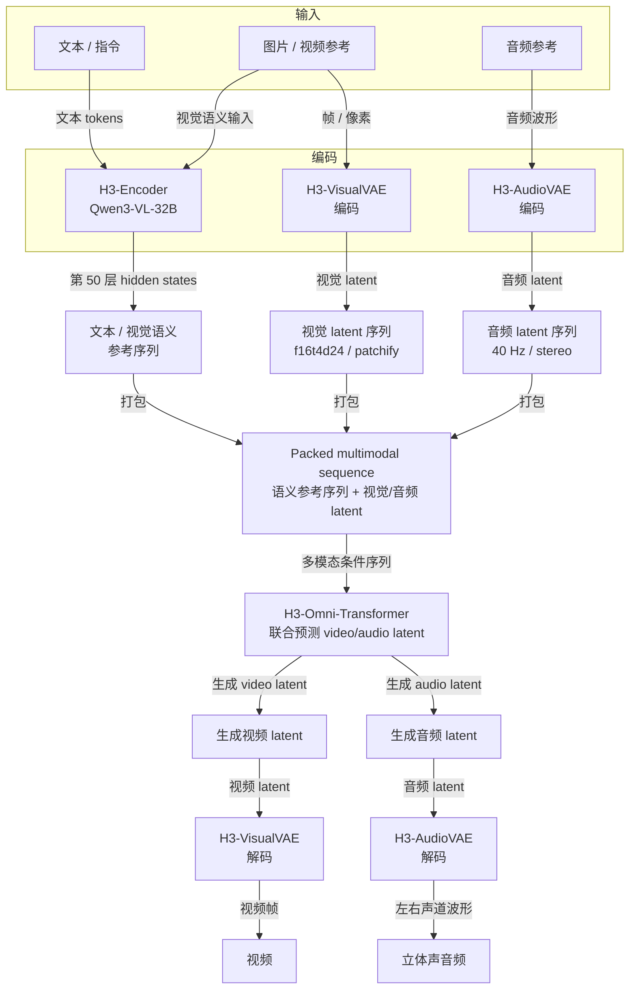

> MiniMax-H3（官方名 MiniMax H3）是一个统一处理文本、图像、视频和音频上下文，并联合生成视频与原生立体声音频的 omni-modal 生成系统。本笔记以 MiniMax 官方博客、GitHub 仓库和 Hugging Face 模型卡为主要依据；官方完整技术报告截至本次检索尚未公开。

## 一句话结论

H3 的核心不是“视频模型外接一个音频模块”，而是把多模态输入编码后打包成单一序列，由一个 33B、dense、single-stream 的 H3-Omni-Transformer 联合预测视频与音频 latent，再分别由 VisualVAE 和 AudioVAE 解码。它用 Qwen3-VL-32B 做语义编码，用 3D MM-RoPE 保留时间和空间关系，用 AdaLN 与 latent 压缩降低多模态生成的计算成本。

## 核心规格

| 项目 | 规格 |
| --- | --- |
| 定位 | 通用 omni-modal 视频-音频生成系统 |
| 输入 | 文本、图片、视频、音频及其组合 |
| 输出 | 视频 + 原生 32 kHz 立体声音频 |
| 核心生成器 | H3-Omni-Transformer，33B 参数、dense、single-stream |
| Transformer 配置 | 50 层；hidden size 5376；56 个 attention heads；head dimension 128；FFN hidden size 14336 |
| 语义编码器 | Qwen3-VL-32B 的完整预训练权重；向生成器提供第 50 层 hidden state |
| 位置编码 | 三维 Multimodal RoPE，覆盖 `(t, h, w)` |
| 视频 VAE | 空间压缩 16×、时间压缩 4×、24 个 latent channels，即 `f16t4d24` |
| 视频进入 Transformer 前 | 以 `1 × 2 × 2`（时间、 高、宽）进一步 patchify；有效空间下采样 32×，时间下采样仍为 4× |
| 音频 VAE | 左右声道独立编码/解码后合并；32 kHz 音频压缩为 40 Hz latent token 序列 |
| 官方 checkpoint 精度 | BF16；公开 checkpoint 是 CFG-distilled Omni Transformer 权重 |
| 核心生成器参数分布 | 约 13B 参数位于 AdaLN 相关分支；其调制输出可预计算并缓存，推理-only 部署可不加载这些分支 |
| 视频长度 | 4–15 秒 |
| 帧率 | 24 FPS |
| 分辨率 | H3-Base 默认短边 768；通过 H3-Regenerate-2K 工作流生成 2K |
| 公开模型形态 | `FL2VA` 与 `Ref2VA` 两类 checkpoint，另提供 Diffusers 格式 |

> 33B 指 H3-Omni-Transformer 核心，不等于完整推理栈的总参数量。完整栈还包括 Qwen3-VL-32B 编码器、VisualVAE、AudioVAE 和处理器；因此不能用 33B × 2 bytes 直接当作整套部署的显存预算。

## 系统架构


> 图中“语义参考序列”特指 H3-Encoder 输出的第 50 层 hidden states；它不是最终视频 latent。VisualVAE 和 AudioVAE 分别输出视觉 latent 序列与音频 latent 序列，三者被打包后输入 H3-Omni-Transformer。Transformer 输出的仍是生成 latent，最后才由两个 VAE 解码为视频和立体声音频。

### 1. H3-Encoder

H3 使用 Qwen3-VL-32B 的完整预训练权重作为语义编码器，并把第 50 层的 hidden state 送入 H3-Omni-Transformer。文本主要由该编码器处理；视觉输入同时利用语义编码器和 VisualVAE，音频则通过 AudioVAE 表示。

### 2. 统一的 packed sequence

各模态被转换为对应 token/latent 后，经过一组输入整理步骤，组成统一的 packed multimodal sequence。它本身不是一个独立的“大模型模块”，更像是把不同形状、不同语义空间的表示整理成 Transformer 可以统一处理的 hidden-state 序列。官方高层文档没有公开每种 token 的固定排列和全部运行时字段，下面是根据公开架构描述和模型配置抽象出的逻辑流程。

#### 处理步骤

1. **分别得到各模态表示**

   - 文本先经过 H3-Encoder（Qwen3-VL-32B），取第 50 层 hidden states，形成文本语义序列。
   - 图片/视频同时经过 H3-Encoder 和 H3-VisualVAE：前者产生视觉语义/参考序列，后者产生视觉 latent。
   - 音频只经过 H3-AudioVAE，产生音频 latent；左右声道在 latent 空间中独立处理。

2. **整理各模态的局部布局**

   - VisualVAE 的 latent 是 `f16t4d24`：24 个通道、时间压缩 4×、空间压缩 16×。
   - 视觉 latent 在进入 Transformer 前按 `1 × 2 × 2`（时间、高、宽）进行 patchify，把相邻 latent 位置合并成视觉 token；有效空间下采样变为 32×。
   - AudioVAE 将每个声道压缩为 40 Hz 的音频 latent 序列。
   - 文本 hidden states、视觉语义序列、视觉 latent 和音频 latent 分别经过输入适配/投影，映射到 H3-Omni-Transformer 的共同 hidden size `5376`。这一步只改变表示维度，不负责跨模态推理。

3. **准备生成目标槽位**

   在生成采样时，packed sequence 不只有参考条件，还要包含待预测的视频和音频 latent 槽位。槽位中的内容是当前 timestep 的待去噪状态，模型会在每次迭代中更新这些位置。不同任务只是参考序列的组成不同，例如：

   ```text
   T2VA：   文本语义序列 + 待生成视频 latent + 待生成音频 latent
   Ref2VA： 文本语义序列 + 视觉/音频参考 latent + 待生成视频/音频 latent
   FL2VA：  文本语义序列 + 首帧/末帧条件 + 中间待生成 latent
   ```

   这是生成过程的逻辑视图；公开 README 没有说明所有任务的精确槽位排列，因此上面的顺序不应当理解为固定的官方内存布局。

4. **沿序列维度拼接**

   概念上可以写成：

   ```python
   semantic_text = project_text(text_hidden_states)
   semantic_visual = project_visual(visual_hidden_states)
   visual_seq = project_visual(patchify(video_latent))
   audio_seq = project_audio(audio_latent)

   condition = concat(
       semantic_text,
       semantic_visual,
       visual_seq,
       audio_seq,
       dim=sequence_dimension,
   )

   packed = concat(
       condition,
       target_video_latent_t,
       target_audio_latent_t,
       dim=sequence_dimension,
   )
   ```

   这段伪代码只表达逻辑，不代表官方源码中的函数名或固定排列。最终主干看到的是一个统一的序列张量，可抽象为 `H_t ∈ R^{B × L × 5376}`；其中 `L` 是文本、视觉、音频以及生成目标槽位的总长度。

5. **附加边界和位置信息**

   拼接后还需要让模型知道每段 token 的来源和位置。实现层面通常要维护序列长度/offset、模态或任务边界、参考条件与生成目标的角色信息，以及用于 MM-RoPE 的位置坐标。视觉 token 使用 `(t, h, w)` 表示时间和两个空间维度；特殊 token 和 tokenizer 配置还承担任务分隔或控制作用。这些是索引、嵌入或布局元数据，不是另一套模态专属 Transformer。

6. **进入主干前的轻量处理**

   H3 的 Transformer 配置中还列出了 `token_refiner_num_layers=2`，说明输入/条件路径中存在一个小型 token refiner。它与 50 层 H3-Omni-Transformer 主干不是同一量级；公开高层文档没有进一步说明它作用于哪些 token，因此这里不把它强行等同于 `concat` 操作本身。

完成上述步骤后，H3-Omni-Transformer 才对整个 packed sequence 执行共享的 Attention 和 FFN。初始开源推理采用 full attention，因此参考文本、视觉 token、音频 token 和生成目标 token 可以在同一序列中建立跨模态关系。模态特定部分主要留在输入/输出投影和 AdaLN 分支：AdaLN 根据 timestep 及模态条件对共享 block 的 hidden states 做 scale、shift、gate 等调制；Transformer 最后通过不同输出路径预测视频与音频 latent，再交给两个 VAE 解码。这就是 H3 用一个统一主干替代多套模态专家流水线的具体含义。

### 3. H3-Omni-Transformer

核心生成器是 33B dense、single-stream Transformer。它联合预测视频和音频 latent，而不是先生成无声视频再调用独立音频模型。输出 latent 分别送入两个 VAE，最终得到带对白、音效和音乐的立体声视频。

H3 在训练后期引入了原生 sparse attention 以降低长多模态序列的成本，但初始开源版本只提供 full-attention 推理；官方 sparse-attention 实现计划后续发布。因此“架构支持 sparse attention”不能等同于“当前开源代码已能直接使用 sparse attention”。

## 三个关键系统设计

### Contextual Omni Representation

H3-Context-IR 是一个托管的多模态上下文理解与编排系统。它不只描述目标视频，而是理解文本、图片、视频、音频之间的关系，以及这些上下文与目标输出的关系。MiniMax 称，源材料通常需要约 100K tokens 的理解推理，最后蒸馏为平均约 4K tokens 的语言表示；语言因此成为跨模态上下文与生成目标之间的通用桥梁。

这解释了 H3 为什么能够处理“引用视频 1 的镜头运动、让图片 2 中的人物演唱、并让演唱匹配音频 3”一类组合指令。需要注意：Context-IR 是系统层的 hosted 组件，不能简单等同于公开的 H3-Omni-Transformer 权重。

### H3-VAE

VisualVAE 使用 `f16t4d24`：空间压缩 16×、时间压缩 4×、24 通道 latent；再用 `1 × 2 × 2` patchify 将有效空间下采样提高到 32×。这直接降低了高分辨率视频进入 Transformer 后的序列长度。

AudioVAE 对左右声道使用相同的编码器/解码器，但分别处理每个声道，再重新组合为 stereo。32 kHz 音频被压缩为每秒 40 个 latent token，兼顾音频重建质量和生成模型的可学习性。

### In-Context Regeneration

H3 的 2K 输出不是简单外挂一个传统超分辨率模型：先由 H3-Base 生成 768p 结果，再把该结果和原始多模态上下文重新送回 H3，在上下文中再生成高分辨率版本。这样可以复用 H3 的生成能力，并再次利用原始参考信息恢复细节，而不是让独立超分辨率模块凭空猜测细节。

## 任务与 checkpoint

| 模式 | 含义 | 典型输入 |
| --- | --- | --- |
| `T2VA` | Text-to-Audio-Video | 纯文本 |
| `I2VA` | Image-to-Audio-Video | 起始图片 + 文本 |
| `L2VA` | Last-frame-to-Audio-Video | 结束图片 + 文本 |
| `FL2VA` | First/Last-frame-to-Audio-Video | 起始帧、结束帧或两者 + 文本 |
| `Ref2VA` | Reference-to-Audio-Video | 文本 + 图片/视频/音频参考 |

官方公开的主要 checkpoint 是：

- **H3-Base-FL2VA**：支持 `t2va`、`fl2va`，可选首帧和末帧。
- **H3-Base-Ref2VA**：支持带图片、视频和/或音频参考的 `ref2va`。
- **H3-Regenerate-2K**：以 768p 结果和原始上下文为输入，执行上下文再生成。

## 训练与推理工程含义

1. **统一模型换取任务泛化**：输入模态、参考关系和输出音视频由同一生成器处理，减少针对 T2V、I2V、编辑、参考生成分别维护专家流水线的需要。
2. **理解与生成分离调度**：多模态上下文使序列长度方差约扩大到原来的三倍，理解与生成的计算形态明显不同；MiniMax 采用分离工作负载并重新平衡样本级异构计算，据官方披露端到端训练吞吐提升接近 30%。
3. **AdaLN 可缓存**：约 13B AdaLN 参数的输出只依赖 timestep embedding，可提前计算并缓存。它降低了 inference-only 的权重加载量，但不代表整个 H3 pipeline 只剩 20B 参数。
4. **序列长度是首要瓶颈**：VisualVAE 的 16×/4× 压缩、额外 patchify、音频 40 Hz latent 和未来 sparse attention，都是围绕多模态序列长度设计的。
5. **音视频联合建模**：视频与音频 latent 在同一生成器中联合预测，有利于保持对白、动作、音效、环境声和音乐之间的时间一致性。

## 部署与资源判断

官方 GitHub 的 SGLang 示例使用 4 张 GPU，并配置 `Ulysses degree=4`；这是官方示例配置，不应解读为最低硬件要求。公开 BF16 H3-Omni-Transformer 的权重规模按 33B 参数估算约为 66 GB，实际部署还要额外容纳 Qwen3-VL-32B、两个 VAE、激活、并行通信缓冲和视频解码缓存。

部署时应区分：

- **核心模型**：H3-Omni-Transformer，33B。
- **语义编码器**：Qwen3-VL-32B，不能漏算。
- **视觉/音频解码器**：VisualVAE + AudioVAE。
- **任务分区**：`FL2VA` 与 `Ref2VA`，需要按输入任务选择对应 variant。
- **2K 工作流**：通常是 768p 基础生成后再做 in-context regeneration，而非单次普通 768p 推理。

## 当前公开信息的边界

- MiniMax 完整 H3 Technical Report 尚未公开，训练数据、完整训练配方、优化器、训练算力和详细消融结果仍不完整。
- 官方提到 sparse attention，但初始开源版本只有 full-attention inference。
- 33B 是核心 Omni Transformer 的参数量；不同部署文章若把 Qwen3-VL 编码器、VAE 或多个任务分区一起统计，数字会明显更大，不能直接互相比较。
- `H3-Context-IR` 与 `H3-Regenerate-2K` 属于系统/工作流层，不应把它们都当成同一个可下载的 33B checkpoint。
- 商业使用前应单独核对 MiniMax H3 Community License 的地域、用途和申请要求。

## 与本库其他主题的关系

- [神经网络](../神经网络.md)：LLM、Agent、上下文管理和多模态模型基础。
- [推理优化](../推理优化.md)：模型结构、量化、运行时和实际部署。
- [GPU编程](../GPU编程.md)：GPU kernel、并行和硬件侧优化。
- [编程语言/Python](../编程语言/Python.md)：PyTorch、编译栈和 Diffusers 生态。
- [浮点精度](./浮点精度.md)：BF16、FP8、NVFP4 等部署精度选择。

## 资料来源

1. [MiniMax H3 官方介绍](https://www.minimax.io/blog/minimax-h3) — Contextual Omni Representation、H3-VAE、训练架构和 In-Context Regeneration。
2. [MiniMax-AI/MiniMax-H3 GitHub](https://github.com/MiniMax-AI/MiniMax-H3) — 开源架构说明、模型变体、部署示例和复现脚本。
3. [MiniMaxAI/MiniMax-H3 Hugging Face 模型卡](https://huggingface.co/MiniMaxAI/MiniMax-H3) — 参数规模、模型配置、规格、精度和许可证。
4. [MiniMax H3 开源公告](https://www.minimax.io/news/minimax-h3-open-source) — H3-Encoder、VisualVAE、AudioVAE 和开源边界的补充说明。
