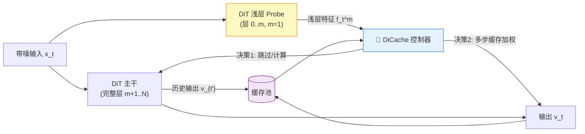
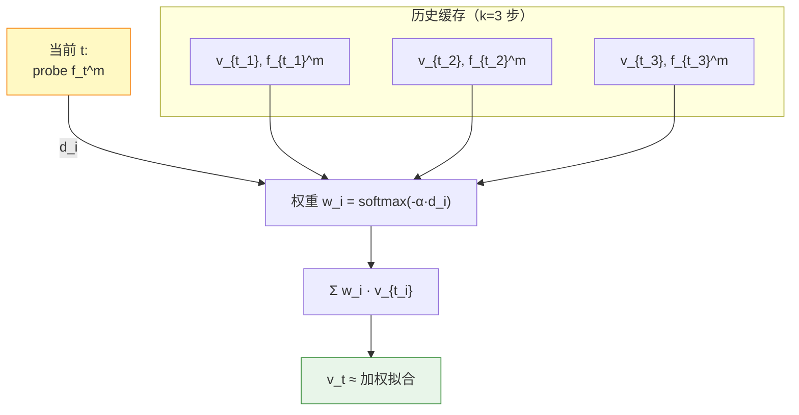

# DiCache: Let Diffusion Model Determine Its Own Cache

> 📌 **TL;DR** — 一个**训练免费、模型无关**的 Diffusion 缓存加速框架。**让模型自己决定何时缓存、怎么用缓存**。通过 **Online Probe Profiling**（浅层 probe 实时判断）和 **Dynamic Cache Trajectory Alignment**（按轨迹加权多步缓存）两大组件，**同时解决 "When to cache" 和 "How to use cache"**。HunyuanVideo 上 **2.34× 加速、PSNR 32.79、LPIPS 0.1492**，与 SVG 稀疏注意力结合可堆叠到 **3.08×**，**显著优于** TeaCache / TaylorSeer / EasyCache / ToCa。

| 属性     | 信息                                                                          |
| ------ | --------------------------------------------------------------------------- |
| **标题** | DiCache: Let Diffusion Model Determine Its Own Cache                        |
| **会议** | ICLR 2026                                                                   |
| **代码** | [Bujiazi/DiCache](https://github.com/Bujiazi/DiCache)                       |
| **论文** | [arXiv:2508.17356](https://arxiv.org/abs/2508.17356)                        |
| **项目页** | [bujiazi.github.io/DiCache](https://bujiazi.github.io/DiCache/)             |

## 📑 目录

1. [问题与动机](#1-问题与动机)
2. [两个关键观察](#2-两个关键观察)
3. [DiCache 整体框架](#3-dicache-整体框架)
4. [核心组件一：Online Probe Profiling](#4-核心组件一online-probe-profiling--何时缓存)
5. [核心组件二：Dynamic Cache Trajectory Alignment](#5-核心组件二dynamic-cache-trajectory-alignment--如何使用缓存)
6. [实验设置与超参](#6-实验设置与超参)
7. [实验结果](#7-实验结果)
8. [与稀疏注意力的可组合性](#8-与稀疏注意力的可组合性)
9. [总结与思考](#9-总结与思考)

***

## 1. 问题与动机

### 🎯 核心痛点

Diffusion 模型（尤其 DiT 架构视频/图像生成，如 Wan2.1、HunyuanVideo、Flux）**推理极慢**（50 步单次数分钟）。现有缓存加速方法分两类，各有问题：

| 方法类型        | 代表                                | 问题                                |
| ----------- | --------------------------------- | --------------------------------- |
| **固定间隔缓存**  | DeepCache、∆-DiT                  | 间隔凭经验，**对不同 prompt/样本不鲁棒**      |
| **启发式缓存**   | TeaCache、TaylorSeer、EasyCache、ToCa | 用**数据集级先验 / 经验法则**，泛化性差、易质量崩坏 |

**DiCache 的核心思路**：与依赖外部经验，不如**让 Diffusion 模型根据自己当前的内部状态**决定缓存 → **样本特定（sample-specific）**的缓存策略。

***

## 2. 两个关键观察

论文作者通过**对 DiT 内部特征的统计分析**得到两个 insight，直接支撑 DiCache 的两个核心组件。

### 🔍 观察 1：浅层 ↔ 深层特征差异强相关（Fig. 3）

#### 2.1.1 问题：现有代理指标为何失败？

现有缓存方法常用**输入差异** $\Delta x_t = \|x_t - x_{t+1}\|$ 作为缓存误差的代理，但作者发现这**根本不可靠**。

**形式化**：用归一化 L1 距离

$$
L1_{\text{rel}}(a, b) = \frac{\|a - b\|_1}{\|a\|_1}
$$

比较**三个量**的变化模式（论文 Fig. 3）：

| 指标                            | 含义               | 表现                | 与输出差异相关？     |
| ----------------------------- | ---------------- | ----------------- | ------------ |
| $L1_{rel}(y_t, y_{t+1})$      | **输出差异**（ground truth） | 方差大、**样本特定**（图 a） | —            |
| $L1_{rel}(x_t, x_{t+1})$      | **输入差异**（旧方法用）     | 随时间步**单调增加**（图 b） | ❌ 几乎不相关     |
| $L1_{rel}(y_t^m, y_{t+1}^m)$  | **浅层特征差异**（m≪M）  | **与输出差异模式高度吻合**（图 c） | ✅ 强相关        |

#### 2.1.2 量化：Spearman 相关系数

论文 Fig. 3(d) 给出**浅层 ↔ 深层**差异的 Spearman 相关系数：

| Probe 深度 m | 与 $L1_{rel}(y_t, y_{t+1})$ 的相关系数 |
| ----------- | -------------------------------- |
| 1           | **~0.8**                          |
| 2~3         | **~0.8**（不再显著提升）                 |
| M（完整）      | 1.0                              |

> 💡 **关键结论**：仅用 **m=1 层**的浅层 probe，差异模式就能 80% 反映输出变化；继续加深 m=2,3 收益微乎其微。这正是 DiCache 默认 **m=1** 的实证依据。

#### 2.1.3 为什么输入差异不靠谱？

* 噪声 schedule（DDPM / Flow Matching）的**信噪比是单调变化**的，$x_t$ 的差异几乎完全由噪声 schedule 决定，与**内容/语义**无关
* 而 $y_t$（网络输出/速度）反映**模型对当前内容的理解**，内容变化剧烈的样本（如主体切换、运动突变）会反映到 $y_t$ 差异中
* 因此**只有用 $y_t^m$ 而不是 $x_t$ 做代理，才能捕捉到"何时该重算"的内容信号**

#### 2.1.4 推论 → Online Probe

> 既然浅层特征差异 $L1_{rel}(y_t^m, y_{t+1}^m)$ 是输出差异 $L1_{rel}(y_t, y_{t+1})$ 的**廉价可靠代理**，那么缓存决策**直接用前者即可**：
>
> * 浅层差异 < δ → 输出变化平缓 → 复用缓存
> * 浅层差异 ≥ δ → 输出变化剧烈 → 完整跑主干

***

### 🔍 观察 2：不同层残差形成相似轨迹（Fig. 4）

#### 2.2.1 残差定义

定义**网络残差**（residual）= 模型在 latent space 与 velocity space 之间的变换方向：

$$
r_t = y_t - x_t, \qquad r_t^m = y_t^m - x_t^m
$$

* $r_t$：整个 DiT（M 层）的残差方向
* $r_t^m$：仅前 m 层的残差方向

#### 2.2.2 经验观察（Fig. 4）

论文 Fig. 4(a) 对比**残差时间序列**：

* 浅层 probe 残差 $r_t^m$（m=5）
* 完整模型残差 $r_t$

→ 两者随时间步 t 的**动态趋势高度类似**（波峰、波谷位置一致）

#### 2.2.3 理论直觉：DiT 训练目标保证方向对齐

* DiT 的训练目标是**学一个从 latent 到 velocity 的变换方向**
* 在**训练良好的 DiT**中，**不同 block 拟合的是同一变换方向的不同"分辨率/细节"**——粗粒度（浅层）→ 细粒度（深层）
* 因此浅层残差方向 ≈ 深层残差方向（**方向对齐，幅度不同**）
* 这一性质是 **DiT 类架构的内在结构特性**，与具体任务/数据集无关

#### 2.2.4 推论 → Trajectory Alignment

> 既然浅层与深层残差**方向对齐**：
>
> * **当前 $r_t$ 的"形变方向"**可以用**历史残差 $\{r_{t_1}, r_{t_2}, ..., r_{t_k}\}$ 的线性组合**来近似
> * **加权权重**由**浅层 probe 在特征空间中的距离**决定——probe 距离小 ⇒ 变换方向接近 ⇒ 权重高
>
> 这就是 Trajectory Alignment 公式 $v_t = \sum_i w_i v_{t_i}$ 的物理意义。

***

### 💡 观察 → 组件的对应

| 观察       | 物理学意义                                | 解决的问题              | 对应组件                                 |
| -------- | ------------------------------------ | ------------------ | ------------------------------------ |
| **1. 浅深层差异强相关** | 输出变化的**廉价代理**（Spearman ~0.8）       | **When to cache**  | Online Probe Profiling Scheme        |
| **2. 层间残差方向对齐** | 深层变换方向的**浅层导航**（DiT 训练目标决定）         | **How to use cache** | Dynamic Cache Trajectory Alignment   |

### 🎯 为什么是"DiCache"这个名字？

> 不同于其他方法从**外部经验/数据集先验**出发，DiCache 的"when"和"how"**完全由模型自身当前的内部状态决定**——观察 1 让模型自己**感知误差**，观察 2 让模型自己**指导缓存使用**。
>
> **Diffusion Cache → 让 Diffusion 模型决定自己的 Cache**。

***

## 3. DiCache 整体框架

DiCache 是一个**轻量级旁路模块**，挂在 diffusion 模型前 m 层之后，**不修改主网络结构**。



**关键设计**：

* **Probe 极浅**（m=1），计算开销可忽略
* **控制器**根据 probe 输出做两个决策：
  1. **是否完整跑主干**（决定 When）
  2. **如何用历史缓存拟合当前特征**（决定 How）
* **无需训练**，逻辑全在推理时

***

## 4. 核心组件一：Online Probe Profiling — "何时缓存"

### 4.1 基本思想

用一个**极浅的 Probe**（DiT 前 m 层，m=1）实时计算特征差异，作为缓存误差的代理。

### 4.2 形式化

设 probe 在时刻 t 输出浅层特征 `f_t^m`，**归一化特征差异**：

$$
\Delta_t^m = \frac{\| f_t^m - f_{t-1}^m \|}{\| f_{t-1}^m \|}
$$

* $\Delta_t^m$ **小** → 浅层（→ 深层）变化平缓，**安全复用缓存**
* $\Delta_t^m$ **大** → 变化剧烈，**必须完整跑主干**

### 4.3 决策规则

```python
if Δ_t^m < δ:
    # 浅层变化小 → 复用缓存
    v_t ≈ trajectory_align(C_t_1, C_t_2, ..., f_t^m)
else:
    # 浅层变化大 → 完整 DiT
    v_t = DiT(x_t)
    cache.push((v_t, f_t^m))
```

### 4.4 超参 δ

| 模型               | δ     | 含义               |
| ---------------- | ----- | ---------------- |
| **WAN 2.1**      | 0.2   | 视频，相对严格          |
| **HunyuanVideo** | 0.1   | 视频，更严格（防闪烁）      |
| **Flux.1.0-dev** | 0.4   | 图像，可放宽           |

> 📊 δ 是质量-加速比的旋钮：δ 大 → 激进加速、质量降；δ 小 → 保守加速、质量保。

### 4.5 推理伪代码

```python
# 每个时间步 t
f_t = probe(x_t)                       # 浅层特征（m=1 极快）
Δ_t = ||f_t - f_prev|| / ||f_prev||    # 归一化差异

if Δ_t < δ:
    v_t = trajectory_align(history, f_t)
else:
    v_t = DiT(x_t)
    history.push((v_t, f_t))

x_{t-1} = scheduler.step(v_t, t, x_t)
```

***

## 5. 核心组件二：Dynamic Cache Trajectory Alignment — "如何使用缓存"

### 5.1 问题

决定要 "skip" 时，怎么从历史缓存 $\{v_{t_1}, v_{t_2}, ..., v_{t_k}\}$ 拟合出当前 $v_t$？

* **朴素做法**：直接复用最近一次（$v_t \approx v_{t_1}$）→ 误差随时间累积
* **DiCache 做法**：按**浅层 probe 特征轨迹**自适应加权组合多步缓存

### 5.2 核心公式

利用"层间轨迹相似"（观察 2），probe 的浅层特征轨迹"导航"深层的近似：

$$
v_t \approx \sum_{i=1}^{k} w_i(t) \cdot v_{t_i}
$$

权重由 probe 特征距离决定：

$$
w_i(t) = \frac{\exp\!\big(-\alpha \cdot d(f_t^m, f_{t_i}^m)\big)}{\sum_j \exp\!\big(-\alpha \cdot d(f_t^m, f_{t_j}^m)\big)}
$$

* $d(\cdot,\cdot)$：probe 特征空间距离（欧氏或余弦）
* $\alpha$：温度系数
* **直觉**：probe 上与当前最相似的历史步骤，深层特征也最相似 → 权重最大

### 5.3 多步缓存组合示意



### 5.4 为什么有效？

| 朴素方法             | DiCache                    |
| ---------------- | -------------------------- |
| $v_t = v_{t_1}$ | $v_t = \sum w_i v_{t_i}$  |
| 单步缓存、无加权         | 多步缓存 + **probe 特征引导加权** |
| 误差随 skip 步数线性增长   | 误差被"导航"约束，与 skip 步数**解耦** |

***

## 6. 实验设置与超参

### 6.1 模型与配置

| 模型               | 分辨率       | 帧数  | 采样步数 | 任务    |
| ---------------- | --------- | --- | ---- | ----- |
| **WAN 2.1-1.3B** | 832×480   | 81  | 50   | 文生视频  |
| **HunyuanVideo** | 544×960   | 129 | 50   | 文生视频  |
| **Flux.1.0-dev** | 1024×1024 | —   | 30   | 文生图像  |

### 6.2 通用超参

| 超参 | 值       | 说明              |
| -- | ------- | --------------- |
| m  | **1**   | Probe 深度（仅 1 层）  |
| k  | 2~4     | 历史缓存步数          |
| α  | 默认 1.0  | 加权温度系数          |

### 6.3 硬件

* GPU：NVIDIA A800 80GB

***

## 7. 实验结果

### 7.1 HunyuanVideo（核心）性能

| 方法           | LPIPS ↓   | SSIM ↑    | PSNR ↑    | 加速比 ↑    |
| ------------ | --------- | --------- | --------- | -------- |
| Baseline     | —         | —         | —         | 1.00×    |
| TeaCache     | 较差        | 较差        | 较差        | ~1.5×    |
| TaylorSeer   | 较好        | 较好        | 较好        | ~1.7×    |
| EasyCache    | 较好        | 较好        | 较好        | ~1.8×    |
| ToCa         | 较好        | 较好        | 较好        | ~1.8×    |
| **DiCache**  | **0.1492** | **0.9396** | **32.79** | **2.34×** |

> ✅ DiCache 在**质量（3 项指标）和加速比**上**同时领先**。

### 7.2 Flux.1.0-dev

* 质量 + 效率**全面占优**所有 baseline
* 加速比 ~1.5-2.0×

### 7.3 消融实验

| 组件                                   | 效果               |
| ------------------------------------ | ---------------- |
| **完整 DiCache**                       | 最佳质量+加速          |
| 去掉 Online Probe（用固定间隔）             | 加速比类似但质量下降       |
| 去掉 Trajectory Alignment（仅用最近1步缓存）  | 加速比不变，质量下降       |
| Probe 深度 m=2 / m=3                  | 增益微乎其微，**m=1 最优** |
| δ 调节                                | 质量-加速比的旋钮        |

> 🧪 两个组件**都必要**；**m=1** 在精度和效率间取得最佳平衡。

### 7.4 与本笔记库其他加速方法对比

| 维度        | DiCache            | RegionE                  | EasyCache          | Sparse-Linear Attn  |
| --------- | ------------------ | ------------------------ | ------------------ | ------------------- |
| 适用任务      | 视频 + 图像生成          | Instruction 图像编辑          | 视频 + 图像生成          | 视频生成（线性注意力）         |
| 加速对象      | 去噪 step 内部         | 去噪 step 内部                | 去噪 step 内部         | Attention 计算         |
| 核心信号      | **浅层 probe 特征差异**  | 区域 mask + 速度衰减           | 累积误差 ε_t         | 时间步差异               |
| 缓存粒度      | 多步加权                | 区域 KV                   | 单步缓存 + 阈值          | —                   |
| 离线 profiling | ❌ 完全在线            | ❌ 训练免费                  | ❌ 训练免费            | 需要                  |
| 加速比       | **2.34×**（Hunyuan） | 2.06-2.57×                 | 2.1-3.3×            | 1.3-2.0×             |

***

## 8. 与稀疏注意力的可组合性

DiCache **正交于**注意力加速方法，可堆叠。

### 与 SVG（Sparse VideoGen）结合（HunyuanVideo 720×1280×129 帧）

| 配置                | 加速比       | 质量损失         |
| ----------------- | --------- | ------------ |
| SVG only          | 1.67×     | —            |
| **DiCache + SVG** | **3.08×** | 视觉质量几乎无损     |

### 可组合的加速方法

| 方法                    | 收益       |
| --------------------- | -------- |
| 稀疏注意力（SVG、Radial Attention） | ✅ 已验证    |
| 量化（FP8/INT8）           | ✅ 理论正交   |
| 蒸馏（小模型 + 缓存）          | ✅ 可组合    |
| Consistency / 流式蒸馏      | ⚠️ 需实验验证 |

***

## 9. 总结与思考

### 9.1 一句话总结

> **让 Diffusion 模型用自己的浅层 probe 决定何时缓存、用浅层轨迹导航多步缓存的组合** —— 一个无训练、模型无关、可与稀疏注意力堆叠的通用缓存框架。

### 9.2 关键 takeaways

1. **"When to cache"**：浅层 probe 差异 Δ_t < δ 时 skip（m=1 即可）
2. **"How to use cache"**：按 probe 特征轨迹做多步缓存的 softmax 加权
3. **质量 + 加速双优**：HunyuanVideo 2.34× 且 LPIPS/SSIM/PSNR 全面占优
4. **可堆叠性**：与 SVG 稀疏注意力结合达到 3.08×
5. **无训练、模型无关**：3 个 DiT 类模型即插即用

### 9.3 适用场景

✅ **适合**：
* 自回归/迭代去噪的 DiT 类模型
* 高分辨率视频/图像生成
* 对延迟敏感、但要求质量不降的生产场景

❌ **不适合**：
* UNet 类（SD1.5/SDXL）— 结构差异，需适配
* 极小步数去噪（< 10 步）— 加速空间小

### 9.4 与本笔记库其他预研的关系

| 已有笔记                                            | 关系                                                |
| ----------------------------------------------- | ------------------------------------------------- |
| [RegionE 图像编辑](RegionE图像编辑.md)                 | 同样训练免费的 DiT 加速；RegionE 聚焦**图像编辑**的区域冗余，DiCache 聚焦**生成任务**的样本特定缓存 |
| [SDNQ 项目分析](SDNQ项目分析报告.md)                     | SDNQ 解决**量化**，与 DiCache 缓存**正交可堆叠**           |
| [Sparse-Linear Attention](Sparse-Linear%20Attention%20技术分析.md) | 稀疏注意力也可与 DiCache 堆叠，参考 HunyuanVideo 3.08× 实验     |

### 9.5 待研究 / 可深入方向

* [ ] 验证 DiCache 在 UNet 类模型（SDXL、SD3）上的迁移性
* [ ] 探索更激进的 δ 调度（per-sample 自适应 δ）
* [ ] 量化 + 缓存 + 稀疏注意力 **三者堆叠**的极限加速
* [ ] 在 1.3B 小模型上的延迟下限研究
* [ ] 浅层 probe 是否可替换为**专门的轻量网络**进一步降低开销

***

## 📚 参考链接

* 论文：<https://arxiv.org/abs/2508.17356>
* 项目页：<https://bujiazi.github.io/DiCache/>
* 代码：<https://github.com/Bujiazi/DiCache>
* OpenReview：<https://openreview.net/forum?id=kflYZjGumW>
