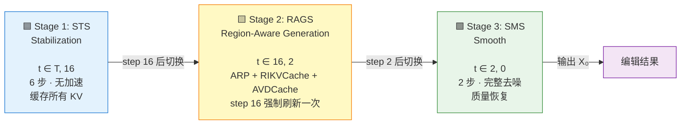
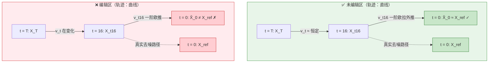
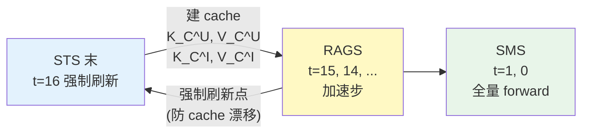
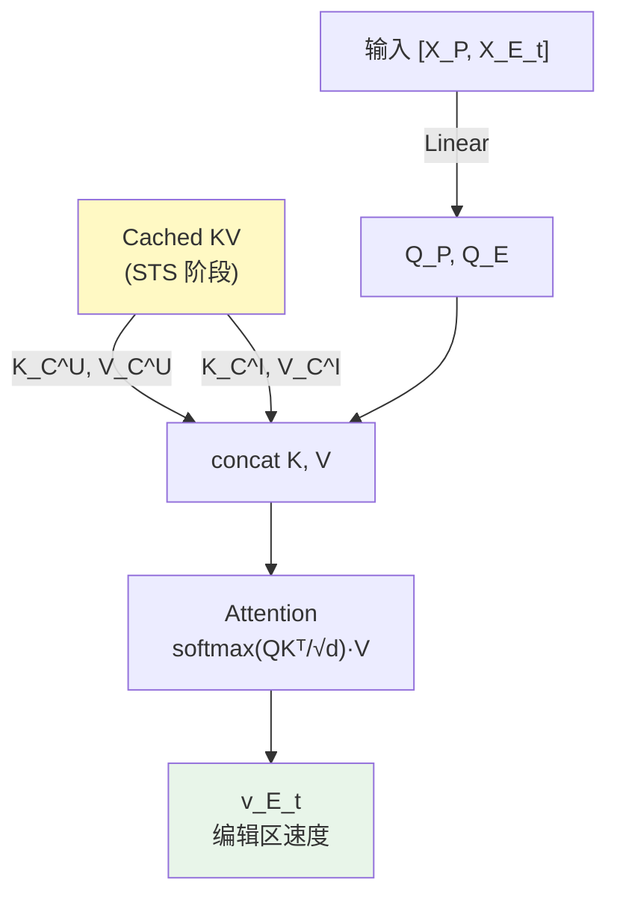
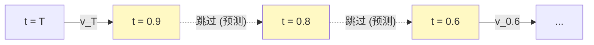
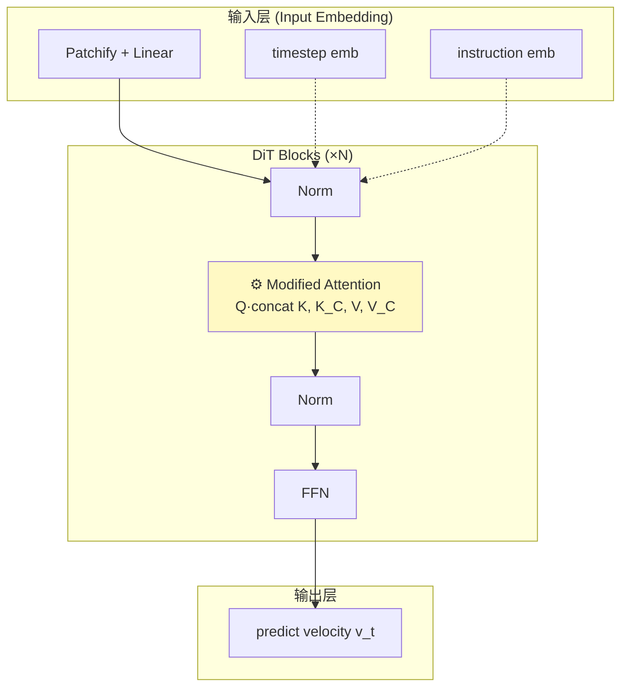
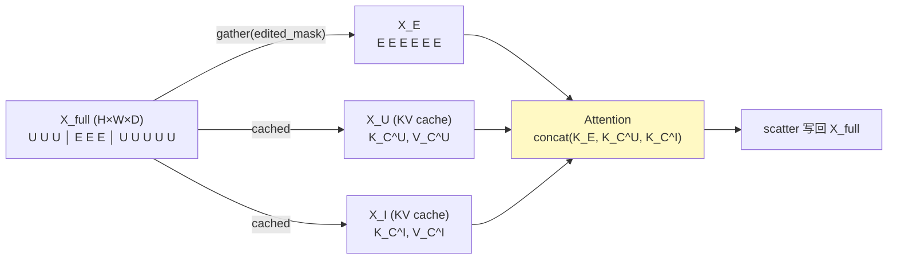

# RegionE: Adaptive Region-Aware Generation for Efficient Image Editing

> 📌 **TL;DR** — 一个**训练免费**的图像编辑加速框架。通过**三阶段推理 + 区域感知生成**，将 IIE（Instruction-based Image Editing）速度提升 **2.06-2.57 倍**，PSNR 仅下降 0.2-0.3 dB，**几乎无损**。
>
> **核心思想**：编辑任务中大部分像素其实没变 → 把图分成"编辑区 / 非编辑区"分开算 → 空间维度用 KV Cache 注入被丢弃的全局信息 → 时间维度用速度衰减跳步。

| 属性     | 信息                                                                    |
| ------ | --------------------------------------------------------------------- |
| **标题** | RegionE: Adaptive Region-Aware Generation for Efficient Image Editing |
| **作者** | Pengtao Chen 等 · 复旦大学                                                 |
| **会议** | ICLR 2026                                                             |
| **代码** | [Peyton-Chen/RegionE](https://github.com/Peyton-Chen/RegionE)         |
| **论文** | [arXiv:2510.25590](https://arxiv.org/abs/2510.25590)                  |

## 📑 目录

1. [问题与动机](#1-问题与动机)
2. [三阶段架构](#2-三阶段架构)
3. [三大核心组件](#3-三大核心组件)

   * 3.1 [ARP — 区域划分](#31-adaptive-region-partition-arp--区域划分)

   * 3.2 [RIKVCache — 空间冗余优化](#32-region-instruction-kv-cache-rikvcache--空间冗余优化)

   * 3.3 [AVDCache — 时间冗余优化](#33-adaptive-velocity-decay-cache-avdcache--时间冗余优化)

   * 3.4 [AVDCache + RIKVCache 联合工作机制](#34-avdcache--rikvcache-联合工作机制)
4. [DiT 中的具体修改点](#4-dit-模型中的具体修改点)
5. [实验效果](#5-实验效果与消融分析)
6. [与现有工作的区别](#6-与现有工作的区别)
7. [总结](#7-总结)

***

## 1. 问题与动机

### 🎯 核心痛点

现有的 **Instruction-based Image Editing (IIE)** 模型存在严重的计算效率问题：

* 即使只修改图像的局部区域，模型也会对**整个图像**进行统一的去噪生成

* 编辑区域和非编辑区域在**生成难度**和**计算冗余**上差异巨大

* 现有方法忽略这种差异，浪费大量算力在"不需要变"的部分

### 💡 三个关键观察

> **观察 1（非编辑区）**：去噪轨迹近似直线 → 可以在单步中推断多步预测
>
> **观察 2（编辑区）**：相邻时间步的速度方向高度一致 → 可以利用缓存跳步
>
> **观察 3（区域差异）**：编辑区/非编辑区难度本质不同 → 应区分处理

***

## 2. 三阶段架构

RegionE 将去噪过程分为三个阶段，分别处理不同粒度的冗余：



### 阶段参数（所有模型通用）

| 阶段       | 步数范围         | 步数     | 关键操作                                |
| -------- | ------------ | ------ | ----------------------------------- |
| **STS**  | t ∈ \[T, 16] | 6      | 标准去噪 + 缓存所有 KV                      |
| **RAGS** | t ∈ (16, 2]  | 14     | 区域感知 + KV Cache + 跳步 + step 16 强制刷新 |
| **SMS**  | t ∈ \[2, 0]  | 2      | 完整去噪（质量恢复）                          |
| **总计**   | —            | **22** | （原 28 步）                            |

### 模型特定超参

| 模型              | 分割阈值 η (ARP) | 决策阈值 δ (AVDCache) |
| --------------- | ------------ | ----------------- |
| Step1X-Edit     | 0.88         | 0.02              |
| FLUX.1 Kontext  | 0.93         | 0.04              |
| Qwen-Image-Edit | 0.80         | 0.03              |

***

## 3. 三大核心组件

### 3.1 Adaptive Region Partition (ARP) — 区域划分

**核心思想**：在 STS 阶段末（step 16），对最终图像做单步估计，比较其与原始图像的相似度，把图像分成"编辑区"和"非编辑区"两个 mask。

**分割规则**：

```python
mask[i] = 1 if |X_final[i] - X_ref[i]| > η else 0
#         ↑ 编辑区              ↑ 非编辑区
```

* `η` 是分割阈值（不同模型不同，见上表）

* 分割只发生一次（step 16），后续 RAGS 阶段复用

---

#### 📌 ARP 核心原理图解：「速度一致」是未编辑区的**内在属性**

> **核心逻辑链条**（从观察到方法）：
>
> 观察到的事实：未编辑区的轨迹是直线（论文图 1 / 2f）
> 　　↓ 推出的性质
> 未编辑区在 t=16 处的速度 v，和未来任意时刻的速度近似相等
> 　　↓ 推出的方法
> 用 t=16 的 v 一次性外推到 t=0，误差小
> 　　↓ 推出的判据
> `|X̂_0 − X_ref|` 小 → mask = 0（未编辑）



**图说**：

- 🟢 **未编辑区**：`v_t` 全程几乎不变（绿箭头方向大小一致），从 t=16 用 `v_t16` 一步外推得到的 `X̂_0` 和真实 `X_ref` 几乎重合。差异小 → mask = 0。
- 🔴 **编辑区**：`v_t` 方向在旋转（红箭头方向不同），用 t=16 的 `v_t16` 线性外推会偏离真实曲线，导致 `X̂_0` 落在远离 `X_ref` 的位置。差异大 → mask = 1。

#### 关键细节：v 是**向量**

| 维度       | 未编辑区                | 编辑区             |
| -------- | ------------------- | --------------- |
| **方向**   | 近似恒定（轨迹是直线）         | 持续旋转（轨迹是曲线）    |
| **大小**   | 很小（"没什么要降噪的"）       | 较大（"要动很多"）      |
| **外推结果** | ΔX 小，`X̂_0` 落在 `X_ref` 附近 | ΔX 大且方向偏，`X̂_0` 飞出去 |

> 「差异小」= **方向对 + 步幅小**，两个因素**叠加**的结果，不是单一原因。

#### 自监督的副产品

这种「误差即定位」是**自监督**的——没有 ground truth mask，**预测误差本身**就把 mask 标出来了。所以论文 Figure 5 说 ARP 划出来的区域 "closely match human perception"——**编辑区 = 模型预测不准的区域**，两者是同一回事。

---


### 3.2 Region-Instruction KV Cache (RIKVCache) — 空间冗余优化

**问题**：编辑时把 DiT 输入从 `[X_P, X_t, X_I]` 改成 `[X_P, X_E_t]`，**完全丢弃**了非编辑区 `X_U` 和指令图 `X_I`。但 DiT 的 attention 是全局 token 交互的，丢弃会导致编辑区缺乏上下文、偏差累积。

#### 🧩 A. 核心设计：RIKVCache 的"三件套"

RIKVCache 的精髓**不是单纯的"用 cache"**，而是把整个 RAGS 步的 DiT 前向**重新设计**成了三件套：

**设计一：只跑编辑区**（最关键，决定 cache 必要性）

```
正常 DiT:   x_full → DiT(x_full)            # 跑全部 N 个 token
RegionE:    x_e    → DiT(x_e)                # 只跑 rN 个 token（r = 编辑区占比）
```

只跑 x_e 之后，**编辑区自然就"看不到"非编辑区了** —— 这是 cache 存在的前提。

**设计二：一次性建 cache**（节省的是"重算"成本）

```
t=16 强制刷新步（必须全量 forward 一次）:
    K_C^U, V_C^U, K_C^I, V_C^I = KV_noedit(x_full)[noedit_mask]   
                                       # 截取非编辑区对应的 K, V 存下来
                                       # 后续 RAGS 步不再算
```

这一步是不可省略的"建索引"成本，但**只发生一次**。

**设计三：attn 时拼接注入**（让 x_e "看得到"非编辑区）

```text
A = softmax([Q_P, Q_E] · [K_P, K_E, K_C^U, K_C^I]ᵀ / √d) · [V_P, V_E, V_C^U, V_C^I]
```

这一行就是**整个 RIKVCache 算法的灵魂**。

**三件套的逻辑闭环**：

```
设计一（只跑 x_e）
    │  问题：编辑区看不到非编辑区 → 生成不连贯
    ↓
设计二（建 cache 存 K_C, V_C）
    │  问题：怎么让 x_e 看到非编辑区？
    ↓
设计三（attn 拼接）→ 形成闭环
```

#### 📦 B. Cache 里到底存什么 —— 四 token 视角

DiT 在编辑任务中涉及**四类 token**，cache 的内容是**精确选择**的结果：

| Token | 含义 | 在 cache 吗 | 为什么 |
| --- | --- | --- | --- |
| **P** | Prompt（文字指令）| ❌ | 文字 prompt 参与 Q 计算但不存 |
| **E** | Edited region（编辑区）| ❌ | **每步都在变化**（去噪过程），缓存没意义 |
| **U** | Unedited region（非编辑区）| ✅ **K_C^U, V_C^U** | 空间邻接上下文（边缘延伸、纹理连续、阴影一致）|
| **I** | Instruction image（指令图 / 原图）| ✅ **K_C^I, V_C^I** | **全局风格锚点**（整体色彩、构图、风格保持）|

**为什么 I 也存**：编辑区只跑 x_e 后，会丢失"原图整体长啥样"的参考。比如把一只猫改成狗，只看 U（猫周围的草地）可能生成一只写实狗，但原图是卡通风格 → 应该生成卡通狗。I 提供了这个"全局风格锚点"。

> 这一点**之前的笔记漏掉了**。论文公式 6 明示了 I 的存在，是 RegionE 设计中容易被忽略但关键的一环。

#### 🧭 C. 位置编码适配性 —— "训练免费"能 work 的隐藏前提

DiT 用 RoPE（旋转位置编码），K 矩阵里**嵌入了相对位置**。K_C^U、V_C^U、K_C^I、V_C^I 都保留原图 token 的**原始位置信息**。

当拼接做 attention 时：

- Q_E（编辑区当前位置）· K_C^U（非编辑区原位置）→ 相对距离**自动算出**
- **不需要任何位置对齐处理**

| 位置编码方式 | 在 K_V 里的体现 | 拼接时是否需要处理 |
| --- | --- | --- |
| **RoPE**（现代 DiT 主流）| K 矩阵里嵌入了相对位置 | ❌ 不需要 |
| **2D 正弦 / Learned PE** | 加在 token embedding 上 | ❌ 不需要 |
| **ALiBi**（线性偏置）| attention score 后加偏置 | ⚠️ 需要扩展 bias 表 |

> 现代 DiT（FLUX、Qwen、Step1X）几乎都用 RoPE，所以 RegionE 不用特殊处理位置编码 —— **这是它能"训练免费"的隐藏前提**。

#### 🔄 D. Cache 刷新机制

cache **不是永久有效**，RAGS 阶段需要周期性刷新：

| 阶段 | 缓存操作 | 说明 |
| --- | --- | --- |
| **STS 末（t=16）** | **建 cache**（首次） | 强制刷新步，全量 forward，截取 U/I 的 KV |
| **RAGS 加速步（t=15, 14, ...）** | **用 cache** | 只跑 x_e，拼接 K_C^U、K_C^I |
| **RAGS 强制刷新点** | **刷新 cache** | 论文 Figure 3 复数标注"forced update"，防漂移 |
| **SMS（t=1, 0）** | **抛弃 cache** | 全量 forward，消除分块痕迹 |



**为什么要周期性刷新**：编辑区在去噪过程中 K_V 会缓慢变化，cache 用久了会"漂移"。强制刷新点相当于"重置" cache 到当前真实状态。

**刷新频率论文没明说**，但根据"高质量"目标，密度不会太低（推测每 2-3 步一次）。

#### 💾 E. 显存开销估算

cache 显存占用（理论值，未压缩）：

```text
per_layer  = 2 (K+V) × (N_U + N_I) × num_heads × head_dim × dtype_bytes
total      = per_layer × num_layers
```

以 FLUX-Kontext 为例（粗估）：

| 参数 | 值 |
| --- | --- |
| num_layers | ~60（双 block + 单 block）|
| N_U + N_I | 1024 token（=32×32 latent）|
| num_heads × head_dim | d_kv ≈ 4096（FLUX）|
| dtype | bf16 = 2 bytes |

```text
per_layer = 2 × 1024 × 4096 × 2 = 16 MB
total     = 16 MB × 60 = ~1 GB
```

**Qwen-Image-Edit / Step1X 类似量级，~0.5-1 GB**。
这是 RegionE 唯一的"额外显存开销"，相比 FLUX 模型本身的 24 GB 权重可以接受。

> ⚠️ 实际可能有量化（fp8/int8）能减半。具体看代码实现（待确认）。

#### 📌 数据流总览



### 3.3 Adaptive Velocity Decay Cache (AVDCache) — 时间冗余优化

**问题**：编辑区虽然轨迹是曲线（需要迭代），但**相邻时间步的速度方向几乎一致**（余弦相似度 → 1），只有大小在衰减。能不能直接跳几步？

**核心公式**：

```text
速度衰减关系（公式 7）：
  ‖v_ti‖ / ‖v_ti+1‖ = (1 - Δt_ti+1,ti) · γ_ti

跳步预测（公式 5）：
  v_tj = v_ti · (1 - Δt_tj,ti) · γ_ti
  其中 Δt_tj,ti = t_j − t_i
```

**决策机制**：

```python
if |v_ti - v_ti+1| / |v_ti| < δ:
    skip_step()                # 速度变化小 → 跳步
else:
    compute_step()             # 速度变化大 → 正常算
```

**跳步示意**：



> 🟡 黄色节点表示"被跳过、速度由前一步推算"。

---

### 3.4 AVDCache + RIKVCache 联合工作机制

**为什么需要单独一节**：两个 cache 改的**不是同一类对象**：

| 组件 | 改的是什么 | 影响的层 |
| --- | --- | --- |
| **RIKVCache** | `DiT.forward()` 内部的 attention 计算 | 一次 forward 的**内部** |
| **AVDCache** | 整个 step 是否要 `DiT.forward()` | 一次 forward 的**外部**（scheduler 层）|

#### 📐 A. 加速比相乘原理

**两件事不冲突**：

- RIKVCache 让**每步变快**（算的 token 少）
- AVDCache 让**总步数变少**（跳步）
- 同时启用 = **每步快 × 步数少 = 加速比相乘**

理论上：2.5×（空间）× 1.5×（时间）≈ **3.75×**
实测：Step1X-Edit **2.54×** → 时间维度贡献 1.27×（比纯 AVDCache 的 1.5× 略低）
**差异原因**：联合时 cache 刷新点增多 + 强制算步占用时间

#### 🔄 B. 完整 RAGS 步的状态机

```text
┌─────────────────────────────────────┐
│ t_i 的状态                             │
│   - x_ti（当前位置）                    │
│   - v_{i-1}（上一步速度）               │
│   - γ_{i-1}（上一步算的衰减因子）         │
│   - K_C^U, V_C^U, K_C^I, V_C^I      │
│     （RIKVCache 内容）                  │
└─────────────────────────────────────┘
              ↓
   ┌──────────────────────┐
   │ 1. AVDCache 决策       │
   │    跳 or 算？          │
   └──────────────────────┘
       ↓ 算                ↓ 跳
   ┌──────────┐         ┌──────────────┐
   │ 真跑 DiT │         │ 预测 v_ti    │
   │ 用 RIKV  │         │ (1-Δt)·γ·v  │
   │ Cache    │         │              │
   └──────────┘         └──────────────┘
       ↓                    ↓
   ┌──────────┐         (进入下一步)
   │ 反算 γ   │
   │ 检查 cache │
   │ 是否过期  │
   └──────────┘
       ↓
   (进入下一步)
```

#### 🔗 C. 两个关键耦合点

**耦合点 1：cache 刷新点 = 强制算步**

```python
# AVDCache 内部逻辑（联合版）
if 是刷新点 OR |v_{i-1} - v_pred| / |v_{i-1}| > δ:
    # 必须真跑！这意味着 RIKVCache 要被使用
    v_real = DiT_with_RIKVCache(x_ti, t_i)   # ← 走 RIKVCache 路径
    γ_new = recompute_gamma(v_{i-1}, v_real)  # ← 反算 γ
    use(v_real)
else:
    v_pred = v_{i-1} · (1 - Δt) · γ_{i-1}     # ← 完全跳过 DiT
    use(v_pred)
```

**含义**：

- AVDCache 跳步时：**DiT 完全不跑**，RIKVCache 闲置
- AVDCache 算步时：**DiT 必须跑**，RIKVCache 派上用场
- **强制刷新点 = AVDCache 不能跳**（必须真跑 DiT）→ 步数减少变慢

**耦合点 2：cache 有效性随 step 推进衰减**

```
step 0 (STS 末): K_C = 真实值           ← 100% 有效
step 1 (RAGS):   K_C 略陈旧（编辑区已走一步）
step 2 (RAGS):   K_C 更陈旧
...
step 5:          K_C 可能已经漂移       ← 需要刷新
```

**为什么 cache 会"漂移"**：

- 编辑区 `X_E` 在每步去噪后**位置变化**
- 但 cache 里**非编辑区的 K_V 是 step 0 时算的**
- 编辑区看到非编辑区的"印象"还是 step 0 时的样子
- 实际当前非编辑区**可能已经有点不同**（虽然小，但有）
- 累积起来，cache 就"失真"了

**刷新频率的折中**：

- 刷新太频繁 → AVDCache 跳不了几步（加速比下降）
- 刷新太少 → cache 漂移（质量下降）
- **这是 RegionE 唯一需要调的"联合超参"**（论文没明说频率）

#### 🎯 D. 为什么 AVDCache 只能在 RAGS 跑？

| 阶段 | 跑 AVDCache 吗 | 为什么 |
| --- | --- | --- |
| **STS** (t=T, 16) | ❌ | 刚启动，**没有 v_{i-1}** 没法判跳步；需要建 cache |
| **RAGS** (t=16, 2) | ✅ | 有 v_{i-1} 可比、有 cache 可用、有跳步价值 |
| **SMS** (t=2, 0) | ❌ | 接近收敛，速度衰减极快，**跳过风险大**；且要消除分块痕迹 |

> **STS 不跑 AVDCache 的深层原因**：STS 要"建 cache"，**必须全量 forward**，跳步会破坏 cache 的完整性。

#### 📊 E. 联合加速比分解

| 组件 | 单独加速比 | 联合贡献 | 备注 |
| --- | --- | --- | --- |
| **仅 ARP** | 2.79× | — | 质量 −3.82 dB（不可用）|
| **+ RIKVCache** | 2.73× | 空间维度 | 质量回到可用 |
| **+ AVDCache** | **2.54×** | 时间维度 | 质量不变 |

**注意反直觉点**：

- "仅 ARP"加速比 2.79× **比"完整" 2.54× 还高**！
- 原因：ARP 把 token 数减到最少，**每步都跑也快**（FLOPs 少）
- 加 AVDCache 后，**单步 FLOPs 没变**，只是**步数变少** → 加速比应该**更高**
- **但实际更低** → 说明 AVDCache 引入的"强制算步"和"γ 反算开销"**抵消了部分收益**

> 这是 RegionE 设计中**唯一"做得不够极致"的地方**——时间维度的加速比被联合开销侵蚀了。

#### ⚖️ F. 关键设计 trade-off

| 取舍 | 偏 RIKVCache | 偏 AVDCache |
| --- | --- | --- |
| 加速比来源 | 减少每步的 FLOPs | 减少总步数 |
| 显存开销 | 大（cache 占用）| 小（仅 γ + v）|
| 风险点 | cache 漂移（质量降）| γ 过期（步数错）|
| 调参敏感度 | 低（η 一次定）| 高（δ 一次定）|
| 适用场景 | 区域比 r 大（编辑多）| 区域比 r 小（编辑少）|

**RegionE 选了均衡**：RIKVCache + AVDCache 同步启用，让两者**互相补偿**：

- RIKVCache 失败时（cache 漂移），AVDCache 还能跳几步救场
- AVDCache 失败时（预测不准），RIKVCache 让失败的那步"算得便宜"

---

***

## 4. DiT 模型中的具体修改点

### 修改层级

RegionE 的修改集中在 DiT 的 **Attention 层** 和 **输入处理层**：



### Gather / Scatter 操作



**关键点**：

* `X_U` 和 `X_I` **不参与这次前向计算**，但它们的 KV 仍然被 attention 查询

* 这样编辑区在算 attention 时仍然能看到全局上下文

***

## 5. 实验效果与消融分析

### 5.1 整体性能（3 个模型 vs vanilla）

| 模型              | 延迟 (s)            | 加速比            | PSNR↑     | LPIPS↓    | 备注                |
| --------------- | ----------------- | -------------- | --------- | --------- | ----------------- |
| Step1X-Edit     | 18.93 → 7.45      | **2.54×**      | 29.43     | 0.053     | PSNR −0.28 dB     |
| FLUX.1 Kontext  | 20.50 → 7.99      | **2.57×**      | 28.21     | 0.057     | PSNR −0.20 dB     |
| Qwen-Image-Edit | 15.60 → 7.57      | **2.06×**      | 31.66     | 0.043     | PSNR −0.32 dB     |

* **加速比 2.06-2.57×**，PSNR 损失控制在 0.2-0.3 dB，**几乎无损**。
* LPIPS 也几乎不变（感知质量保持）。

### 5.2 消融实验（以 Step1X-Edit 为例）

| 变体            | PSNR↑     | LPIPS↓    | 加速比       | 分析                   |
| ------------- | --------- | --------- | --------- | -------------------- |
| **完整**         | 29.43     | 0.053     | 2.54×     | 基线                   |
| w/o ARP       | 25.61     | 0.087     | 2.79×     | ❌ PSNR −3.82，质量明显下降  |
| w/o RIKVCache | 22.87     | 0.207     | 2.73×     | ❌ PSNR −7.65，LPIPS 暴涨 4× |
| w/o AVDCache  | 29.41     | 0.053     | 1.65×     | ⚠️ PSNR 不变但加速比腰斩       |

### 5.3 关键发现

1. **RIKVCache 至关重要** — 去掉 PSNR 直接掉 7.65 dB（说明局部生成需要全局 KV 注入）
2. **ARP 是质量保证** — 去掉 PSNR 掉 3.82 dB（区域划分不准会导致编辑区错乱）
3. **AVDCache 是加速器** — 去掉质量不变但速度退回 1.65×（贡献了一半的加速）
4. **三者缺一不可** — 各自负责"质、质、速"三个维度

***

## 6. 与现有工作的区别

### RegionE vs 其他缓存方法

| 方法      | 缓存粒度        | 空间优化     | 时间优化       | 训练成本     |
| ------- | ----------- | -------- | ---------- | -------- |
| Δ-DiT   | 时间步         | ❌        | ✅         | 需要训练     |
| FORA    | 时间步         | ❌        | ✅         | 训练免费     |
| **RegionE** | **patch 级** | **✅**    | **✅**      | **训练免费** |

### 核心差异

* **不训练**：RegionE 完全不修改模型权重，是纯推理加速
* **区域感知**：把"算力按区域分配"做到极致，编辑区 1 步 = 原模型 1 步，非编辑区 0 步
* **KV 注入**：通过 RIKVCache 把被丢弃的全局信息接回来，保证局部生成不偏

***

## 7. 总结

**RegionE = ARP + RIKVCache + AVDCache** 的三件套组合拳：

| 组件           | 解决什么          | 怎么解决            |
| ------------ | ------------- | --------------- |
| **ARP**      | 编辑区/非编辑区混合计算  | 区域划分，分开算        |
| **RIKVCache** | 局部生成缺全局上下文    | cache + 注入到 attention |
| **AVDCache** | 速度慢，每步都跑      | 速度一致时跳步         |

**效果**：2-2.5× 加速，PSNR 损失 < 0.3 dB。**训练免费**，落地成本极低。

### 关键术语表

| 术语                 | 含义                  |
| ------------------ | ------------------- |
| **STS**            | Stabilization，稳态化阶段   |
| **RAGS**           | Region-Aware Generation |
| **SMS**            | Smooth，平滑阶段         |
| **ARP**            | Adaptive Region Partition |
| **RIKVCache**      | Region-Instruction KV Cache |
| **AVDCache**       | Adaptive Velocity Decay Cache |
| **IIE**            | Instruction-based Image Editing |
| **η**              | ARP 分割阈值            |
| **δ**              | AVDCache 跳步决策阈值      |
| **DI**             | DiT 的输入 `[X_P, X_t, X_I]` |
| **DE_t**           | 编辑区输入               |
| **v_t**            | 速度（DiT 输出，预测的 dx/dt）|
| **X̂_0**            | 单步欧拉估计的最终图          |
| **X_ref**          | 原始参考图（用于 mask 计算）   |
| **K_C^U, V_C^U**   | 非编辑区的 cache KV      |
| **K_C^I, V_C^I**   | 指令图的 cache KV       |

### 思考与疑问

> ❓ **关于 η**：三个模型用不同 η（0.88/0.93/0.80），论文没明确说怎么定的，猜测是 grid search 选 PSNR 最佳。
>
> ❓ **关于强制刷新频率**：RAGS 阶段多久刷新一次 cache 论文没明说。
>
> ❓ **关于位置编码**：RegionE 依赖 RoPE 兼容性，对于用 ALiBi 的老 DiT 不知是否 work。
>
> ❓ **关于 Qwen-Image-Edit 加速比偏低**：只有 2.06× 而其他两个 2.5×，可能和它本身架构或推理时合并 KV 策略有关。
>
> ❓ **关于 mask 区域比 r**：不同图的 r 不同（猫 5% vs 风景 30%），RegionE 加速比和 r 直接相关。
>
> ❓ **关于联合开销**（新增）：为什么完整版 2.54× 比仅 ARP 2.79× 还低？强制刷新点和 γ 反算的开销占比需要量化。
>
> 📚 **延伸阅读**：
>
> * [FLUX.1 Kontext 论文](https://arxiv.org/abs/2506.15742)（看 attention 实现细节）
> * [DiT 原文](https://arxiv.org/abs/2212.09748)（理解 RoPE 怎么嵌进 K）
> * [Δ-DiT / FORA / Learning-to-Cache](https://github.com/ali-vilab/learning-to-cache)（同类工作对比）
