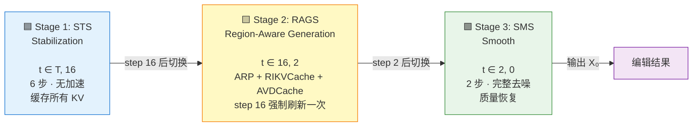
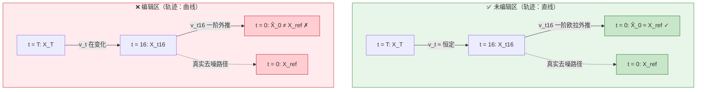
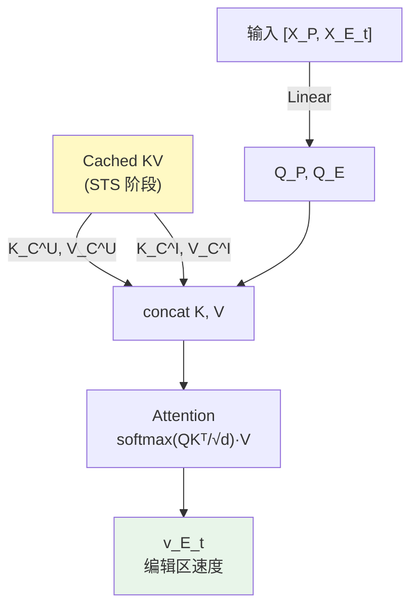
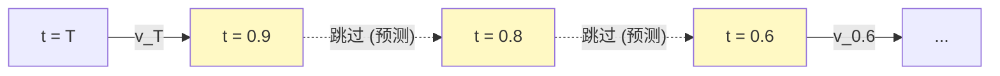
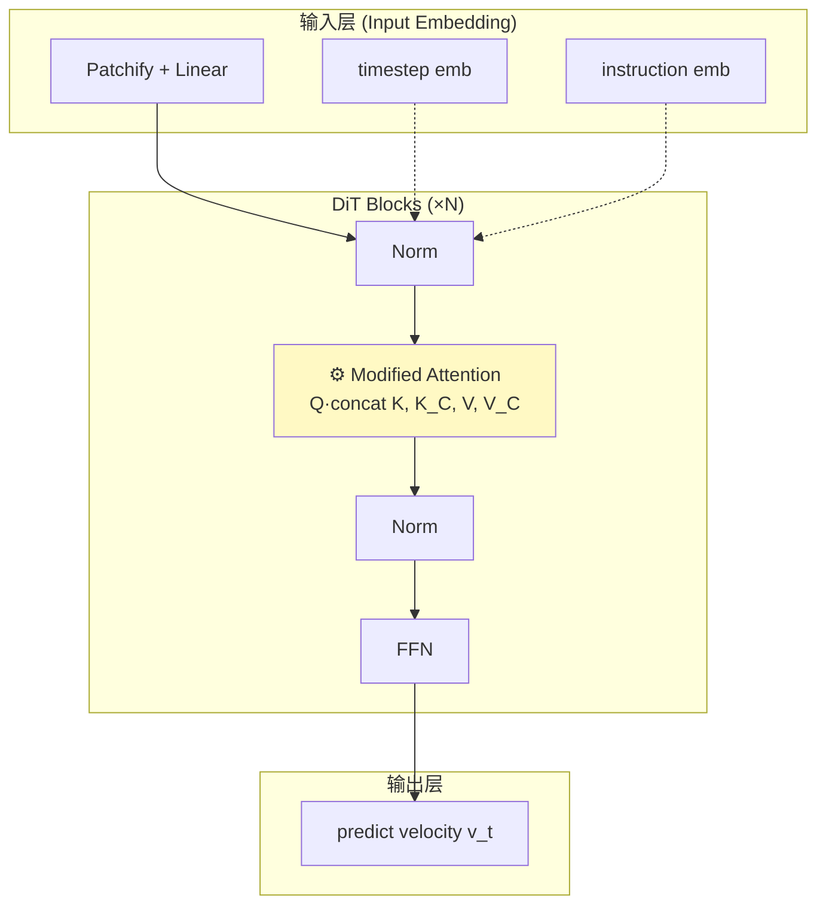
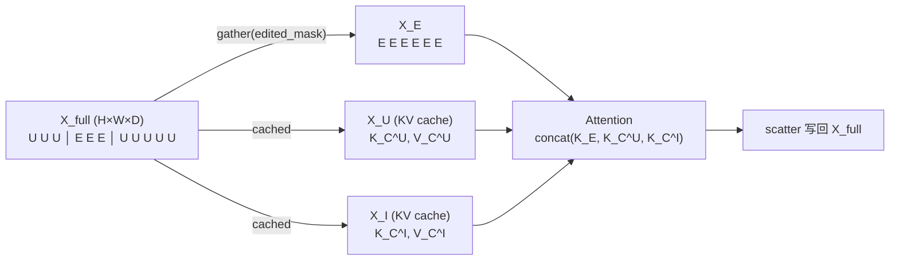

# RegionE: Adaptive Region-Aware Generation for Efficient Image Editing

> 📌 **TL;DR** — 一个**训练免费**的图像编辑加速框架。通过**三阶段推理 + 区域感知生成**，将 IIE（Instruction-based Image Editing）速度提升 **2.06-2.57 倍**，PSNR 仅下降 0.2-0.3 dB，**几乎无损**。
>
> **核心思想**：编辑任务中大部分像素其实没变 → 把图分成"编辑区 / 非编辑区"分开算 → 空间维度用 KV Cache 注入被丢弃的全局信息 → 时间维度用速度衰减跳步。

| 属性     | 信息                                                                    |
| ------ | --------------------------------------------------------------------- |
| **标题** | RegionE: Adaptive Region-Aware Generation for Efficient Image Editing |
| **作者** | Pengtao Chen 等 · 复旦大学                                                 |
| **会议** | ICLR 2026                                                             |
| **代码** | [Peyton-Chen/RegionE](https://github.com/Peyton-Chen/RegionE)         |
| **论文** | [arXiv:2510.25590](https://arxiv.org/abs/2510.25590)                  |

## 📑 目录

1. [问题与动机](#1-问题与动机)
2. [三阶段架构](#2-三阶段架构)
3. [三大核心组件](#3-三大核心组件)

   * 3.1 [ARP — 区域划分](#31-adaptive-region-partition-arp--区域划分)

   * 3.2 [RIKVCache — 空间冗余优化](#32-region-instruction-kv-cache-rikvcache--空间冗余优化)

   * 3.3 [AVDCache — 时间冗余优化](#33-adaptive-velocity-decay-cache-avdcache--时间冗余优化)
4. [DiT 中的具体修改点](#4-dit-模型中的具体修改点)
5. [实验效果](#5-实验效果与消融分析)
6. [与现有工作的区别](#6-与现有工作的区别)
7. [总结](#7-总结)

***

## 1. 问题与动机

### 🎯 核心痛点

现有的 **Instruction-based Image Editing (IIE)** 模型存在严重的计算效率问题：

* 即使只修改图像的局部区域，模型也会对**整个图像**进行统一的去噪生成

* 编辑区域和非编辑区域在**生成难度**和**计算冗余**上差异巨大

* 现有方法忽略这种差异，浪费大量算力在"不需要变"的部分

### 💡 三个关键观察

> **观察 1（非编辑区）**：去噪轨迹近似直线 → 可以在单步中推断多步预测
>
> **观察 2（编辑区）**：相邻时间步的速度方向高度一致 → 可以利用缓存跳步
>
> **观察 3（区域差异）**：编辑区/非编辑区难度本质不同 → 应区分处理

***

## 2. 三阶段架构

RegionE 将去噪过程分为三个阶段，分别处理不同粒度的冗余：



### 阶段参数（所有模型通用）

| 阶段       | 步数范围         | 步数     | 关键操作                                |
| -------- | ------------ | ------ | ----------------------------------- |
| **STS**  | t ∈ \[T, 16] | 6      | 标准去噪 + 缓存所有 KV                      |
| **RAGS** | t ∈ (16, 2]  | 14     | 区域感知 + KV Cache + 跳步 + step 16 强制刷新 |
| **SMS**  | t ∈ \[2, 0]  | 2      | 完整去噪（质量恢复）                          |
| **总计**   | —            | **22** | （原 28 步）                            |

### 模型特定超参

| 模型              | 分割阈值 η (ARP) | 决策阈值 δ (AVDCache) |
| --------------- | ------------ | ----------------- |
| Step1X-Edit     | 0.88         | 0.02              |
| FLUX.1 Kontext  | 0.93         | 0.04              |
| Qwen-Image-Edit | 0.80         | 0.03              |

***

## 3. 三大核心组件

### 3.1 Adaptive Region Partition (ARP) — 区域划分

**核心思想**：在 STS 阶段末（step 16），对最终图像做单步估计，比较其与原始图像的相似度，把图像分成"编辑区"和"非编辑区"两个 mask。

**分割规则**：

```python
mask[i] = 1 if |X_final[i] - X_ref[i]| > η else 0
#         ↑ 编辑区              ↑ 非编辑区
```

* `η` 是分割阈值（不同模型不同，见上表）

* 分割只发生一次（step 16），后续 RAGS 阶段复用

---

#### 📌 ARP 核心原理图解：「速度一致」是未编辑区的**内在属性**

> **核心逻辑链条**（从观察到方法）：
>
> 观察到的事实：未编辑区的轨迹是直线（论文图 1 / 2f）
> 　　↓ 推出的性质
> 未编辑区在 t=16 处的速度 v，和未来任意时刻的速度近似相等
> 　　↓ 推出的方法
> 用 t=16 的 v 一次性外推到 t=0，误差小
> 　　↓ 推出的判据
> `|X̂_0 − X_ref|` 小 → mask = 0（未编辑）



**图说**：

- 🟢 **未编辑区**：`v_t` 全程几乎不变（绿箭头方向大小一致），从 t=16 用 `v_t16` 一步外推得到的 `X̂_0` 和真实 `X_ref` 几乎重合。差异小 → mask = 0。
- 🔴 **编辑区**：`v_t` 方向在旋转（红箭头方向不同），用 t=16 的 `v_t16` 线性外推会偏离真实曲线，导致 `X̂_0` 落在远离 `X_ref` 的位置。差异大 → mask = 1。

#### 关键细节：v 是**向量**

| 维度       | 未编辑区                | 编辑区             |
| -------- | ------------------- | --------------- |
| **方向**   | 近似恒定（轨迹是直线）         | 持续旋转（轨迹是曲线）    |
| **大小**   | 很小（"没什么要降噪的"）       | 较大（"要动很多"）      |
| **外推结果** | ΔX 小，`X̂_0` 落在 `X_ref` 附近 | ΔX 大且方向偏，`X̂_0` 飞出去 |

> 「差异小」= **方向对 + 步幅小**，两个因素**叠加**的结果，不是单一原因。

#### 自监督的副产品

这种「误差即定位」是**自监督**的——没有 ground truth mask，**预测误差本身**就把 mask 标出来了。所以论文 Figure 5 说 ARP 划出来的区域 "closely match human perception"——**编辑区 = 模型预测不准的区域**，两者是同一回事。

---


### 3.2 Region-Instruction KV Cache (RIKVCache) — 空间冗余优化

**问题**：编辑时把 DiT 输入从 `[X_p, X_t, X_I]` 改成 `[X_p, X_E_t]`，**完全丢弃**了非编辑区 `X_U` 和指令图 `X_I`。但 DiT 的 attention 是全局 token 交互的，丢弃会导致编辑区缺乏上下文、偏差累积。

**解决**：把 STS 阶段缓存的 `X_U` 和 `X_I` 的 KV 接回来：

```text
Attention = softmax([Q_P, Q_E] · [K_P, K_E, K_C^U, K_C^I]ᵀ / √d) · [V_P, V_E, V_C^U, V_C^I]

其中：
  Q_P, Q_E          ← 当前输入的 query
  K_C^U, V_C^U      ← 非编辑区（STS 阶段缓存）
  K_C^I, V_C^I      ← 指令图（STS 阶段缓存）
```

**数据流**：



**缓存更新策略**：

| 阶段         | 缓存操作                     |
| ---------- | ------------------------ |
| STS        | 缓存所有 KV（包括 `X_U`, `X_I`） |
| RAGS 正常步   | 使用 RIKVCache             |
| RAGS 强制刷新步 | 跑一遍全图 DiT，刷新缓存           |

### 3.3 Adaptive Velocity Decay Cache (AVDCache) — 时间冗余优化

**问题**：编辑区虽然轨迹是曲线（需要迭代），但**相邻时间步的速度方向几乎一致**（余弦相似度 → 1），只有大小在衰减。能不能直接跳几步？

**核心公式**：

```text
速度衰减关系（公式 7）：
  ‖v_ti‖ / ‖v_ti+1‖ = (1 - Δt_ti+1,ti) · γ_ti

跳步预测（公式 5）：
  v_tj = v_ti · (1 - Δt_tj,ti) · γ_ti
  其中 Δt_tj,ti = t_j − t_i
```

**决策机制**：

```python
if |v_ti - v_ti+1| / |v_ti| < δ:
    skip_step()                # 速度变化小 → 跳步
else:
    compute_step()             # 速度变化大 → 正常算
```

**跳步示意**：



> 🟡 黄色节点表示"被跳过、速度由前一步推算"。

***

## 4. DiT 模型中的具体修改点

### 修改层级

RegionE 的修改集中在 DiT 的 **Attention 层** 和 **输入处理层**：



### Gather / Scatter 操作



**关键点**：

* `X_U` 和 `X_I` **不参与这次前向计算**，但它们的 KV 仍然被 attention 查询

* 这样编辑区在算 attention 时仍然能看到全局上下文

***

## 5. 实验效果与消融分析

### 5.1 整体性能（3 个模型 vs vanilla）

| 模型              | 延迟 (s)            | 加速比       | PSNR ↑        | SSIM ↑ | LPIPS ↓       |
| --------------- | ----------------- | --------- | ------------- | ------ | ------------- |
| Step1X-Edit     | 27.95 → **10.87** | **2.57×** | 31.08 → 30.52 | 0.94   | 0.055 → 0.054 |
| FLUX.1 Kontext  | 19.87 → **8.25**  | **2.41×** | 32.43 → 32.13 | 0.95   | 0.038         |
| Qwen-Image-Edit | 17.51 → **8.50**  | **2.06×** | 31.35 → 31.12 | 0.94   | 0.046 → 0.045 |

> 📊 **结论**：三个模型都能稳定拿到 2-2.5× 加速，质量损失微乎其微（PSNR 平均掉 0.3 dB）。

### 5.2 消融实验（Step1X-Edit）

| 组件变体            | PSNR ↑    | SSIM ↑ | LPIPS ↓   | 延迟 (s) ↓ | 加速比 ↑ | 评价                       |
| --------------- | --------- | ------ | --------- | -------- | ----- | ------------------------ |
| **完整 RegionE**  | **30.52** | 0.94   | **0.054** | 10.87    | 2.57× | —                        |
| w/o RIKVCache   | 22.87     | 0.82   | 0.207     | 10.22    | 2.73× | ❌ PSNR −7.65，LPIPS 暴涨 4× |
| w/o AVDCache    | 31.14     | 0.95   | 0.046     | 16.12    | 1.73× | ✅ 质量更高但速度慢（少了 47% 加速）    |
| w/o STS         | 21.44     | 0.81   | 0.161     | 7.15     | 3.91× | ❌ 质量崩塌，PSNR −9           |
| w/o SMS         | 28.86     | 0.90   | 0.085     | 9.77     | 2.86× | ⚠️ 质量略降                  |
| w/o Forced Step | 28.45     | 0.92   | 0.080     | 10.20    | 2.74× | ⚠️ 质量略降                  |

**关键发现**：

1. **RIKVCache 至关重要** — 去掉 PSNR 直接掉 7.65 dB（说明局部生成需要全局 KV 注入）
2. **AVDCache 贡献 47% 加速** — 1.73× → 2.57×
3. **三阶段设计必要** — STS 和 SMS 都不能少

***

## 6. 与现有工作的区别

| 方法   | 策略           | RegionE vs 它        |
| ---- | ------------ | ------------------- |
| RAS  | 只更新语义连贯区域    | + 同时处理**空间 + 时间**冗余 |
| ToCa | 动态更新部分 token | + 利用 **IIE 轨迹特性**   |
| DuCa | token 敏感度感知  | + **训练-free，即插即用**  |

**RegionE 独特性**：

1. 🎯 利用 IIE 任务特有的轨迹特性（非编辑区轨迹直线）
2. 🎯 同时解决**空间**（KV Cache）和**时间**（速度跳步）两个维度
3. 🎯 完全 **训练-free**，即插即用到任意 IIE 模型

***

## 7. 总结

### 三大核心贡献

| 缩写            | 全称                            | 解决什么           |
| ------------- | ----------------------------- | -------------- |
| **ARP**       | Adaptive Region Partition     | 编辑区 vs 非编辑区怎么分 |
| **RIKVCache** | Region-Instruction KV Cache   | 丢弃区域信息怎么补      |
| **AVDCache**  | Adaptive Velocity Decay Cache | 编辑区怎么跳步        |

### 实现的三个层次

| 层级          | 修改点                                 | 效果            |
| ----------- | ----------------------------------- | ------------- |
| 输入层         | `[X_p, X_t, X_I]` → `[X_p, X_E_t]`  | 减少 token 数    |
| Attention 层 | K, V 拼接 cached KV（`K_C^U`, `K_C^I`） | 保留全局上下文       |
| 调度层         | 三阶段策略 + 自适应跳步决策                     | 控制何时加速、何时刷新缓存 |

### 关键公式速查

```text
① 区域划分:   mask = (|X_final − X_ref| > η)
② RIKVCache: A = softmax(Q · [K, K_C]ᵀ / √d) · [V, V_C]
③ AVDCache:  ‖v_ti‖ / ‖v_ti+1‖ = (1 − Δt_ti+1,ti) · γ_ti
```

***

## 📚 参考资料

* 论文：<https://arxiv.org/abs/2510.25590>

* 代码：<https://github.com/Peyton-Chen/RegionE>

* OpenReview：<https://openreview.net/forum?id=I6j5fLdH80>
