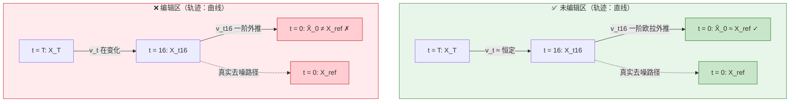

# ARP 核心原理图解：「速度一致」是未编辑区的内在属性

> 📂 配图源文件，对应 `预研/RegionE图像编辑.md` 的 3.1 章节。
> 在 GitNote 中，`mermaid` 代码块会自动渲染为流程图。

## 一、逻辑链条（从观察到方法）

```
观察到的事实：未编辑区的轨迹是直线（论文图 1 / 2f）
　　↓ 推出的性质
未编辑区在 t=16 处的速度 v，和未来任意时刻的速度近似相等
　　↓ 推出的方法
用 t=16 的 v 一次性外推到 t=0，误差小
　　↓ 推出的判据
|X̂_0 − X_ref| 小  →  mask = 0（未编辑）
```

## 二、示意图



## 三、关键细节：v 是向量

| 维度 | 未编辑区 | 编辑区 |
| --- | --- | --- |
| 方向 | 近似恒定（轨迹是直线） | 持续旋转（轨迹是曲线） |
| 大小 | 很小（"没什么要降噪的"） | 较大（"要动很多"） |
| 欧拉外推 | ΔX 小，X̂_0 落在 X_ref 附近 | ΔX 大且方向偏，X̂_0 飞出去 |

> 「差异小」= 方向对 + 步幅小，两个因素叠加的结果。

## 四、自监督的副产品

「误差即定位」——预测误差本身就把 mask 标出来了，不需要 ground truth。这就是论文 Figure 5 说 ARP 划出来的区域 "closely match human perception" 的原因。
